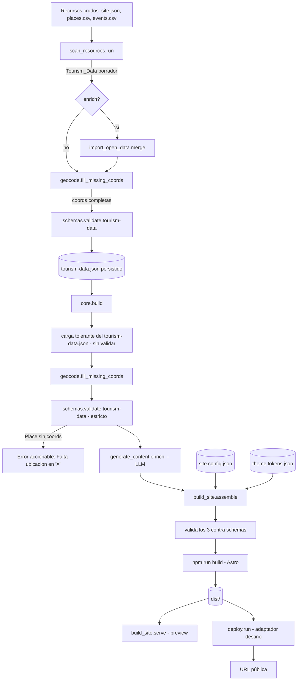
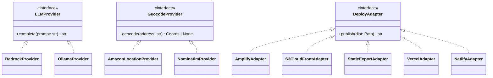

# Documento de Diseño

## Overview

Este diseño describe la implementación completa de la lógica real de las tools del agente Puriq, hoy en su mayoría placeholders. El objetivo es que cada tool (`scan_resources`, `import_open_data`, `generate_content`, `geocode`, `build_site` + `serve`, `deploy`), su exposición vía MCP y las consideraciones transversales (errores, validación, configuración, secretos) cumplan los requisitos aprobados sin romper las invariantes de arquitectura del proyecto.

Invariantes de arquitectura que este diseño respeta de forma estricta:

1. **El agente compone y configura módulos pre-construidos; nunca genera su código.** `build_site` copia la Template Astro y la parametriza; no escribe componentes.
2. **El LLM solo toca contenido y configuración.** `generate_content` rellena descripciones, SEO y traducciones dentro de `Tourism_Data`; jamás produce código de módulos ni de build.
3. **El contrato son 3 JSON validados contra `schemas/` en cada operación.** Toda tool que produzca o transforme un documento del contrato lo valida antes de escribirlo o usarlo.
4. **Edición en capas sin pisar datos del usuario.** Las tools completan solo lo faltante (descripciones vacías, coords ausentes) y preservan lo existente.
5. **Sitio estático Astro.** La salida final es `dist/` estático.
6. **LLM = Amazon Bedrock (Claude) con fallback local Ollama**, seleccionado por `PURIQ_LLM_MODE`.
7. **Deploy por adaptadores** (`aws-amplify`, `s3-cloudfront`, `static-export`, más `vercel`/`netlify` no-AWS).
8. **El core (`agent/puriq/core.py`) cablea el pipeline** (collect/build/preview/deploy). Este diseño mantiene su forma pública salvo un cambio mínimo justificado en `collect()` (ver [Decisión de diseño DD-1](#dd-1-la-geocodificación-ocurre-antes-de-validarpersistir-el-contrato)).

Alcance mapeado a requisitos: Req 1 (`scan_resources`), Req 2 (`import_open_data`), Req 3 (`generate_content`), Req 4 (`geocode`), Req 5 y 6 (`build_site` + `serve`), Req 7 (`deploy`), Req 8 (MCP), Req 9 (transversal).

### Investigación y hallazgos que informan el diseño

- **El esquema `tourism-data` exige `coords` en cada Place** (`place.required = [id, name, category, coords]`). Sin embargo, `scan_resources` deja Places sin `coords` cuando faltan `lat`/`lng` (Req 1.9), para que `geocode` los complete (Req 4.1). El `core.collect()` actual valida el contrato justo después de `scan`+`enrich`, **antes** de `geocode` (que hoy corre en `build()`). Esto produciría un fallo de validación para Places sin coords. Se resuelve en DD-1.
- **Dependencias ya declaradas** en `agent/pyproject.toml`: `httpx` (Overpass/Wikidata/Nominatim), `boto3` (Bedrock, S3, CloudFront, Amplify, Location), `jsonschema` (validación), `typer`+`rich` (CLI), `ollama` (extra `local`), `mcp` (extra `mcp`). El diseño se apoya en estas y no introduce librerías nuevas.
- **`schemas.py`** ya centraliza `validate/load/dumps` contra `schemas/`. Todas las tools reutilizan este módulo para cumplir Req 9.4, en lugar de validar por su cuenta.
- **`slugify`** ya existe y es correcto en `scan_resources.py` (NFKD -> ASCII -> kebab-case). Se promueve a utilidad compartida para reutilizarla en `import_open_data` (Req 1.6, 2.5).

## Architecture

### Vista del pipeline

El core orquesta un pipeline de fases. Las tools son funciones puras sobre el contrato salvo en sus fronteras de E/S (red, disco, procesos), que se aíslan detrás de adaptadores.



### Capas y responsabilidades

- **CLI (`cli.py`)**: capa fina con `typer`/`rich`. Traduce comandos a llamadas del core, captura excepciones y las presenta como mensajes descriptivos (Req 9.1). No contiene lógica de negocio.
- **Core (`core.py`)**: orquesta fases. Mantiene su interfaz pública (`collect`, `build`, `preview`, `deploy`); ver DD-1 para el único ajuste interno.
- **Tools (`tools/*.py`)**: cada tool hace una cosa y se reutiliza tanto desde el CLI (vía core) como desde MCP. La lógica no se duplica (Req 8.2).
- **Schemas (`schemas.py`)**: única fuente de validación del contrato (Req 9.4).
- **MCP (`mcp/server.py`)**: envoltorio delgado que registra las tools y delega en `puriq.core`/`puriq.tools` (Req 8).
- **Config**: variables de entorno leídas de `agent/.env` (cargadas por el proceso). Un módulo `config.py` centraliza el acceso y evita exponer secretos (Req 9.2, 9.3, 9.5).

### Patrón de adaptadores

Dos familias de comportamiento variable se aíslan tras interfaces (protocolos) para permitir fallback y evitar acoplar la lógica a un proveedor:

- **Proveedor de LLM** (`generate_content`): `BedrockProvider` (por defecto) y `OllamaProvider` (fallback local), seleccionados por `PURIQ_LLM_MODE`.
- **Proveedor de geocodificación** (`geocode`): `AmazonLocationProvider` (preferido) y `NominatimProvider` (fallback OSM).
- **Destino de deploy** (`deploy`): un adaptador por cada `target` soportado.



### Decisiones de diseño

#### DD-1: La geocodificación precede a la validación estricta en AMBOS puntos del pipeline

**Contexto:** El esquema exige `coords` en cada Place, pero `scan_resources` deja Places sin `coords` (Req 1.9) para que `geocode` los complete (Req 4.1). Además, el flujo central de mantenibilidad de Puriq es "editar el `tourism-data.json` a mano y reconstruir": un usuario puede agregar un Place con solo `address` (sin `coords`) y ejecutar `puriq build`. En ambos casos —el pipeline de `collect()` y la recarga en `build()`— existe un momento en que el documento en memoria todavía no tiene todas las `coords`, y una validación estricta prematura fallaría.

**Decisión:** Establecer una **regla única** en el pipeline: las `coords` están garantizadas solo *después* del paso de `geocode`, y la validación estricta contra el esquema ocurre *inmediatamente después* de `geocode`, en los dos puntos donde el contenido entra al pipeline:

- **`collect()`** — orden: `scan → enrich (import_open_data) → geocode → validate → persistir`. El `tourism-data.json` persistido siempre queda válido (con `coords`).
- **`build()`** — orden: cargar el `tourism-data.json` de forma **tolerante** a `coords` faltantes (sin validación estricta previa) → `geocode.fill_missing_coords` → `validate` estricto → `generate_content.enrich` → `build_site.assemble`. La carga tolerante permite que un JSON editado a mano (con Places que solo tienen `address`) pase por `geocode` antes de validarse.

**Manejo de error:** si tras geocodificar un Place sigue sin `coords` (porque no tiene `address` o la dirección no se pudo resolver), el pipeline reporta un error claro que **nombra el Place** (p. ej. "Falta ubicación en 'X': agregá dirección o coordenadas") en lugar de propagar un `jsonschema.ValidationError` crudo. Esto se implementa como una comprobación previa a `schemas.validate` que recorre los Places sin `coords` y construye el mensaje accionable.

**Justificación:** Soporta directamente el diferenciador clave de mantenibilidad del producto (editar el contrato a mano y reconstruir), manteniendo el esquema congelado como contrato estricto. La regla "geocode antes de validar" es consistente con Req 1.9 + Req 4.1 + Req 9.4 en ambos puntos de entrada. Mantiene la forma pública del core (`collect`/`build`/`preview`/`deploy` intactas); el cambio es el orden interno y una carga tolerante en `build()`.

**Alternativas descartadas:** (a) Relajar el esquema para hacer `coords` opcional — rechazada porque el esquema es el contrato congelado y el módulo mapa depende de `coords`. (b) Validar solo en `collect()` y confiar en que `build()` siempre reciba un JSON ya válido — rechazada porque rompe el flujo de edición manual + reconstrucción, que es central para la mantenibilidad. (c) Definir un "esquema borrador" laxo separado del estricto — añade una segunda fuente de verdad de validación y complejidad innecesaria; la carga tolerante (parseo JSON sin validar) más la validación estricta post-geocode logra lo mismo con un solo esquema.

#### DD-2: `slugify` como utilidad compartida

Se extrae `slugify` (hoy en `scan_resources.py`) a un módulo utilitario reutilizable (`tools/_slug.py` o similar) para que `import_open_data` genere ids con la misma normalización (Req 1.6, 2.5) sin duplicar código.

#### DD-3: Fallo de fuente externa no rompe el pipeline

`import_open_data` (Req 2.8) y `generate_content` por ítem (Req 3.10) capturan fallos de red/servicio y devuelven el documento sin la parte fallida, registrando la causa. Prioriza robustez: un enriquecimiento opcional nunca debe abortar la construcción del sitio.

#### DD-4: Selección de proveedor por configuración, no por parámetro

Los proveedores de LLM y geocoding se resuelven leyendo el entorno (`PURIQ_LLM_MODE`, disponibilidad de Amazon Location) dentro de una fábrica, no propagando flags por toda la firma de las funciones. Esto mantiene las firmas del core estables y centraliza la política de fallback.

## Components and Interfaces

Las firmas se expresan en Python (lenguaje del agente). Se mantiene compatibilidad con las llamadas actuales del core.

### Scan_Resources (Req 1)

```python
def run(resources_dir: Path) -> dict:
    """Lee site.json + places.csv (+ events.csv) y devuelve el dict Tourism_Data borrador.
    Puede dejar Places sin `coords` (los completa geocode)."""
```

Responsabilidad: leer y **normalizar** recursos crudos a estructura de contrato. No llama al LLM ni geocodifica.

- Exige `site.json` y `places.csv`; error con archivo faltante y ruta si faltan (Req 1.2, 1.3).
- `events.csv` opcional: presente -> eventos incluidos (Req 1.4); ausente -> `events = []` (Req 1.5).
- Genera `id` con `slugify(name)` para Places y Events (Req 1.6).
- Omite filas con `name` vacío o solo espacios (Req 1.7).
- `lat`/`lng` numéricos -> `coords` con floats (Req 1.8); ausentes -> sin `coords` (Req 1.9).
- Valor no numérico en `lat`/`lng` -> error que identifica fila (índice) y columna (Req 1.11). Nuevo respecto al placeholder: hoy `float()` lanza `ValueError` genérico; se envuelve para reportar fila/columna.
- `event.place` -> `placeId` solo si referencia un `id` de Place existente (Req 1.10).

### Import_Open_Data (Req 2)

```python
def merge(data: dict) -> dict:
    """Devuelve `data` enriquecido con Places de fuentes abiertas (OSM/Wikidata/Wikimedia)."""

# Frontera de red aislada:
def _query_overpass(center: dict, radius_m: int) -> list[dict]: ...
def _query_wikidata(center: dict) -> list[dict]: ...
def _image_from_commons(entity) -> str | None: ...
```

Responsabilidad: enriquecer `Tourism_Data.places` con POIs turísticos.

- Consulta Overpass por POIs dentro del área de `site.center` (Req 2.1) usando `httpx`.
- Mapea POI OSM -> Place con `source="osm"` (Req 2.2); Wikidata -> `source="wikidata"` (Req 2.3).
- Adjunta URL de imagen de Wikimedia Commons con licencia libre a `images` (Req 2.4).
- Genera `id` slug único que no colisiona con ids existentes (Req 2.5), desambiguando con sufijo numérico.
- Deduplica por nombre + proximidad geográfica: si coincide con un Place existente, omite el duplicado y conserva el existente (Req 2.6).
- `source` distinto de `"user"` marca los importados para revisión (Req 2.7).
- Ante fallo/timeout de una fuente, devuelve `data` sin cambios y registra la causa (Req 2.8, DD-3).
- Salida conforme a `tourism-data.schema.json` (Req 2.9). Nota: los POIs OSM/Wikidata traen coords, por lo que cumplen el requisito de `coords`.

### Generate_Content (Req 3)

```python
def enrich(data: dict, voice: dict | None = None) -> dict:
    """Rellena descripciones/SEO/i18n vacías usando el LLM_Provider según el tono/voz."""

class LLMProvider(Protocol):
    def complete(self, prompt: str) -> str: ...

def get_provider() -> LLMProvider:
    """Fábrica: Bedrock (PURIQ_LLM_MODE=bedrock) u Ollama (PURIQ_LLM_MODE=local)."""
```

Responsabilidad: completar contenido faltante usando el LLM, respetando la voz de marca.

- Place/Event con `description` vacía -> genera descripción (Req 3.1, 3.2).
- `description` no vacía -> se conserva sin cambios (Req 3.3).
- Prompt incluye `Theme_Tokens.voice.tone` (Req 3.4) y refleja `voice.formality` cuando está definida (Req 3.5).
- `site.locales` con más de un Locale -> genera traducciones para cada Locale distinto de `site.defaultLocale` (Req 3.6).
- Metadatos SEO basados en `name`, `region` y `description` de `Tourism_Data` (Req 3.7).
- Selección de proveedor: `PURIQ_LLM_MODE=local` -> Ollama (Req 3.8); `bedrock` -> Amazon Bedrock con `PURIQ_BEDROCK_MODEL` (Req 3.9) vía `boto3` `bedrock-runtime`.
- Fallo del LLM por ítem -> conserva valor del ítem, registra el fallo y continúa con los demás (Req 3.10, DD-3).
- Salida conforme al esquema (Req 3.11).

### Geocode (Req 4)

```python
def fill_missing_coords(data: dict) -> dict:
    """Completa `coords` de Places con `address` y sin `coords`."""

class GeocodeProvider(Protocol):
    def geocode(self, address: str) -> dict | None:  # {"lat":..,"lng":..} | None
        ...

def get_provider() -> GeocodeProvider:
    """Amazon Location si está configurado; si no, Nominatim."""
```

Responsabilidad: convertir direcciones en coordenadas, completando solo lo faltante.

- Place con `address` y sin `coords` -> calcula y asigna `coords` (Req 4.1).
- Place con `coords` -> preserva (Req 4.2); Place sin `address` -> sin cambios (Req 4.3).
- `coords` asignadas con `lat ∈ [-90, 90]`, `lng ∈ [-180, 180]` (Req 4.4).
- Proveedor: Amazon Location si configurado/disponible (Req 4.5); si no, Nominatim (Req 4.6), vía `httpx`.
- Dirección irresoluble -> Place sin `coords` y registro de la dirección (Req 4.7).
- Salida conforme al esquema (Req 4.8).

### Build_Site + serve (Req 5, 6)

```python
def assemble(project: Path, data: dict, config: dict, theme: dict) -> Path:
    """Ensambla y construye el sitio Astro; devuelve project/dist."""

def serve(project: Path, port: int = 4322) -> None:
    """Sirve project/dist para preview."""
```

Responsabilidad de `assemble`: preparar el directorio de trabajo, parametrizar módulos/tema, y ejecutar el build de Astro. No genera código de módulos.

- Copia la Template a un directorio de trabajo excluyendo `node_modules` y `dist` (Req 5.1) — ya implementado con `shutil.ignore_patterns`.
- Escribe los 3 documentos del contrato en `src/data/` de la Template (Req 5.2).
- Valida los 3 documentos contra sus esquemas **antes** del build (Req 5.10) usando `schemas.validate`.
- Resuelve módulos desde `Site_Config.modules`: activa los `enabled=true` (Req 5.3), desactiva los `enabled=false` (Req 5.4) y los dispone según `order` (Req 5.5). La activación se materializa como datos/flags que la Template lee (no como edición de código).
- Traduce colores y tipografía de `Theme_Tokens` a variables CSS (Req 5.6) escritas en un archivo de tokens que la Template importa.
- Ejecuta `npm run build` (Req 5.7) vía `subprocess`; éxito -> deja salida en `dist/` y devuelve la ruta (Req 5.8); error -> reporta error con la salida relevante del proceso (Req 5.9).

Responsabilidad de `serve`:

- `dist/` existe -> sirve su contenido en el puerto indicado (Req 6.1).
- `dist/` ausente -> error indicando ejecutar `puriq build` primero (Req 6.2).
- Sin puerto indicado -> puerto por defecto 4322 (Req 6.3).

### Deploy (Req 7)

```python
def run(project: Path, target: str = "aws-amplify") -> str:
    """Publica project/dist mediante el adaptador del destino; devuelve la URL/ruta pública."""

class DeployAdapter(Protocol):
    def publish(self, dist: Path) -> str: ...

ADAPTERS = ("aws-amplify", "s3-cloudfront", "static-export", "vercel", "netlify")
```

Responsabilidad: publicar `dist/` según el destino, aislando cada proveedor en un adaptador.

- Destino soportado + `dist/` existente -> publica y devuelve URL pública (Req 7.1).
- Destino no soportado -> error que lista los destinos válidos (Req 7.2) — ya implementado.
- `dist/` ausente -> error indicando `puriq build` primero (Req 7.3) — ya implementado.
- `aws-amplify` -> publica en AWS Amplify Hosting vía `boto3`, devuelve URL (Req 7.4).
- `s3-cloudfront` -> sube `dist/` a S3, invalida la distribución CloudFront vía `boto3`, devuelve URL (Req 7.5).
- `static-export` -> deja `dist/` listo y devuelve la ruta local (Req 7.6).
- Rechazo del proveedor o credenciales faltantes -> error que identifica la causa **sin exponer valores de secretos** (Req 7.7).

### MCP_Server (Req 8)

```python
def main() -> None:
    """Arranca el servidor MCP `tourism-builder` y registra las tools del core."""
```

Responsabilidad: exponer las tools a un cliente LLM (Claude) reutilizando el core.

- Registra `scan_resources`, `import_open_data`, `generate_content`, `build_site`, `deploy` (Req 8.1).
- Cada handler delega en la misma implementación de `puriq.core`/`puriq.tools` que usa el CLI, sin duplicar lógica (Req 8.2).
- Declara el esquema de entrada de cada tool acorde a su firma (Req 8.3).
- Error de una tool -> mensaje descriptivo al cliente **sin secretos** (Req 8.4).

### Configuración transversal (Req 9)

```python
# config.py
def get_env(name: str, *, required: bool = False, secret: bool = False) -> str | None:
    """Lee una variable de agent/.env; si required y falta, error nombrando la variable.
    Si secret, su valor nunca se incluye en mensajes de error."""

def redact(text: str) -> str:
    """Elimina/enmascara valores de secretos conocidos en un texto de salida/error."""
```

- CLI muestra mensajes descriptivos con causa y acción sugerida ante errores de tool (Req 9.1).
- Config sensible (credenciales AWS, `PURIQ_BEDROCK_MODEL`, `PURIQ_LLM_MODE`, destino de deploy) leída de variables de entorno de `agent/.env` (Req 9.2).
- Valores de secretos excluidos de errores y salida del CLI (Req 9.3) vía `redact`.
- Toda producción/transformación de un documento del contrato se valida contra su esquema antes de escribir o usar en build (Req 9.4).
- Variable de entorno requerida ausente -> error que nombra la variable faltante (Req 9.5).

## Data Models

El contrato son tres documentos JSON, cada uno validado contra su esquema en `schemas/`:

- **`tourism-data.json`** — capa de contenido; validado contra `schemas/tourism-data.schema.json`.
- **`site.config.json`** — capa de estructura; validado contra `schemas/site-config.schema.json`.
- **`theme.tokens.json`** — capa de marca; validado contra `schemas/theme-tokens.schema.json`.

### Modelo Place (dentro de `tourism-data.places`)

Campos según esquema (`$defs/place`):

- Requeridos: `id` (`^[a-z0-9-]+$`), `name` (no vacío), `category`, `coords` (`{lat ∈ [-90,90], lng ∈ [-180,180], zoom?}`).
- Opcionales: `address`, `shortDescription`, `description` (vacío = lo genera el LLM), `images` (lista de rutas/URLs), `hours`, `tags` (lista), `source` (`user` | `osm` | `wikidata`, default `user`).

Notas de flujo: `scan_resources` puede emitir un Place **borrador** sin `coords`, y un usuario puede editar el `tourism-data.json` a mano agregando un Place con solo `address`. En ambos casos `geocode` completa las `coords` **antes** de la validación estricta, tanto en `collect()` como en la recarga tolerante de `build()` (DD-1). Si tras geocodificar un Place sigue sin `coords`, el pipeline emite un error que nombra el Place en vez de un `ValidationError` crudo. `source` distingue origen (usuario vs importado) para la revisión del Req 2.7.

### Modelo Event (dentro de `tourism-data.events`)

Campos según esquema (`$defs/event`):

- Requeridos: `id` (`^[a-z0-9-]+$`), `name` (no vacío), `startDate` (fecha ISO).
- Opcionales: `endDate` (fecha ISO), `placeId` (referencia a un Place), `description`, `images`, `recurring` (`none` | `yearly` | `monthly` | `weekly`, default `none`).

Invariante referencial: `placeId`, cuando está presente, referencia un `id` de Place existente (Req 1.10).

### Modelo Site (dentro de `tourism-data.site`)

Requeridos: `name`, `region`, `defaultLocale` (`^[a-z]{2}$`), `center` (`coords`). Opcionales: `description`, `locales` (lista de Locales). `locales` con más de un elemento activa la generación de traducciones (Req 3.6). `center` guía el área de consulta de datos abiertos (Req 2.1).

### Modelo Site_Config

Requeridos: `layout` (`clasico` | `moderno`), `modules`. Cada módulo (`map`, `places`, `events`, `blog`, `chatweb`) tiene `enabled` (bool) y `order` (entero ≥ 1); `chatweb` añade `persona` y `knowledgeSource`. Opcionales: `hero`, `contact`, `deploy` (`target`, `domain`). `build_site` usa `modules` para activar/ordenar (Req 5.3–5.5) y `deploy.target` como destino por defecto.

### Modelo Theme_Tokens

Requeridos: `colors` (`primary`, `background`, `text`; opcionales `secondary`, `accent`; formato hex) y `typography` (`headingFont`, `bodyFont`; opcional `baseSize`). Opcionales: `voice` (`tone`, `formality`), `logo`, `radius`. `generate_content` usa `voice`; `build_site` traduce `colors`/`typography` a variables CSS (Req 5.6).

## Correctness Properties

*Una propiedad es una característica o comportamiento que debe cumplirse en todas las ejecuciones válidas de un sistema — esencialmente, una afirmación formal sobre lo que el sistema debe hacer. Las propiedades son el puente entre las especificaciones legibles por humanos y las garantías de corrección verificables por máquina.*

Estas propiedades se derivan del análisis de prework y de su reflexión de consolidación (se eliminaron redundancias de conformidad de esquema, preservación de coords y no-fuga de secretos).

### Propiedad 1: Los ids son slugs bien formados derivados del nombre

*Para todo* nombre de Place o Event, `scan_resources` genera un `id` que cumple el patrón `^[a-z0-9-]+$` y es igual a `slugify(name)`.

**Validates: Requirements 1.6**

### Propiedad 2: Solo sobreviven filas con nombre no vacío

*Para todo* conjunto de filas de `places.csv`/`events.csv`, el resultado de `scan_resources` incluye exactamente las filas cuyo `name` no es vacío ni solo espacios, y ninguna con nombre vacío.

**Validates: Requirements 1.7**

### Propiedad 3: Las coordenadas del CSV se preservan y son numéricas; su ausencia se respeta

*Para toda* fila de `places.csv`: si `lat` y `lng` son numéricos, el Place resultante tiene `coords` con esos valores como floats; si faltan, el Place resultante no tiene la clave `coords`.

**Validates: Requirements 1.8, 1.9**

### Propiedad 4: Integridad referencial de eventos

*Para todo* Tourism_Data producido por `scan_resources`, cada `placeId` presente en un Event pertenece al conjunto de `id` de los Places del mismo documento.

**Validates: Requirements 1.10**

### Propiedad 5: Los eventos se incluyen o quedan vacíos según exista events.csv

*Para todo* directorio de recursos: si contiene `events.csv`, todos los eventos con nombre válido aparecen en `Tourism_Data.events`; si no lo contiene, `Tourism_Data.events` es una lista vacía.

**Validates: Requirements 1.4, 1.5**

### Propiedad 6: Procedencia de los datos importados

*Para todo* Place agregado por `import_open_data`, su campo `source` es `"osm"` o `"wikidata"` (según la fuente), lo que lo distingue de los Places del usuario para su revisión.

**Validates: Requirements 2.2, 2.3, 2.7**

### Propiedad 7: Unicidad de ids tras la importación

*Para todo* Tourism_Data resultante de `import_open_data`, los `id` de todos los Places son únicos (ningún id importado colisiona con uno existente).

**Validates: Requirements 2.5**

### Propiedad 8: La importación no duplica y preserva lo existente

*Para todo* POI importado que coincide con un Place existente por nombre y proximidad geográfica, el resultado omite el duplicado y conserva el Place existente sin modificarlo.

**Validates: Requirements 2.6**

### Propiedad 9: Un fallo de fuente externa preserva el documento

*Para todo* Tourism_Data de entrada, si una fuente de datos abiertos falla o agota su tiempo de espera, `import_open_data` devuelve el documento de entrada sin cambios.

**Validates: Requirements 2.8**

### Propiedad 10: Completitud de descripciones tras la generación

*Para todo* Place o Event con `description` vacía, tras `generate_content.enrich` con un LLM_Provider exitoso, su `description` deja de estar vacía.

**Validates: Requirements 3.1, 3.2**

### Propiedad 11: Preservación del contenido existente

*Para todo* Place o Event con `description` no vacía, `generate_content.enrich` conserva ese texto sin modificarlo.

**Validates: Requirements 3.3**

### Propiedad 12: El prompt refleja la voz de marca

*Para todo* valor de `Theme_Tokens.voice.tone`, el prompt construido por `generate_content` contiene ese tono; y cuando `voice.formality` está definida, el prompt la incluye.

**Validates: Requirements 3.4, 3.5**

### Propiedad 13: Traducciones por locale configurado

*Para todo* Tourism_Data con `site.locales` de más de un elemento, `generate_content` produce contenido traducido para cada Locale distinto de `site.defaultLocale`.

**Validates: Requirements 3.6**

### Propiedad 14: Robustez ante fallo del LLM por ítem

*Para todo* conjunto de ítems, si la invocación al LLM_Provider falla para algunos, `generate_content` conserva el valor previo de esos ítems y procesa correctamente los restantes.

**Validates: Requirements 3.10**

### Propiedad 15: Geocode solo completa lo faltante

*Para todo* Tourism_Data —incluidos los que provienen de un `tourism-data.json` editado a mano y cargado de forma tolerante en `build()`— `geocode.fill_missing_coords` preserva las `coords` de Places que ya las tienen y no modifica Places que no tienen `address`. En consecuencia, aplicarlo dos veces produce el mismo resultado (idempotencia).

**Validates: Requirements 4.2, 4.3**

### Propiedad 16: Las coordenadas asignadas están en rango válido

*Para toda* dirección resuelta, las `coords` asignadas por `geocode` cumplen `lat ∈ [-90, 90]` y `lng ∈ [-180, 180]`.

**Validates: Requirements 4.1, 4.4**

### Propiedad 17: Resolución de módulos = subconjunto habilitado y ordenado

*Para toda* `Site_Config`, el conjunto de módulos activados por `build_site` es exactamente el de módulos con `enabled=true`, dispuestos en orden ascendente de `order`; los módulos con `enabled=false` no aparecen.

**Validates: Requirements 5.3, 5.4, 5.5**

### Propiedad 18: Los tokens de marca se materializan como variables CSS

*Para todo* `Theme_Tokens`, cada color definido en `colors` y cada fuente de `typography` aparece como una variable CSS en la salida de `build_site`.

**Validates: Requirements 5.6**

### Propiedad 19: El contrato se valida después de geocode y antes de escribirse o construirse

*Para todo* documento del contrato producido o transformado por una tool, la validación estricta contra su esquema de `schemas/` ocurre inmediatamente después del paso de `geocode` (donde las `coords` quedan garantizadas) y antes de persistirse o de usarse en el build; un documento inválido impide la escritura y el build de Astro. En `build()`, la carga previa del `tourism-data.json` es tolerante (sin validación estricta) para permitir que un documento editado a mano pase por `geocode` antes de validarse.

**Validates: Requirements 2.9, 3.11, 4.8, 5.10, 9.4**

### Propiedad 22: Coords garantizadas tras geocode o error accionable que nombra el Place

*Para todo* Tourism_Data que entra al pipeline (vía `collect()` o vía la carga tolerante de `build()`), tras `geocode.fill_missing_coords` se cumple una de dos condiciones antes de la validación: (a) todos los Places tienen `coords` válidas, o (b) el pipeline produce un error que nombra cada Place que sigue sin `coords`, en lugar de un error de validación de esquema crudo.

**Validates: Requirements 1.9, 4.1, 4.7, 9.4**

### Propiedad 20: Deploy rechaza destinos no soportados

*Para todo* string de destino que no pertenece a `ADAPTERS`, `deploy.run` produce un error que lista los destinos válidos.

**Validates: Requirements 7.2**

### Propiedad 21: No exposición de secretos

*Para todo* error o salida producidos por las tools, el CLI o el MCP_Server, ningún valor de secreto configurado (credenciales AWS, etc.) aparece en el texto.

**Validates: Requirements 7.7, 8.4, 9.3**

## Error Handling

- **Recursos faltantes (Scan):** `site.json`/`places.csv` ausentes -> `FileNotFoundError` con archivo y ruta consultada (Req 1.2, 1.3). Valores no numéricos en `lat`/`lng` -> error que identifica índice de fila y columna (Req 1.11).
- **Fallo de fuentes externas (Import/Geocode/LLM):** capturado y degradado con gracia — se devuelve el documento sin la parte fallida y se registra la causa (Req 2.8, 3.10, 4.7). Un enriquecimiento opcional nunca aborta el pipeline (DD-3).
- **Build de Astro (Build_Site):** salida distinta de cero -> error con la salida relevante del proceso (`stdout`/`stderr`) (Req 5.9). Contrato inválido -> el build no se ejecuta (Req 5.10).
- **Preview (serve):** `dist/` ausente -> error que indica ejecutar `puriq build` primero (Req 6.2).
- **Deploy:** destino no soportado -> error listando válidos (Req 7.2); `dist/` ausente -> error de build previo (Req 7.3); rechazo del proveedor o credenciales faltantes -> error con la causa **sin secretos** (Req 7.7).
- **MCP:** cualquier error de tool se traduce a un mensaje descriptivo para el cliente, sin secretos (Req 8.4).
- **CLI (transversal):** todas las excepciones de tool se capturan en la capa CLI y se presentan con `rich` como mensaje descriptivo (causa + acción sugerida) (Req 9.1). Los valores de secretos se enmascaran con `redact` (Req 9.3). Variable de entorno requerida ausente -> error que nombra la variable (Req 9.5).
- **Validación del contrato (transversal):** `jsonschema.ValidationError` se traduce a un mensaje que indica el documento y el campo que incumple, antes de escribir o construir (Req 9.4).
- **Coords faltantes tras geocode (DD-1):** en `collect()` y en la recarga tolerante de `build()`, tras ejecutar `geocode` el pipeline comprueba los Places que aún no tienen `coords`. Antes de invocar `schemas.validate`, emite un error accionable que nombra cada Place afectado (p. ej. "Falta ubicación en 'X': agregá dirección o coordenadas"), en lugar de dejar que `jsonschema` produzca un error crudo sobre `coords`. La carga del `tourism-data.json` en `build()` es **tolerante**: parsea el JSON sin validación estricta previa, de modo que un documento editado a mano con `coords` faltantes pueda pasar por `geocode` antes de validarse.

## Testing Strategy

El diseño está pensado para ser testeable aislando las fronteras de E/S (red, disco, procesos, servicios AWS) detrás de interfaces (proveedores/adaptadores), de modo que la lógica pura de cada tool se pueda ejercitar con datos generados y proveedores mockeados. **Este documento no agrega tests; describe la estrategia para cuando se implementen.**

### Enfoque dual

- **Pruebas unitarias / de ejemplo:** casos concretos, selección de proveedor por entorno, valores por defecto y condiciones de error puntuales. Cubren los criterios clasificados como EXAMPLE/EDGE_CASE en el prework: selección de proveedor de LLM y geocoding (Req 3.8, 3.9, 4.5, 4.6), puerto por defecto y `dist/` ausente en preview (Req 6.2, 6.3), `static-export` (Req 7.6), lectura de config y variable faltante (Req 9.2, 9.5), mensajes de error del CLI (Req 9.1), registro de tools MCP y declaración de esquemas (Req 8.1, 8.2, 8.3), y condiciones de error de Scan (Req 1.2, 1.3, 1.11).
- **Pruebas de propiedad (property-based):** validan las propiedades universales de la sección anterior sobre entradas generadas.
- **Pruebas de integración:** para fronteras externas donde el comportamiento no varía útilmente con la entrada — consultas Overpass/Wikidata (Req 2.1), invocación Bedrock (Req 3.9), build de Astro y salida en `dist/` (Req 5.7, 5.8), preview servido (Req 6.1) y adaptadores de deploy AWS (Req 7.1, 7.4, 7.5) — con 1-3 ejemplos y servicios mockeados (`boto3` mocks / respuestas HTTP mock).

### Configuración de pruebas de propiedad

- Librería de property-based testing del ecosistema Python: **Hypothesis** (no se implementa PBT desde cero).
- Mínimo **100 iteraciones** por prueba de propiedad.
- Cada prueba de propiedad referencia su propiedad del diseño con la etiqueta:
  `# Feature: agent-tools, Property {número}: {texto de la propiedad}`.
- Cada propiedad se implementa con **una sola** prueba de propiedad.
- Los proveedores de LLM y geocoding se sustituyen por mocks deterministas para probar la lógica (completitud, preservación, rango de coords, robustez ante fallo) sin costo de servicios externos.

### Trazabilidad

Cada propiedad declara los requisitos que valida mediante `**Validates: Requirements X.Y**`. En conjunto, las propiedades y las pruebas de ejemplo/integración cubren los 9 requisitos del documento aprobado.
