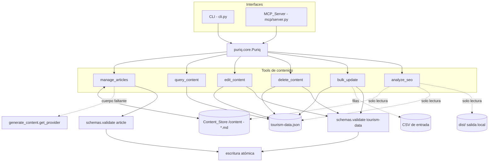
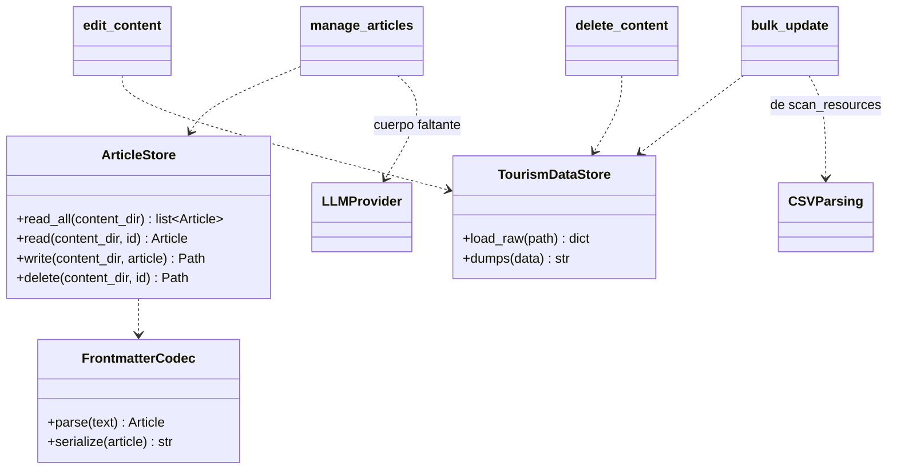

# Documento de Diseño

## Overview

Este diseño describe un conjunto de **tools de gestión de contenido** que amplían Puriq para dar a un usuario avanzado —desde cualquier cliente MCP o desde el CLI— control CRUD sobre un proyecto turístico existente: artículos de blog (`manage_articles`), consulta de Places/Events (`query_content`), edición (`edit_content`), eliminación con integridad referencial (`delete_content`), actualización masiva desde CSV (`bulk_update`) y análisis SEO local (`analyze_seo`).

La premisa central es que estas tools son una **capa fina**, idéntica en forma a las tools actuales de Puriq (`scan_resources`, `generate_content`, `geocode`, `build_site`, `deploy`). Viven en `agent/puriq/tools/`, se cablean en `puriq.core.Puriq` y se exponen **tanto por el MCP_Server** (`agent/puriq/mcp/server.py`) **como por el CLI** (`agent/puriq/cli.py`) sin duplicar lógica: el CLI, el MCP y cualquier agente MCP invocan la **misma función subyacente**.

Invariantes de arquitectura que este diseño respeta de forma estricta (heredadas del proyecto y del spec `agent-tools`):

1. **El agente compone y configura; nunca genera código de módulos.** Estas tools operan sobre datos del contrato y sobre archivos markdown de contenido; jamás escriben componentes de la Template.
2. **El LLM solo toca contenido.** En `manage_articles`, el LLM_Provider únicamente redacta el **cuerpo** del artículo cuando el usuario no lo aporta. No se añade una nueva superficie de LLM: se reutiliza la abstracción `get_provider()` de `generate_content`.
3. **El contrato son documentos validados contra `schemas/` en cada mutación.** Toda tool que transforme `tourism-data.json` o persista un Article lo valida con `puriq.schemas` (o el nuevo `article.schema.json`) **antes** de escribir. Una operación inválida se rechaza sin escritura parcial y produce un error accionable que nombra el documento/campo.
4. **Edición intencional sin pisar datos.** Las ediciones son **merge a nivel de campo**: solo tocan los campos indicados y preservan el resto.
5. **Local, un solo usuario, sitio estático.** Sin base de datos, sin analítica, sin autenticación. Las tools operan sobre los archivos del proyecto en la máquina del usuario.
6. **Ids y nombres de archivo derivados con `slugify`** (`puriq/tools/_slug.py`), cumpliendo `^[a-z0-9-]+$`.
7. **Secretos enmascarados** con `config.redact` en toda salida y error.
8. **`analyze_seo` es de solo lectura**: nunca muta contenido y analiza únicamente la salida/contenido local (nunca una URL publicada en vivo).

Alcance mapeado a requisitos: Req 1–5 (`manage_articles` + `article.schema.json`), Req 6 (`query_content`), Req 7 (`edit_content`), Req 8 (`delete_content`), Req 9 (`bulk_update`), Req 10 (`analyze_seo`), Req 11 (MCP + CLI), Req 12 (transversal).

### Investigación y hallazgos que informan el diseño

- **No existe un modelo formal de Article.** Hoy el "blog" son archivos markdown sueltos bajo `/content` sin metadatos estructurados. Este spec introduce `schemas/article.schema.json` para el frontmatter, siguiendo el mismo patrón que los tres esquemas existentes (`tourism-data`, `site-config`, `theme-tokens`), todos cargados/validados por `puriq.schemas`. El módulo `schemas.py` centraliza `validate/load/dumps` contra `schemas/`; se extiende su tabla `_FILES` para incluir `article`.
- **`tourism-data.schema.json` fija `additionalProperties: false`** en la raíz y en `place`/`event`. Por eso `edit_content` y `bulk_update` solo pueden escribir campos del esquema: una edición que introduzca un campo desconocido es rechazada por la validación previa (Req 7.5, 9.7). Los `$defs/place` y `$defs/event` definen los campos y tipos válidos (p. ej. `coords` requerido en Place, `startDate` requerido en Event con `format: date`).
- **El parseo de CSV ya está resuelto** en `scan_resources.py` (`_read_csv` con `csv.DictReader` y `encoding="utf-8-sig"`, `_split_tags`, `_parse_coord` con error que nombra fila/columna, normalización de fila a Place/Event). `bulk_update` reutiliza estos patrones (DD-4) para no duplicar la lógica de normalización ni el reporte de errores de tipo (Req 9.5).
- **La abstracción de LLM ya existe** en `generate_content.get_provider()` (Bedrock/Ollama por `PURIQ_LLM_MODE`, con `complete(prompt) -> str`). `manage_articles` la reutiliza para el cuerpo del artículo (Req 2.2), sin introducir un nuevo proveedor (DD-3).
- **`slugify`** ya es utilidad compartida en `tools/_slug.py`. Se reutiliza para el `id` de Article (Req 1.2, 2.1) y para derivar ids en `bulk_update` (Req 9.4, 12.5).
- **No hay librería de frontmatter declarada** en `pyproject.toml`. Para no introducir dependencias nuevas, el parseo/serialización de frontmatter se implementa con un parser mínimo de bloque YAML plano delimitado por `---` (claves escalares y listas simples), suficiente para los campos del Article_Frontmatter (DD-2).

## Architecture

### Vista de las tools de gestión de contenido

Las tools se agrupan por el artefacto sobre el que operan: el **Content_Store** (`/content`, artículos markdown) y el **Tourism_Data** (`tourism-data.json`). Todas comparten el patrón "cargar → transformar en memoria → validar contra esquema → persistir de forma atómica".



### Capas y responsabilidades

- **CLI (`cli.py`)**: añade subcomandos finos (`articles`, `query`, `edit`, `delete`, `bulk-update`, `seo`) que delegan en el core; captura excepciones con el decorador `@manejar_errores` ya existente, que presenta mensajes descriptivos y enmascara secretos (Req 11.3, 12.4).
- **Core (`core.py`)**: añade métodos que orquestan cada tool sobre el `project` (p. ej. `create_article`, `list_articles`, `edit_article`, `delete_article`, `query`, `edit`, `delete`, `bulk_update`, `analyze_seo`). Es el punto único que comparten CLI y MCP (Req 11.2, 11.3).
- **Tools (`tools/*.py`)**: cada tool hace una cosa y contiene la lógica pura. La lógica no se duplica entre interfaces.
- **Schemas (`schemas.py` + `schemas/`)**: única fuente de validación; se extiende con `article` (Req 1.5, 12.1).
- **MCP (`mcp/server.py`)**: se añaden entradas a `TOOL_SPECS` y sus handlers de delegación, siguiendo el patrón existente (delegación + `redact` de errores).

### Reutilización sin duplicación (Req 11.2, 11.3)



### Decisiones de diseño

#### DD-1: La colección de artículos se deriva escaneando `/content` (sin índice separado)

**Contexto:** Para listar y filtrar artículos (Req 3) hay dos opciones: (a) escanear el Content_Store leyendo el frontmatter de cada `.md`, o (b) mantener un índice JSON (`content/index.json`) que replique los metadatos.

**Decisión:** Derivar la colección **escaneando** `/content` y parseando el Article_Frontmatter de cada archivo markdown (Req 1.4). No se mantiene un índice separado.

**Justificación:** Evita una **segunda fuente de verdad**. Con un índice, cada creación/edición/eliminación debería actualizar dos artefactos y podrían desincronizarse (p. ej. un usuario edita un `.md` a mano y el índice queda obsoleto). El escaneo es siempre consistente con los archivos reales, alineado con la invariante "editar a mano y reconstruir" del proyecto. El propio `build_site`/Template ya consume `/content` directamente.

**Tradeoff (declarado):** El listado es O(n) en número de artículos y hace E/S por archivo en cada consulta. Para un blog local de un solo usuario (decenas a cientos de artículos) el costo es despreciable. Si en el futuro el volumen creciera, se podría añadir un índice como **caché derivada** (nunca como fuente de verdad), reconstruible por escaneo. Se descarta ahora por YAGNI.

#### DD-2: Codec de frontmatter propio (sin dependencia nueva)

**Contexto:** El Article es markdown con frontmatter (`id`, `title`, `date`, `tags`, `category`, `summary`) + cuerpo. `pyproject.toml` no declara `python-frontmatter` ni `PyYAML`.

**Decisión:** Implementar un `FrontmatterCodec` mínimo en `manage_articles` (o `tools/_frontmatter.py`) que parsea/serializa un bloque delimitado por `---` con claves escalares (`id`, `title`, `date`, `category`, `summary`) y listas simples (`tags`), y devuelve/consume `(frontmatter: dict, body: str)`. No se añaden librerías nuevas.

**Justificación:** El conjunto de campos es cerrado y simple; un parser acotado cubre el caso sin arrastrar una dependencia. La corrección del par parse/serialize se garantiza con una **propiedad de round-trip** (ver Correctness Properties). Se descarta añadir `PyYAML` para no ampliar la superficie de dependencias por un formato controlado.

**Tradeoff:** El codec no soporta YAML arbitrario (anclas, mapas anidados, tipos exóticos). Es intencional: el Article_Frontmatter es un contrato acotado por `article.schema.json`; cualquier archivo fuera de ese contrato se reporta como error de esquema que nombra archivo y campo (Req 1.6).

#### DD-3: La creación de artículos reutiliza `generate_content.get_provider()`

**Decisión:** Cuando el usuario no aporta el cuerpo, `manage_articles` obtiene el proveedor con `generate_content.get_provider()` y llama `complete(prompt)` para redactar el `body` (Req 2.2). No se define un nuevo `LLMProvider` ni una nueva fábrica.

**Justificación:** Mantiene una sola política de selección/fallback de LLM (Bedrock/Ollama por `PURIQ_LLM_MODE`, DD-4 del spec `agent-tools`) y una sola superficie de LLM en el proyecto. El LLM sigue tocando **solo contenido** (invariante 2). Si el usuario aporta el cuerpo, se conserva sin invocar al LLM (Req 2.3).

#### DD-4: `bulk_update` reutiliza los patrones de parseo CSV de `scan_resources`

**Decisión:** El parseo de filas CSV (`_read_csv` con `csv.DictReader`, `_split_tags`, `_parse_coord` con error fila/columna, normalización de fila a Place/Event) se **reutiliza/extrae** de `scan_resources` en lugar de reimplementarse. Se factoriza a un helper compartido (`tools/_csv.py`) o se importa desde `scan_resources`.

**Justificación:** El formato de `places.csv`/`events.csv` ya está definido y probado; `bulk_update` debe fusionar con las **mismas** reglas de normalización de ids (`slugify`), tipos y reporte de errores (Req 9.4, 9.5), evitando divergencias entre "scan inicial" y "actualización masiva".

**Tradeoff:** Acopla `bulk_update` a los helpers de `scan_resources`. Se mitiga extrayendo los helpers a un módulo neutro compartido; ambas tools pasan a depender del módulo neutro, no una de la otra.

#### DD-5: Merge a nivel de campo como semántica común de edición/actualización

**Decisión:** `edit_content` (Req 7.1, 7.2), `manage_articles` edit (Req 4.1) y `bulk_update` (Req 9.2) comparten la semántica **merge de campos**: solo se sobrescriben los campos presentes en la solicitud/fila; los ausentes se preservan intactos. La regeneración del `id` nunca ocurre en una edición (Req 4.3).

**Justificación:** Unifica el comportamiento "editar sin pisar" en las tres tools y lo hace verificable con una sola familia de propiedades (preservación de campos no tocados). Evita el patrón destructivo de "reemplazar el objeto entero".

#### DD-6: Escritura atómica y validación-antes-de-escribir

**Decisión:** Toda mutación valida el documento resultante contra su esquema **antes** de tocar disco; si la validación falla, no se escribe nada (rechazo sin escritura parcial) y se reporta el campo que incumple (Req 7.5, 9.7, 12.1, 12.3). La escritura se hace de forma atómica (escribir a temporal + `os.replace`) para que un fallo a mitad de escritura no deje el archivo corrupto.

**Justificación:** Garantiza la invariante 3 y el criterio transversal Req 12.3 ("una operación rechazada deja el contenido persistido sin cambios") incluso ante errores de E/S.

## Components and Interfaces

Las firmas se expresan en Python (lenguaje del agente). Las funciones de tool son puras respecto de sus entradas salvo en las fronteras de E/S (disco, LLM), aisladas para permitir mocks.

### Article_Schema (Req 1)

Nuevo esquema `schemas/article.schema.json`, registrado en `puriq.schemas._FILES` como `"article"`. Valida el Article_Frontmatter (no el cuerpo markdown, que es texto libre).

```jsonc
// $defs conceptual del frontmatter
{
  "required": ["id", "title", "date"],
  "properties": {
    "id":       { "pattern": "^[a-z0-9-]+$" },
    "title":    { "type": "string", "minLength": 1 },
    "date":     { "type": "string", "format": "date" },   // YYYY-MM-DD
    "tags":     { "type": "array", "items": { "type": "string" } },
    "category": { "type": "string" },
    "summary":  { "type": "string" }
  },
  "additionalProperties": false
}
```

### FrontmatterCodec (Req 1, DD-2)

```python
def parse(text: str) -> tuple[dict, str]:
    """Divide un markdown en (frontmatter dict, body). Bloque delimitado por '---'."""

def serialize(frontmatter: dict, body: str) -> str:
    """Serializa (frontmatter, body) a markdown con bloque '---' al inicio."""
```

- Round-trip: `parse(serialize(fm, body))` reproduce `(fm, body)` (Property 1).
- Si el bloque frontmatter no puede parsearse o no cumple `article.schema.json`, se reporta un error que nombra el archivo y el campo (Req 1.6).

### Manage_Articles (Req 1–5)

```python
def create_article(content_dir: Path, *, title: str, body: str | None = None,
                   date: str | None = None, tags: list[str] | None = None,
                   category: str | None = None, summary: str | None = None) -> dict:
    """Crea un Article. Devuelve {'id', 'path'}."""

def list_articles(content_dir: Path, *, date_from: str | None = None,
                  date_to: str | None = None, tag: str | None = None,
                  category: str | None = None) -> list[dict]:
    """Lista/filtra artículos por frontmatter; ordena por date desc."""

def edit_article(content_dir: Path, *, id: str, **fields) -> dict:
    """Merge de campos sobre un Article existente. Devuelve {'id'}."""

def delete_article(content_dir: Path, *, id: str) -> dict:
    """Elimina el .md del Article. Devuelve {'id'}."""
```

Responsabilidades y reglas:

- **Modelo (Req 1):** cada Article es un `.md` en el Content_Store con frontmatter (`id`, `title`, `date`, `tags`, `category`, `summary`) + `body` (Req 1.1). `id` es un Slug `^[a-z0-9-]+$` (Req 1.2); `date` es `YYYY-MM-DD` (Req 1.3). El listado deriva la colección escaneando `/content` (Req 1.4, DD-1). Toda persistencia valida el frontmatter contra `article.schema.json` antes de escribir (Req 1.5); un frontmatter inválido reporta archivo + campo (Req 1.6).
- **Creación (Req 2):** `id = slugify(title)` (Req 2.1). Sin `body` -> se genera con `generate_content.get_provider().complete(prompt)` (Req 2.2, DD-3); con `body` -> se conserva (Req 2.3). Sin `date` -> fecha actual (Req 2.4). Si ya existe un Article con ese `id` -> error "ya existe", sin sobrescribir (Req 2.5). Título ausente/vacío -> error "título obligatorio" (Req 2.6). Éxito -> escribe el `.md` y devuelve `id` + ruta (Req 2.7).
- **Listado/filtrado (Req 3):** sin filtros -> todos con su frontmatter (Req 3.1). Filtro por rango de fechas -> `date` dentro del rango inclusive (Req 3.2). Por etiqueta -> `tags` contiene la etiqueta (Req 3.3). Por categoría -> `category` igual (Req 3.4). Varios filtros -> conjunción (Req 3.5). Sin coincidencias -> lista vacía, sin error (Req 3.6). Resultado ordenado por `date` descendente (Req 3.7).
- **Edición (Req 4):** merge de solo los campos indicados, preserva el resto (Req 4.1, DD-5). `id` inexistente -> error "no encontrado" (Req 4.2). Editar `title` **no** regenera el `id` (Req 4.3). Valida el frontmatter resultante antes de escribir (Req 4.4); si una edición vacía un campo obligatorio -> rechazo con el nombre del campo (Req 4.5). Éxito -> escribe y devuelve `id` (Req 4.6).
- **Eliminación (Req 5):** borra el `.md` correspondiente (Req 5.1). `id` inexistente -> error "no encontrado" (Req 5.2). Éxito -> devuelve el `id` eliminado (Req 5.3).

### Query_Content (Req 6)

```python
def query(data: dict, *, kind: str,  # "places" | "events"
          category: str | None = None, tag: str | None = None,
          name: str | None = None,
          date_from: str | None = None, date_to: str | None = None) -> list[dict]:
    """Filtra Places o Events de Tourism_Data. Solo lectura (no persiste)."""
```

- Places sin filtros -> todos los Places (Req 6.1); Events sin filtros -> todos los Events (Req 6.2).
- Filtro por categoría (Places) -> `category` igual (Req 6.3); por etiqueta (Places) -> `tags` contiene (Req 6.4).
- Búsqueda por nombre -> `name` contiene el texto, **sin distinguir mayúsculas/minúsculas** (Req 6.5).
- Rango de fechas (Events) -> `startDate` dentro del rango inclusive (Req 6.6).
- Varios filtros -> conjunción (Req 6.7). Sin coincidencias -> lista vacía, sin error (Req 6.8).

### Edit_Content (Req 7)

```python
def edit(data: dict, *, id: str, fields: dict) -> dict:
    """Merge de campos sobre un Place o Event por id. Devuelve el data mutado."""
```

- Place o Event con `id` existente -> actualiza solo los campos indicados, preserva el resto (Req 7.1, 7.2, DD-5).
- `id` inexistente en Places y Events -> error "no encontrado" (Req 7.3).
- Valida el `tourism-data` resultante contra `tourism-data.schema.json` antes de persistir (Req 7.4). Si no cumple -> rechaza, no escribe, reporta el campo que incumple (Req 7.5, DD-6).
- Éxito -> el core persiste `tourism-data.json` y la tool devuelve el `id` modificado (Req 7.6).

### Delete_Content (Req 8)

```python
def delete(data: dict, *, id: str) -> dict:
    """Elimina un Place o Event por id, manejando integridad referencial.
    Devuelve {'id', 'affectedEvents': [...]}."""
```

- Event con `id` existente -> lo elimina (Req 8.1); Place con `id` existente -> lo elimina (Req 8.2).
- `id` inexistente -> error "no encontrado" (Req 8.3).
- Si hay Events cuyo `placeId` referencia el Place a eliminar -> informa los Events afectados (Req 8.4) y, tras eliminar el Place, deja el `tourism-data` **sin** referencias `placeId` colgantes al Place eliminado (Req 8.5), limpiando el campo `placeId` de esos Events.
- Valida el resultado contra el esquema antes de persistir (Req 8.6). Éxito -> el core persiste y la tool devuelve el `id` eliminado (Req 8.7).

### Bulk_Update (Req 9)

```python
def bulk_update(data: dict, csv_path: Path, *, kind: str) -> dict:
    """Fusiona filas de un CSV de Places/Events en Tourism_Data por id.
    Devuelve {'added': int, 'updated': int, 'skipped': [...], 'data': dict}."""
```

- Fila con `id` inexistente -> agrega un nuevo elemento a partir de la fila (Req 9.1). Fila con `id` coincidente -> actualiza solo los campos presentes en la fila y preserva los ausentes (Req 9.2, DD-5). La misma regla de fusión por `id` aplica a Places y Events (Req 9.3).
- Fila sin `id` y sin `name` del que derivar un Slug -> se omite y se registra el número de fila (Req 9.4).
- Fila con valor inválido para un campo tipado (`lat`/`lng` no numérico, fecha mal formada) -> error que identifica número de fila y columna (Req 9.5), reutilizando `_parse_coord`/validación de fecha de los helpers CSV (DD-4).
- Valida el `tourism-data` resultante antes de persistir (Req 9.6); si no cumple -> no escribe y reporta el campo que incumple (Req 9.7). Éxito -> persiste y devuelve resumen con `added`/`updated` (Req 9.8).

### Analyze_SEO (Req 10)

```python
def analyze_seo(project: Path) -> dict:
    """Analiza contenido/salida local (tourism-data.json, /content, dist/).
    Solo lectura. Devuelve {'issues': [...], 'ok': bool}."""
```

- Analiza **contenido y salida generada localmente**, sin consultar ninguna URL en vivo (Req 10.1).
- Place/Event/Article sin meta descripción o sin resumen -> sugerencia que identifica el elemento y el campo faltante (Req 10.2).
- Contenido sin título adecuado -> sugerencia que identifica el elemento (Req 10.3).
- Imagen sin texto alternativo -> sugerencia que identifica imagen y elemento asociado (Req 10.4).
- Jerarquía de encabezados incorrecta en una página generada -> sugerencia que identifica la página (Req 10.5).
- Slug que no cumple `^[a-z0-9-]+$` o excede longitud recomendada -> sugerencia que identifica el elemento y el problema (Req 10.6).
- Sin problemas -> resultado que indica "sin problemas" (Req 10.7). En todos los casos, **no modifica** el contenido del proyecto (Req 10.8, invariante 8).

### MCP_Server y CLI (Req 11)

- **MCP:** se añaden a `TOOL_SPECS` las tools `manage_articles`, `query_content`, `edit_content`, `delete_content`, `bulk_update`, `analyze_seo` (Req 11.1) con su `inputSchema` acorde a la firma delegada (Req 11.4). Cada handler delega en la misma implementación del core que usa el CLI (Req 11.2). Un error se traduce a mensaje descriptivo enmascarado con `redact` (Req 11.5).
- **CLI:** se añaden subcomandos que delegan en los mismos métodos del core (Req 11.3), envueltos por `@manejar_errores` (mensajes descriptivos + `redact`).

### Consideraciones transversales (Req 12)

- Toda producción/transformación del contrato se valida contra su esquema antes de escribir (Req 12.1, DD-6).
- Operación de edición/eliminación con `id` inexistente -> rechazo con error "no encontrado" (Req 12.2).
- Operación rechazada por validación -> contenido persistido sin cambios (Req 12.3, escritura atómica DD-6).
- Valores de secretos excluidos de errores y salida vía `redact` (Req 12.4).
- Generación de `id`/nombre de archivo -> `slugify`, cumpliendo `^[a-z0-9-]+$` (Req 12.5).

## Data Models

### Modelo Article (nuevo)

Un Article es un archivo markdown en el Content_Store (`/content/<id>.md`) compuesto por:

- **Article_Frontmatter** (validado contra `schemas/article.schema.json`):
  - Requeridos: `id` (`^[a-z0-9-]+$`), `title` (no vacío), `date` (`YYYY-MM-DD`, `format: date`).
  - Opcionales: `tags` (lista de strings), `category` (string), `summary` (string).
  - `additionalProperties: false` (un campo desconocido invalida el frontmatter, Req 1.6).
- **`body`**: el cuerpo markdown tras el bloque frontmatter (texto libre; puede generarlo el LLM, Req 2.2).

Relación `id`/nombre de archivo: `id = slugify(title)` en la creación (Req 2.1); el nombre del archivo deriva del `id`. Editar el `title` **no** cambia el `id` ni el nombre del archivo (Req 4.3).

### Modelos Place y Event (existentes, `tourism-data.json`)

Se reutilizan tal cual los define `tourism-data.schema.json` (`$defs/place`, `$defs/event`):

- **Place** — Requeridos: `id` (`^[a-z0-9-]+$`), `name` (no vacío), `category`, `coords` (`{lat ∈ [-90,90], lng ∈ [-180,180], zoom?}`). Opcionales: `address`, `shortDescription`, `description`, `images`, `hours`, `tags`, `source` (`user|osm|wikidata`).
- **Event** — Requeridos: `id` (`^[a-z0-9-]+$`), `name` (no vacío), `startDate` (`format: date`). Opcionales: `endDate` (`format: date`), `placeId`, `description`, `images`, `recurring`.

**Invariante referencial (Req 8.5):** un `placeId` presente en un Event debe referenciar un `id` de Place existente. `delete_content`, al eliminar un Place, elimina el campo `placeId` de los Events que lo referenciaban para no dejar referencias colgantes.

**Restricción de edición (Req 7.5, 9.7):** como el esquema fija `additionalProperties: false` en `place`/`event`, `edit_content` y `bulk_update` solo pueden asignar campos definidos por el esquema; cualquier campo desconocido hace fallar la validación previa y se rechaza la operación sin escribir.

### Contrato de filas CSV (Bulk_Update)

Reutiliza el formato documentado en `scan_resources` (DD-4):

- **Places CSV:** `id?,name,category,address,lat,lng,short_description,hours,tags,image` (`tags` separadas por `;`; `lat`/`lng` numéricos). Si falta `id`, se deriva de `name` con `slugify`; si faltan ambos, la fila se omite y se registra su número (Req 9.4).
- **Events CSV:** `id?,name,start_date,end_date,place,description,recurring`. Fechas ISO `YYYY-MM-DD`; valor mal formado -> error con fila/columna (Req 9.5).

La fusión es por `id`: fila nueva -> alta; `id` existente -> merge de solo los campos presentes en la fila (Req 9.1–9.3, DD-5).

## Correctness Properties

*Una propiedad es una característica o comportamiento que debe cumplirse en todas las ejecuciones válidas de un sistema — esencialmente, una afirmación formal sobre lo que el sistema debe hacer. Las propiedades son el puente entre las especificaciones legibles por humanos y las garantías de corrección verificables por máquina.*

Estas propiedades se derivan del análisis de prework y de su reflexión de consolidación. Se eliminaron redundancias agrupando: (a) todos los filtros en "subconjunto correcto" + "conjunción = intersección"; (b) toda la validación-antes-de-escribir y el no-cambios ante rechazo en una sola propiedad transversal; (c) `id = slugify` en una sola propiedad; (d) merge de campos sobre Article/Place/Event/CSV en una familia; (e) no-fuga de secretos en una propiedad; (f) detección SEO en una propiedad de "sugerencias == elementos que violan la regla".

### Propiedad 1: Round-trip del codec de frontmatter

*Para todo* Article_Frontmatter válido y todo cuerpo markdown `body`, `parse(serialize(frontmatter, body))` reproduce el mismo `(frontmatter, body)`.

**Validates: Requirements 1.1**

### Propiedad 2: El id es un slug bien formado derivado del título

*Para todo* título de Article (y todo nombre del que una tool derive un identificador), el `id` generado es igual a `slugify(título)` y cumple el patrón `^[a-z0-9-]+$`.

**Validates: Requirements 1.2, 2.1, 12.5**

### Propiedad 3: La colección de artículos se recupera por escaneo (round-trip del store)

*Para todo* conjunto de artículos escritos en el Content_Store, `list_articles` sin filtros devuelve exactamente ese conjunto (por `id` y por los campos de frontmatter), derivándolo del escaneo de `/content`.

**Validates: Requirements 1.4, 3.1**

### Propiedad 4: Preservación del cuerpo aportado

*Para todo* Article creado con un `body` no vacío aportado por el usuario, el Article persistido contiene ese `body` sin modificarlo (y no se invoca al LLM_Provider).

**Validates: Requirements 2.3**

### Propiedad 5: Los filtros de artículos devuelven el subconjunto correcto

*Para todo* conjunto de artículos y todo filtro individual (rango de fechas, etiqueta o categoría), `list_articles` devuelve exactamente los artículos que satisfacen ese filtro: todos los devueltos lo cumplen y ningún artículo excluido lo cumple. El rango de fechas incluye los extremos.

**Validates: Requirements 3.2, 3.3, 3.4**

### Propiedad 6: Conjunción de filtros de artículos

*Para todo* conjunto de artículos y toda combinación de filtros, el resultado de `list_articles` es la intersección de los resultados de cada filtro individual (solo los artículos que satisfacen todos los filtros).

**Validates: Requirements 3.5**

### Propiedad 7: El listado de artículos está ordenado por fecha descendente

*Para todo* conjunto de artículos, la lista devuelta por `list_articles` está ordenada por `date` de forma descendente.

**Validates: Requirements 3.7**

### Propiedad 8: La edición preserva los campos no indicados (merge de campos)

*Para todo* elemento (Article, Place o Event) y todo subconjunto de campos válidos, aplicar una edición actualiza exactamente esos campos y deja el resto de los campos idénticos a su valor previo. En particular, editar el `title`/`name` no altera el `id`.

**Validates: Requirements 4.1, 4.3, 7.1, 7.2**

### Propiedad 9: Los filtros de Query_Content devuelven el subconjunto correcto

*Para todo* Tourism_Data y todo filtro individual sobre Places o Events (categoría, etiqueta, búsqueda por nombre sin distinguir mayúsculas/minúsculas, rango de fechas de `startDate` inclusive), `query` devuelve exactamente los elementos que satisfacen ese filtro; sin filtros devuelve todos los elementos del tipo consultado.

**Validates: Requirements 6.1, 6.2, 6.3, 6.4, 6.5, 6.6**

### Propiedad 10: Conjunción de filtros de Query_Content

*Para todo* Tourism_Data y toda combinación de filtros, el resultado de `query` es la intersección de los resultados de cada filtro individual.

**Validates: Requirements 6.7**

### Propiedad 11: La eliminación quita exactamente el elemento objetivo

*Para todo* Tourism_Data y todo `id` existente de Place o Event, `delete` produce un documento que no contiene ese `id` y conserva todos los demás elementos sin cambios.

**Validates: Requirements 5.1, 8.1, 8.2**

### Propiedad 12: Integridad referencial al eliminar un Place

*Para todo* Tourism_Data y todo Place eliminado, el documento resultante no contiene ningún Event con `placeId` igual al `id` eliminado, y el conjunto de Events afectados reportado es exactamente el de los Events que tenían `placeId` igual a ese `id`.

**Validates: Requirements 8.4, 8.5**

### Propiedad 13: La fusión CSV agrega los nuevos y actualiza por id preservando lo ausente

*Para todo* Tourism_Data y todo CSV de Places o Events, `bulk_update` agrega un nuevo elemento por cada fila con `id` inexistente y, para cada fila con `id` coincidente, actualiza solo los campos presentes en la fila y preserva los campos ausentes del elemento existente.

**Validates: Requirements 9.1, 9.2, 9.3**

### Propiedad 14: Las filas sin id ni name se omiten y se registran

*Para todo* CSV, cada fila que no incluye `id` ni un `name` del que derivar un Slug se omite de la fusión (no altera el Tourism_Data) y se reporta en el resumen con su número de fila.

**Validates: Requirements 9.4**

### Propiedad 15: El resumen de la fusión cuenta correctamente altas y actualizaciones

*Para todo* CSV válido, el resumen devuelto por `bulk_update` cumple que `added` es la cantidad de filas con `id` nuevo aplicadas y `updated` es la cantidad de filas con `id` existente aplicadas, y su suma es igual a la cantidad de filas procesadas (no omitidas).

**Validates: Requirements 9.8**

### Propiedad 16: Validación antes de escribir y no-cambios ante rechazo

*Para toda* mutación del contrato (crear/editar/eliminar artículos, editar/eliminar Places o Events, fusión masiva), la validación estricta contra el esquema correspondiente (`article.schema.json` o `tourism-data.schema.json`) ocurre **antes** de escribir; si el documento resultante no cumple el esquema, la operación se rechaza sin escritura parcial y el contenido persistido queda idéntico al estado previo.

**Validates: Requirements 1.5, 4.4, 7.4, 7.5, 8.6, 9.6, 9.7, 12.1, 12.3**

### Propiedad 17: Análisis SEO — las sugerencias corresponden exactamente a los defectos

*Para todo* contenido local, el conjunto de sugerencias de `analyze_seo` corresponde exactamente a los elementos que violan cada regla verificable: falta de meta descripción/resumen, falta de título adecuado, imágenes sin texto alternativo, y slugs que no cumplen `^[a-z0-9-]+$` o exceden la longitud recomendada. Todo elemento que viola una regla aparece con su sugerencia; ningún elemento conforme aparece.

**Validates: Requirements 10.2, 10.3, 10.4, 10.6**

### Propiedad 18: Análisis SEO — detección de jerarquía de encabezados

*Para todo* árbol de encabezados de una página generada, `analyze_seo` marca la página como problemática si y solo si la secuencia de niveles `hN` salta un nivel (p. ej. de `h1` a `h3` sin `h2`) o no comienza en `h1`.

**Validates: Requirements 10.5**

### Propiedad 19: El análisis SEO no muta el contenido

*Para todo* proyecto, el estado del Content_Store y de `tourism-data.json` tras ejecutar `analyze_seo` es idéntico al estado previo (análisis de solo lectura).

**Validates: Requirements 10.8**

### Propiedad 20: No exposición de secretos

*Para todo* error o salida producidos por las tools de gestión de contenido, el CLI o el MCP_Server, ningún valor de secreto configurado (credenciales AWS, etc.) aparece en el texto.

**Validates: Requirements 11.5, 12.4**

## Error Handling

- **Frontmatter inválido (Manage_Articles):** un `.md` cuyo Article_Frontmatter no puede parsearse o no cumple `article.schema.json` -> error que nombra el **archivo** y el **campo** que incumple (Req 1.6). Al persistir, el frontmatter se valida antes de escribir; si falla, no se escribe (Req 1.5).
- **Creación (Manage_Articles):** título ausente/vacío -> error "el título es obligatorio" (Req 2.6); `id` duplicado -> error "el artículo ya existe", sin sobrescribir el archivo existente (Req 2.5).
- **Elemento no encontrado (transversal):** una operación de edición o eliminación (`edit_article`, `delete_article`, `edit_content`, `delete_content`) con un `id` inexistente -> error "no encontrado", sin modificar el contenido persistido (Req 4.2, 5.2, 7.3, 8.3, 12.2).
- **Edición que invalida el contrato:** una edición de Article que vacía un campo obligatorio -> rechazo que nombra el campo (Req 4.5); una edición de Place/Event que produce un `tourism-data` inválido -> rechazo que identifica el campo que incumple, sin escribir (Req 7.5). En ambos casos el archivo persistido queda sin cambios (Req 12.3, escritura atómica DD-6).
- **Bulk_Update:** fila con valor tipado inválido (`lat`/`lng` no numérico, fecha mal formada) -> error que identifica número de fila y columna (Req 9.5), reutilizando `_parse_coord` y la validación de fecha de los helpers CSV (DD-4). Fila sin `id` ni `name` -> se omite y se registra su número (Req 9.4). Resultado de la fusión inválido contra el esquema -> no se escribe y se reporta el campo (Req 9.7).
- **Validación del contrato (transversal):** un `jsonschema.ValidationError` se traduce a un mensaje que indica el documento y el campo que incumple, antes de escribir (Req 12.1). El decorador `@manejar_errores` del CLI ya traduce `ValidationError` y `MissingCoordsError` a mensajes accionables; se reutiliza tal cual.
- **MCP:** cualquier error de tool se traduce a un mensaje descriptivo para el cliente, enmascarado con `redact` para no exponer secretos (Req 11.5), siguiendo el patrón ya implementado en `_call_tool`.
- **CLI (transversal):** todas las excepciones de tool se capturan en `@manejar_errores`, se presentan con `rich` (causa + acción sugerida) y se enmascaran con `config.redact` (Req 12.4).
- **Secretos (transversal):** ningún valor de secreto aparece en errores ni salida; `redact` se aplica en la frontera de presentación (CLI y MCP), consistente con las tools existentes (Req 11.5, 12.4).

## Testing Strategy

El diseño aísla las fronteras de E/S (disco, LLM) detrás de funciones/adaptadores para poder ejercitar la **lógica pura** con datos generados y proveedores mockeados. **Este documento no agrega tests; describe la estrategia para cuando se implementen.**

### Enfoque dual

- **Pruebas de propiedad (property-based):** validan las propiedades universales de la sección anterior sobre entradas generadas. Cubren la lógica pura: round-trip del codec de frontmatter (P1), `id = slugify` (P2), round-trip del store de artículos (P3), preservación del cuerpo (P4), filtros como subconjunto/intersección para artículos y para Query_Content (P5, P6, P9, P10), orden por fecha (P7), merge de campos (P8), eliminación e integridad referencial (P11, P12), fusión CSV y conteos (P13, P14, P15), validación-antes-de-escribir y no-cambios (P16), detección SEO y jerarquía de headings (P17, P18), no-mutación del análisis (P19) y no-fuga de secretos (P20).
- **Pruebas de ejemplo / edge-case (unit):** casos concretos y condiciones de error clasificados como EXAMPLE/EDGE_CASE en el prework: fecha por defecto al crear sin `date` (Req 2.4), `id` duplicado (Req 2.5), título vacío (Req 2.6), retorno de creación con `id`+ruta (Req 2.7), frontmatter inválido nombrando archivo/campo (Req 1.6), `id` inexistente en edición/eliminación (Req 4.2, 5.2, 7.3, 8.3, 12.2), edición que vacía un campo obligatorio (Req 4.5), listado/consulta sin coincidencias -> lista vacía (Req 3.6, 6.8), retornos de éxito (Req 4.6, 5.3, 7.6, 8.7), valor tipado inválido en CSV con fila/columna (Req 9.5), y resultado "sin problemas" del SEO (Req 10.7).
- **Pruebas de integración / smoke:** para fronteras externas o wiring donde el comportamiento no varía útilmente con la entrada — creación asistida por LLM con `provider` mockeado (Req 2.2), registro de las 6 tools en MCP (Req 11.1), delegación compartida CLI/MCP sobre el mismo callable del core (Req 11.2, 11.3), declaración de `inputSchema` acorde a la firma (Req 11.4) y verificación de que `analyze_seo` no realiza llamadas de red (Req 10.1). Se usan 1-3 ejemplos con mocks; no son property-based.

### Configuración de pruebas de propiedad

- Librería de property-based testing del ecosistema Python: **Hypothesis** (ya presente en el proyecto; no se implementa PBT desde cero).
- Mínimo **100 iteraciones** por prueba de propiedad.
- Cada prueba de propiedad referencia su propiedad del diseño con la etiqueta:
  `# Feature: content-management, Property {número}: {texto de la propiedad}`.
- Cada propiedad se implementa con **una sola** prueba de propiedad.
- El LLM_Provider se sustituye por un mock determinista para probar la lógica de creación (preservación del cuerpo, invocación condicional) sin costo ni no-determinismo del servicio externo.

### Trazabilidad

Cada propiedad declara los requisitos que valida mediante `**Validates: Requirements X.Y**`. En conjunto, las propiedades y las pruebas de ejemplo/integración cubren los 12 requisitos del documento aprobado.

## Mapeo de componentes a requisitos

| Componente / Artefacto | Requisitos que satisface |
| --- | --- |
| `schemas/article.schema.json` (Article_Schema) + registro en `schemas.py` | Req 1.1, 1.2, 1.3, 1.5, 1.6, 12.1 |
| `FrontmatterCodec` (parse/serialize, DD-2) | Req 1.1, 1.6 |
| `ArticleStore` (escaneo de `/content`, DD-1) | Req 1.4, 3.1, 5.1 |
| `manage_articles.create_article` | Req 2.1, 2.2, 2.3, 2.4, 2.5, 2.6, 2.7, 12.5 |
| `manage_articles.list_articles` | Req 3.1, 3.2, 3.3, 3.4, 3.5, 3.6, 3.7 |
| `manage_articles.edit_article` | Req 4.1, 4.2, 4.3, 4.4, 4.5, 4.6 |
| `manage_articles.delete_article` | Req 5.1, 5.2, 5.3 |
| `query_content.query` | Req 6.1, 6.2, 6.3, 6.4, 6.5, 6.6, 6.7, 6.8 |
| `edit_content.edit` (merge de campos, DD-5) | Req 7.1, 7.2, 7.3, 7.4, 7.5, 7.6 |
| `delete_content.delete` (integridad referencial) | Req 8.1, 8.2, 8.3, 8.4, 8.5, 8.6, 8.7 |
| `bulk_update.bulk_update` (parseo CSV compartido, DD-4) | Req 9.1, 9.2, 9.3, 9.4, 9.5, 9.6, 9.7, 9.8 |
| `analyze_seo.analyze_seo` (solo lectura) | Req 10.1, 10.2, 10.3, 10.4, 10.5, 10.6, 10.7, 10.8 |
| Métodos de `puriq.core.Puriq` (orquestación) | Req 11.2, 11.3 |
| Entradas en `mcp/server.py` `TOOL_SPECS` + handlers | Req 11.1, 11.2, 11.4, 11.5 |
| Subcomandos del CLI (`cli.py`) + `@manejar_errores` | Req 11.3, 12.4 |
| Validación-antes-de-escribir + escritura atómica (DD-6) | Req 12.1, 12.2, 12.3 |
| `config.redact` (frontera de presentación) | Req 11.5, 12.4 |
| `_slug.slugify` (utilidad compartida) | Req 1.2, 2.1, 12.5 |
