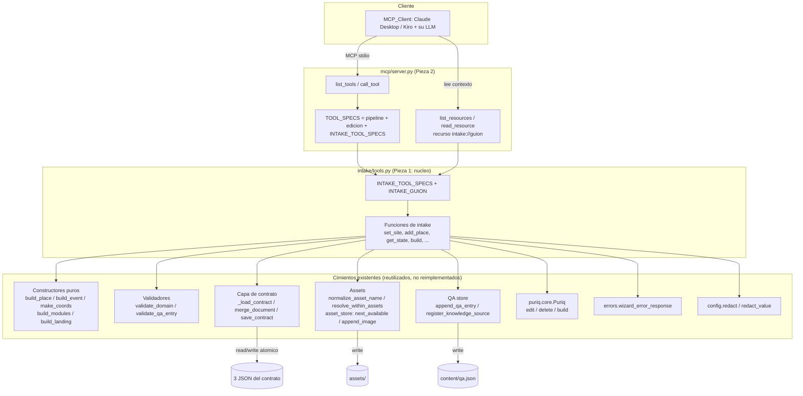
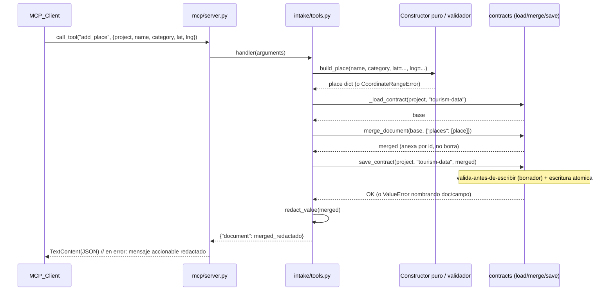

# Documento de Diseño

## Overview

Este diseño cubre el **Hito 1** de la capa conversacional de Puriq: las **Piezas 1 y 2** de
`docs/registro-conversacional.md`.

- **Pieza 1 — Intake tools (núcleo compartido):** un módulo nuevo `agent/puriq/intake/tools.py`
  que declara las acciones de registro (`set_site`, `configure_modules`, `add_place`, `add_event`,
  `edit_item`, `remove_item`, `set_brand`, `configure_landing`, `add_qa`, `attach_asset`,
  `get_state`, `build`) como **capa fina** sobre los cimientos que ya existen. Cada tool sigue el
  ciclo **validar → persistir con `save_contract` (borrador cuando aplica) → devolver el estado
  nuevo**, y no reimplementa lógica: envuelve los constructores puros, los validadores y la capa de
  contrato del wizard.
- **Pieza 2 — Exposición por MCP:** extender `agent/puriq/mcp/server.py` para registrar las intake
  tools en `list_tools`/`call_tool`, embebiendo el **guion** del intake en las descripciones de las
  tools y en un recurso MCP opcional, conservando intactas las tools de edición y de pipeline ya
  registradas.

El principio rector es el mismo que ya siguen el CLI y el MCP actual: **una sola implementación
compartida**. El MCP expone las intake tools a un cliente externo (Claude Desktop, Kiro) que aporta
su propio LLM y conduce la conversación; el mismo núcleo servirá luego al loop web (Pieza 3, fuera de
alcance). `get_state` es la pieza central del lazo conversacional: devuelve el estado del contrato y
una lista de **faltantes** que el LLM del cliente usa para decidir qué preguntar a continuación.

### Alcance

Dentro: el módulo `intake/tools.py`, su registro por MCP y el recurso del guion. Fuera (fases
posteriores, declarado en los requisitos): el loop web (`intake/agent.py`, `intake/prompt.py`), el
provider con tool-use/visión, la interpretación de imágenes/PDF, el canal `POST /api/chat` y el
estado de sesión. En esta fase `attach_asset` **solo guarda y asocia** el archivo; no lo interpreta.

## Investigación y hallazgos que informan el diseño

Antes de diseñar se leyó el código real que las intake tools deben envolver. Los hallazgos que
condicionan el diseño:

1. **El patrón MCP ya es data-driven.** `mcp/server.py` declara `TOOL_SPECS: list[dict]` donde cada
   entrada tiene `name`, `description`, `inputSchema` (JSON Schema **puro**, sin dependencia del SDK
   `mcp`) y un `handler` que recibe el dict `arguments` ya validado y delega en la implementación
   compartida. `_HANDLERS = {spec["name"]: spec["handler"]}` se deriva automáticamente, y
   `build_server()` registra `list_tools`/`call_tool` iterando `TOOL_SPECS`. Esto permite **extender
   sin tocar el motor**: basta con concatenar más specs a `TOOL_SPECS`.

2. **Las tools MCP orientadas a proyecto reciben `project` como argumento.** `build_site`, `deploy`,
   `edit_content`, `delete_content`, etc. reciben `arguments["project"]` (ruta) y delegan en
   `puriq.core.Puriq(project)`. Las intake tools adoptan la misma convención: cada una recibe
   `project` en sus argumentos, lo que las hace uniformes con las tools existentes y reutilizables por
   el loop web más adelante.

3. **El wizard REST ya implementa exactamente el ciclo de cada intake tool**, con el patrón
   *load → merge → save* (DD-1): `base = contracts._load_contract(project, doc)` →
   `merged = contracts.merge_document(base, patch)` → `contracts.save_contract(project, doc, merged)`.
   `_load_contract` usa carga **tolerante** para `tourism-data` (permite Places con solo `address`) y
   estricta para los otros dos; `save_contract` **valida antes de escribir** (borrador con `coords`
   opcional para `tourism-data`) y persiste de forma **atómica** (temp + `os.replace`). Los endpoints
   `put_site`, `add_place`, `add_event`, `put_site_config`, `put_theme_tokens`, `upload_asset`,
   `add_qa` son, en la práctica, las intake tools escritas para HTTP. El diseño **reusa esos mismos
   pasos**, no los reinventa.

4. **Los constructores y validadores puros existen y tienen firmas estables:**
   - `wizard/intake.py`: `make_coords(lat, lng, zoom=None)`, `build_place(name, category, *, lat, lng, zoom, address)`,
     `build_event(name, start_date, *, end_date, place_id, description, recurring)`; error tipado
     `CoordinateRangeError` (rango y "se requieren ambas coordenadas").
   - `wizard/modules.py`: `build_modules(selection: Iterable[Mapping])` → `{key: {enabled, order, label, ...}}`;
     `MODULE_CATALOG`, `DEFAULT_MODULE_LABELS`; error `ModuleCatalogError` (fuera de catálogo, repetido).
   - `wizard/landing.py`: `build_landing(selection)` → `list`; `LANDING_CATALOG`; error `LandingCatalogError`.
   - `wizard/validation.py`: `validate_domain`, `validate_qa_entry`, `validate_deploy_target`; errores
     `DomainError`, `QAValidationError`, `DeployTargetError`.
   - `wizard/assets.py`: `normalize_asset_name(filename, allowed_exts=IMAGE_EXTS)`,
     `resolve_within_assets(project, name)`, `IMAGE_EXTS`.
   - `tools/_slug.py`: `slugify(text)` (kebab-case ASCII, `^[a-z0-9-]+$`), ya usado por `build_place`/`build_event`.

5. **`Puriq.edit`/`Puriq.delete`/`Puriq.build` ya encapsulan la edición y el pipeline.**
   `Puriq(project).edit(id, fields)` carga tolerante, delega en `edit_content.edit` (que lanza
   `ValueError` "no encontrado" si el `id` no existe) y persiste como **borrador**.
   `Puriq(project).delete(id)` delega en `delete_content.delete` (integridad referencial: limpia
   `placeId` colgante) y devuelve `{"id", "affectedEvents"}`. `Puriq(project).build(use_llm=True)`
   corre geocode → validación estricta → generate → assemble y devuelve la ruta `dist/`. `edit_item`,
   `remove_item` y `build` **delegan directamente** en estos métodos.

6. **Errores y secretos ya tienen una única fuente de verdad.** `errors.wizard_error_response(exc, documento=None)`
   traduce cualquier excepción a `{causa, acción}` (o `{documento, campo, sugerencia}` para
   `jsonschema.ValidationError`) y **siempre** aplica `config.redact`. `config.redact(text)` enmascara
   valores de secretos. El `_call_tool` actual del MCP ya captura excepciones y aplica `redact`.

7. **Dos helpers de E/S del intake viven hoy dentro de `wizard/server.py`** (que importa FastAPI):
   `_append_image`, `_next_available_asset` (asset + asociación a `images`), `_append_qa_entry`,
   `_register_knowledge_source` (QA + `knowledgeSource`), y `_redact_value` (redacción recursiva).
   `intake/tools.py` **no puede** importar `wizard/server.py` sin arrastrar FastAPI y levantar la app.
   Además, `MAX_ASSET_BYTES` está declarado en `server.py`, no en el módulo puro `assets.py`. Esto
   obliga a una **relocalización** de esos helpers a módulos neutrales para poder compartirlos sin
   reimplementarlos (ver Decisiones de diseño DD-3 y DD-4).

## Architecture

El núcleo son las intake tools; el MCP es una de sus dos superficies (la otra, la web, es una fase
posterior). Las intake tools se apoyan enteramente en los cimientos existentes.



### Flujo de una intake tool de escritura (ciclo canónico)

Todas las tools de escritura comparten el mismo ciclo, idéntico al patrón DD-1 del wizard:



### Decisiones de diseño

- **DD-1 (registro data-driven, no invasivo).** Las intake tools se declaran como una lista
  `INTAKE_TOOL_SPECS` con la **misma forma** que `TOOL_SPECS` (name/description/inputSchema/handler).
  `mcp/server.py` construye `TOOL_SPECS = [*_PIPELINE_Y_EDICION_SPECS, *INTAKE_TOOL_SPECS]`. El motor
  (`list_tools`, `call_tool`, `_HANDLERS`, `_serialize`) **no cambia**, con lo que las tools existentes
  quedan registradas por construcción (Req 13.6). *Alternativa descartada:* declarar las tools con el
  SDK `mcp.types.Tool` dentro de `tools.py` — rompería la importación diferida del SDK que hoy permite
  inspeccionar los specs sin el extra `mcp` instalado.

- **DD-2 (funciones tipadas + adaptador de argumentos).** `intake/tools.py` expone una **función por
  acción** con argumentos explícitos y tipados (p. ej. `add_place(project, *, name, category, ...)`),
  y cada entrada de `INTAKE_TOOL_SPECS` lleva un `handler` que **adapta** el dict `arguments` a esa
  llamada. Así las funciones son limpias y testeables (aptas para PBT) y la superficie MCP queda como
  una fina capa de desempaquetado, reutilizable tal cual por el loop web.

- **DD-3 (relocalizar los helpers de asset a un módulo neutral).** Se crea `wizard/asset_store.py`
  (E/S, sin FastAPI) al que se **mueven** `next_available_asset(project, name)` y
  `append_image(project, entity_key, entity_id, rel_path)` desde `server.py`, y se **mueve**
  `MAX_ASSET_BYTES` desde `server.py` a `wizard/assets.py` (el módulo puro, junto a `IMAGE_EXTS`).
  `server.py` pasa a importarlos (refactor de reubicación, sin reescribir lógica). Con esto
  `intake/tools.py` reutiliza exactamente la misma implementación de asociación de imágenes y límite
  de tamaño sin acoplarse al servidor web (Req 1.2, 14).

- **DD-4 (relocalizar los helpers de QA y la redacción recursiva).** Se crea `wizard/qa_store.py`
  (E/S, sin FastAPI) al que se **mueven** `append_qa_entry(project, entry)` y
  `register_knowledge_source(project, rel_path)` desde `server.py`; y se **mueve** `_redact_value` a
  `config.py` como `redact_value(value)` (variante recursiva de `redact`, única fuente de verdad).
  `server.py` importa ambos. `intake/tools.py` reutiliza `qa_store` y `config.redact_value`.

- **DD-5 (traducción de errores en el borde del intake, para paridad entre superficies).** Cada
  función de intake **deja propagar** sus excepciones tipadas (`CoordinateRangeError`,
  `ModuleCatalogError`, `LandingCatalogError`, `DomainError`, `QAValidationError`, `ValueError`,
  `jsonschema.ValidationError`). El **despacho compartido** `run_intake_tool(name, arguments)` de
  `intake/tools.py` ejecuta el handler y, ante excepción, devuelve
  `wizard_error_response(exc, documento=<doc afectado>)` (ya redactado y accionable, Req 14.4, 14.5).
  En MCP, `call_tool` enruta las intake tools por `run_intake_tool`; para las tools existentes conserva
  su camino actual. La red de seguridad de `redact` del `call_tool` se mantiene como defensa en
  profundidad.

- **DD-6 (transporte del binario de `attach_asset` por MCP).** MCP transporta JSON, no binarios. Para
  esta fase `attach_asset` acepta **una de dos** fuentes en sus argumentos: `content_base64` (el
  binario codificado en base64, preferido y portable entre clientes) **o** `source_path` (ruta local
  legible por el servidor, útil cuando el cliente y el servidor comparten disco). El límite
  `MAX_ASSET_BYTES` se comprueba **sobre los bytes decodificados**, antes de tocar disco. Interpretar
  la imagen (visión, `alt`) queda explícitamente fuera de esta fase.

- **DD-7 (`get_state` como snapshot de solo lectura con faltantes).** `get_state` no muta el contrato:
  carga los tres documentos con `_load_contract` y computa `missing` comparando contra el
  **documento base** (`contracts._base_document`) para detectar marcadores por defecto (nombre/región
  vacíos, centro `0,0`, colores `#000000/#ffffff/#111111`, `modules` vacío, `places` vacío). Devuelve
  todo redactado con `config.redact_value`.

## Components and Interfaces

### 1. `agent/puriq/intake/__init__.py`

Paquete nuevo. Reexporta la superficie pública para importaciones cómodas:
`INTAKE_TOOL_SPECS`, `INTAKE_TOOL_NAMES`, `INTAKE_GUION`, `run_intake_tool`.

### 2. `agent/puriq/intake/tools.py` (Pieza 1)

Contiene: (a) las funciones de intake, (b) `INTAKE_TOOL_SPECS`, (c) `INTAKE_GUION`, (d) el despacho
`run_intake_tool`. Importa de los cimientos (nunca de `wizard/server.py`).

**Constantes y helpers internos**

```python
# Documentos del contrato (mismas claves que contracts._DOC_FILES).
_TOURISM = "tourism-data"; _CONFIG = "site-config"; _THEME = "theme-tokens"

# Colores marcadores por defecto del documento base (para detectar "marca sin definir", Req 2.6).
_DEFAULT_BRAND_COLORS = {"primary": "#000000", "background": "#ffffff", "text": "#111111"}

def _save(project, doc, patch) -> dict:
    """load -> merge -> save; devuelve el documento fusionado (sin redactar)."""
    base = contracts._load_contract(project, doc)
    merged = contracts.merge_document(base, patch)
    contracts.save_contract(project, doc, merged)
    return merged

def _state_response(merged: dict) -> dict:
    """Envuelve el documento afectado como estado redactado devuelto por una escritura."""
    return {"document": config.redact_value(merged)}
```

**Funciones de intake** (todas reciben `project: Path`; devuelven el estado resultante redactado):

| Función | Firma (kwargs relevantes) | Envuelve | Escribe / devuelve |
|---|---|---|---|
| `set_site` | `name, region, center_lat, center_lng, center_zoom=None, default_locale="es", domain=None, contact=None` | `make_coords` + `validate_domain` | `tourism-data.site` y (si aplica) `site-config.deploy.domain` / `site-config.contact` |
| `configure_modules` | `selection: list[dict]` | `build_modules` | `site-config.modules` |
| `add_place` | `name, category, lat=None, lng=None, zoom=None, address=None` | `build_place` | anexa a `tourism-data.places` (borrador si sin coords) |
| `add_event` | `name, start_date, end_date=None, place_id=None, description=None, recurring=None` | `build_event` | anexa a `tourism-data.events` |
| `edit_item` | `id, fields: dict` | `Puriq.edit` | edita Place/Event; devuelve estado |
| `remove_item` | `id` | `Puriq.delete` | elimina Place/Event (integridad ref.); devuelve estado |
| `set_brand` | `colors=None, typography=None, voice=None` | `save_contract` (validación hex del esquema) | `theme-tokens.colors/typography/voice` |
| `configure_landing` | `selection: list[dict]` | `build_landing` | `site-config.landing` |
| `add_qa` | `question, answer` | `validate_qa_entry` + `qa_store` | anexa a `content/qa.json`; registra `knowledgeSource` |
| `attach_asset` | `filename, content_base64=None, source_path=None, target, id` | `normalize_asset_name` + `resolve_within_assets` + `asset_store` | copia a `assets/`; asocia a Place/Event |
| `get_state` | — (solo `project`) | `_load_contract` ×3 | estado de los 3 docs + `missing` (solo lectura) |
| `build` | `use_llm=True` | `Puriq.build` | ruta de `dist/` |

Notas de comportamiento por función (cómo cada una honra sus requisitos):

- **`set_site`** (Req 3): construye el centro con `make_coords(center_lat, center_lng, center_zoom)`
  (rango validado → `CoordinateRangeError`, Req 3.6). Arma el parche
  `{"site": {name, region, defaultLocale, center}}` y lo guarda en `tourism-data`. Si viene `domain`,
  lo normaliza con `validate_domain` (formato inválido → `DomainError`, Req 3.4) y lo guarda en
  `site-config.deploy.domain`; si viene `contact`, en `site-config.contact` (Req 3.3, 3.5). Devuelve el
  estado (se puede devolver el `tourism-data` afectado; el `site-config` se persiste en el mismo
  llamado si hubo dominio/contacto).

- **`configure_modules` / `configure_landing`**: delegan en `build_modules` / `build_landing`
  (asignan `order ≥ 1` según el orden recibido; fuera de catálogo o repetido →
  `ModuleCatalogError`/`LandingCatalogError`, Req 4.2–4.4, 9.2–9.3) y guardan en `site-config`.

- **`add_place` / `add_event`**: delegan en `build_place`/`build_event` (id = `slugify(name)`,
  Req 5.1/6.1). El parche `{"places": [place]}` / `{"events": [event]}` se **anexa por id** vía
  `merge_document` sin borrar los existentes (Req 5.6, 6.3). `add_place` con solo `address` persiste
  como **borrador** (la validación relajada de `save_contract` no exige `coords`, Req 5.3); una sola
  coordenada o fuera de rango → `CoordinateRangeError` (Req 5.4, 5.5).

- **`edit_item` / `remove_item`**: delegan en `Puriq(project).edit(id, fields)` y
  `Puriq(project).delete(id)`. `id` inexistente → `ValueError` "no encontrado" (Req 7.3). `remove_item`
  hereda la integridad referencial de `delete_content` (limpia `placeId` colgante, Req 7.4) y devuelve
  `{"id", "affectedEvents"}` junto al estado.

- **`set_brand`**: arma el parche `theme-tokens` solo con lo provisto (`colors`, `typography`, `voice`)
  y guarda con `save_contract` **estricto**; un color no-hex es rechazado por el esquema y se traduce a
  mensaje con el formato esperado (Req 8.2). El `merge_document` conserva lo no tocado (Req 8.3, 8.4).

- **`add_qa`**: valida con `validate_qa_entry` (campo vacío → `QAValidationError` que lo nombra,
  Req 10.2), anexa con `qa_store.append_qa_entry` (sin borrar existentes, Req 10.3) y registra
  `content/qa.json` en `site-config.modules.chatweb.knowledgeSource` con
  `qa_store.register_knowledge_source`. Devuelve `{entry, knowledgeSource, document}`.

- **`attach_asset`** (Req 11, DD-6): obtiene los bytes de `content_base64` (decodificando) o de
  `source_path` (leyendo el archivo); comprueba `len(bytes) <= MAX_ASSET_BYTES` **antes** de escribir
  (Req 11.3); normaliza el nombre con `normalize_asset_name` (extensión no soportada →
  `ValueError` que lista formatos, Req 11.2); desambigua colisión con
  `asset_store.next_available_asset` y verifica contención con `resolve_within_assets` (Req 11.4);
  escribe los bytes; asocia con `asset_store.append_image(project, entity_key, id, rel_path)` que lanza
  `ValueError` "no encontrado" si el Place/Event no existe (Req 11.6). Devuelve `{path, document}`.

- **`get_state`** (Req 2, DD-7): carga los tres docs con `_load_contract` (sin mutar) y computa
  `missing` (ver Data Models). Devuelve `config.redact_value({...docs, "missing": [...]})`.

- **`build`**: delega en `Puriq(project).build(use_llm=use_llm)`; devuelve `{"dist": str(path)}`. Un
  contrato incompleto/ inválido propaga el error del pipeline (p. ej. `MissingCoordsError`,
  `ValidationError`), traducido por `wizard_error_response` sin exponer secretos (Req 12.3).

**`INTAKE_TOOL_SPECS` y `INTAKE_GUION`**

`INTAKE_TOOL_SPECS: list[dict]` declara cada tool con `name`, `description` (que **incluye el guion
por fases**, Req 13.4), `inputSchema` (JSON Schema puro coherente con la firma, Req 13.2) y `handler`
(adaptador `arguments → función`). `INTAKE_GUION: str` es el texto del guion del §5 (fases 1–9 y la
regla de "pedir archivos activamente"), embebido en las descripciones y servido como recurso MCP.

**`run_intake_tool(name, arguments) -> dict | str`** (DD-5): localiza el handler, lo ejecuta y traduce
excepciones con `wizard_error_response(exc, documento=...)`.

### 3. `agent/puriq/mcp/server.py` (Pieza 2)

Cambios mínimos y aditivos:

1. `from puriq.intake.tools import INTAKE_TOOL_SPECS, INTAKE_TOOL_NAMES, INTAKE_GUION, run_intake_tool`.
2. `TOOL_SPECS = [*_EXISTING_SPECS, *INTAKE_TOOL_SPECS]` (las 11 existentes primero; Req 13.1, 13.6).
   `_HANDLERS` se sigue derivando de `TOOL_SPECS` (incluye ya las intake).
3. En `_call_tool`: si `name in INTAKE_TOOL_NAMES`, ejecutar `run_intake_tool(name, arguments)` (que ya
   devuelve dict/estado o el error accionable redactado) y serializar con `_serialize`; en caso
   contrario, mantener el camino actual. El `except` genérico con `redact` permanece como red de
   seguridad.
4. **Recurso MCP del guion** (Req 13.5): registrar `@server.list_resources()` y
   `@server.read_resource()` que exponen un único recurso `intake://guion` (mimeType `text/markdown`)
   cuyo contenido es `INTAKE_GUION`, para que el cliente lo cargue como contexto. El SDK `mcp` se sigue
   importando de forma diferida dentro de `build_server()`.

### 4. `agent/puriq/wizard/asset_store.py` (nuevo, DD-3) y `agent/puriq/wizard/qa_store.py` (nuevo, DD-4)

Módulos de E/S sin FastAPI que **albergan** los helpers movidos desde `server.py`:

- `asset_store.next_available_asset(project, name) -> tuple[str, Path]`
- `asset_store.append_image(project, entity_key, entity_id, rel_path) -> dict`
- `qa_store.append_qa_entry(project, entry) -> str` (devuelve `content/qa.json`)
- `qa_store.register_knowledge_source(project, rel_path) -> dict`

`wizard/server.py` se actualiza para **importar** estos helpers (y `MAX_ASSET_BYTES` desde
`wizard/assets.py`, `redact_value` desde `config`) en vez de definirlos, preservando su comportamiento
actual sin duplicar lógica.

## Data Models

Los modelos de datos son los tres documentos del contrato (definidos por `schemas/`) más el QA store;
las intake tools **no introducen nuevos modelos persistidos**. Los modelos nuevos son de
**entrada/salida** de las tools.

### Entrada de las tools (JSON Schema en `inputSchema`)

Cada `inputSchema` incluye `project` (string, requerido) y `additionalProperties: false`, coherente
con las tools MCP existentes. Ejemplos representativos:

- `add_place`: `{project, name, category, lat?, lng?, zoom?, address?}`, requeridos `[project, name, category]`.
- `configure_modules`: `{project, selection: [{key, enabled?, label?, persona?, knowledgeSource?}]}`,
  requeridos `[project, selection]`; `key` con `enum` = `MODULE_CATALOG`.
- `configure_landing`: `{project, selection: [{type, enabled?, content?}]}`; `type` con `enum` = `LANDING_CATALOG`.
- `set_site`: `{project, name, region, center: {lat, lng, zoom?}, defaultLocale?, domain?, contact?}`.
- `attach_asset`: `{project, filename, content_base64?, source_path?, target: enum[place,event], id}`,
  requeridos `[project, filename, target, id]` (más exactamente uno de `content_base64`/`source_path`).
- `edit_item`: `{project, id, fields: object}`; `remove_item`: `{project, id}`.
- `add_qa`: `{project, question, answer}`.
- `get_state`: `{project}`; `build`: `{project, use_llm?}`.

### Salida de `get_state` (estado + faltantes)

```jsonc
{
  "tourism-data": { "site": {...}, "places": [...], "events": [...] },
  "site-config":  { "layout": "...", "modules": {...}, "landing": [...], "deploy": {...}, "contact": {...} },
  "theme-tokens": { "colors": {...}, "typography": {...}, "voice": {...}, "logo": "..." },
  "missing": [
    { "piece": "site",    "field": "name"    },   // Req 2.3: name | region | center ausente
    { "piece": "modules", "field": null       },   // Req 2.4: ningun modulo habilitado
    { "piece": "places",  "field": null       },   // Req 2.5: places vacio
    { "piece": "brand",   "field": "colors"    }    // Req 2.6: colores por defecto del doc base
  ]
}
```

Reglas de cómputo de `missing` (todo comparado contra `contracts._base_document`):

- **site** (Req 2.3): por cada uno de `name`, `region`, `center` que esté vacío/ausente o sea el
  marcador base (`name`/`region` == `""`, `center` == `{lat:0, lng:0}`), se añade una entrada
  nombrando el campo.
- **modules** (Req 2.4): si ningún módulo tiene `enabled: true`, se añade `{piece:"modules"}`.
- **places** (Req 2.5): si `places` está vacío, se añade `{piece:"places"}`.
- **brand** (Req 2.6): si `theme-tokens.colors` == `_DEFAULT_BRAND_COLORS`, se añade `{piece:"brand"}`.
- **completo** (Req 2.7): si ninguna regla dispara, `missing` es `[]`.

El resultado completo se pasa por `config.redact_value` antes de devolverse (Req 2.8).

### Salida de las tools de escritura

`{"document": <documento del contrato afectado, redactado>}`; `remove_item` añade `affectedEvents`;
`add_qa` devuelve `{entry, knowledgeSource, document}`; `attach_asset` devuelve `{path, document}`;
`build` devuelve `{"dist": "<ruta>"}`.

## Correctness Properties

*Una propiedad es una característica o comportamiento que debe cumplirse en todas las ejecuciones
válidas del sistema: esencialmente, un enunciado formal de lo que el sistema debe hacer. Las
propiedades son el puente entre las especificaciones legibles por humanos y las garantías de
corrección verificables por máquina.*

Estas propiedades se ejercitan sobre un **proyecto temporal** (directorio con los 3 JSON) generado
por el motor de PBT; el coste por iteración es bajo (E/S local en tmp), por lo que 100+ iteraciones
aportan cobertura real de casos borde (nombres unicode, listas grandes, colisiones de id, coordenadas
límite). Las propiedades sobre las funciones **puras** subyacentes (`build_modules`, `build_landing`,
`build_place`, `normalize_asset_name`, `resolve_within_assets`, `merge_document`) ya existen en sus
specs; aquí se prueban las propiedades del **nivel intake** (ciclo validar→persistir→devolver).

### Property 1: Una escritura exitosa devuelve el estado persistido

*Para toda* intake tool de escritura y toda entrada válida sobre un proyecto, el documento devuelto
por la tool es igual (salvo redacción) al documento del contrato cargado desde disco tras la
operación.

**Validates: Requirements 1.4, 3.1, 3.7, 4.5, 6.7, 8.5, 9.4**

### Property 2: Agregar preserva las entradas preexistentes (aditividad)

*Para todo* contrato con una colección de entradas (Places, Events o QA_Entries) y toda entrada nueva
válida, el resultado de agregarla contiene todas las entradas previas más la nueva, sin eliminar ni
reordenar las existentes.

**Validates: Requirements 5.6, 6.3, 10.3**

### Property 3: Un lugar con solo dirección se persiste como borrador sin inventar coordenadas

*Para todo* Place con `address` y sin coordenadas, `add_place` lo persiste correctamente y el
documento resultante en disco conserva la dirección y **no** contiene `coords` para ese Place.

**Validates: Requirements 1.5, 5.3**

### Property 4: `get_state` es de solo lectura

*Para todo* estado del contrato en disco, invocar `get_state` deja los tres archivos del contrato
byte a byte idénticos a como estaban antes de la invocación.

**Validates: Requirements 2.1**

### Property 5: `missing` refleja exactamente las piezas requeridas ausentes

*Para todo* contrato, una pieza requerida (identidad del sitio con su campo, selección de módulos,
carga de lugares, definición de marca) aparece en `missing` si y solo si está ausente o conserva su
marcador por defecto del documento base; y un contrato con todas las piezas requeridas produce
`missing` vacío.

**Validates: Requirements 2.2, 2.3, 2.4, 2.5, 2.6, 2.7**

### Property 6: Ningún valor de secreto aparece en la salida de una tool

*Para toda* invocación de intake tool (exitosa o con error) cuyo estado o mensaje contendría un valor
registrado como secreto, la respuesta devuelta no contiene el valor crudo del secreto.

**Validates: Requirements 2.8, 14.5**

### Property 7: Los id y nombres de archivo generados cumplen el patrón slug

*Para todo* nombre de Place/Event y todo nombre de archivo de asset soportado, el identificador o el
*stem* del nombre generado cumple el patrón `^[a-z0-9-]+$` y coincide con `slugify` de su fuente.

**Validates: Requirements 5.1, 6.1, 11.1, 14.6**

### Property 8: Una operación rechazada deja el contrato persistido sin cambios

*Para toda* intake tool de escritura y toda entrada que la tool rechaza (coordenada fuera de rango o
incompleta, módulo/sección fuera de catálogo o repetido, dominio o color inválido, campo de QA vacío,
formato o tamaño de imagen inválido, ruta que escapa de `assets/`, id inexistente, o validación de
esquema fallida), los tres archivos del contrato quedan byte a byte idénticos a como estaban antes de
la invocación.

**Validates: Requirements 3.4, 3.6, 4.3, 4.4, 5.4, 5.5, 8.2, 9.3, 10.2, 11.2, 11.3, 11.4, 11.6, 14.2, 14.3**

### Property 9: El `order` asignado es 1..n coherente con el orden de la selección

*Para toda* selección ordenada de módulos o de secciones de portada, el resultado asigna a cada
elemento un `order` entero mayor o igual a 1 estrictamente creciente y coherente con su posición en la
selección.

**Validates: Requirements 4.2, 9.2**

### Property 10: `edit_item` cambia solo los campos indicados y preserva el resto

*Para todo* Place o Event existente y todo subconjunto de campos, `edit_item` actualiza únicamente los
campos indicados, preserva los no indicados y nunca regenera el `id`.

**Validates: Requirements 7.1**

### Property 11: Operar sobre un id inexistente se rechaza como "no encontrado"

*Para todo* identificador que no corresponde a ningún Place ni Event, `edit_item`, `remove_item` y
`attach_asset` rechazan la operación con un error de "no encontrado" y no modifican el contrato.

**Validates: Requirements 7.3, 11.6**

### Property 12: Eliminar un lugar referenciado no deja referencias colgantes

*Para todo* contrato en el que uno o más Events referencian un Place por `placeId`, tras
`remove_item` de ese Place el contrato resultante no contiene ninguna referencia `placeId` que apunte
al Place eliminado.

**Validates: Requirements 7.4**

### Property 13: Asociar una imagen es aditivo e idempotente

*Para todo* Place o Event existente y toda imagen válida, tras `attach_asset` la lista `images` de la
entidad contiene la ruta relativa del asset; asociar la misma imagen dos veces no la duplica.

**Validates: Requirements 11.5**

### Property 14: Todo error se traduce a una respuesta accionable

*Para toda* entrada que provoca un error en una intake tool, `run_intake_tool` devuelve una respuesta
traducida y accionable (con causa y acción sugerida, o documento/campo/sugerencia para errores de
esquema), producida por `wizard_error_response`.

**Validates: Requirements 14.4**

## Error Handling

El manejo de errores reutiliza la única fuente de verdad del proyecto y no introduce mensajes nuevos
ad hoc.

- **Errores tipados de entrada.** Los constructores y validadores lanzan excepciones tipadas y
  accionables por sí mismas: `CoordinateRangeError` (rango o "se requieren ambas coordenadas"),
  `ModuleCatalogError`/`LandingCatalogError` (fuera de catálogo, repetido, listan el catálogo),
  `DomainError` (formato esperado), `QAValidationError` (campo vacío nombrado),
  `ValueError` "no encontrado" de `edit_content`/`delete_content`, y los `ValueError` de
  `normalize_asset_name`/`resolve_within_assets` (formatos aceptados / ruta fuera de `assets/`).

- **Errores de esquema.** `save_contract` valida antes de escribir y, ante incumplimiento, lanza un
  `ValueError` (envolviendo `jsonschema.ValidationError`) que nombra el documento y el campo, sin
  escribir nada (Req 14.1, 14.2). Un color no-hex, un `order` inválido o un campo requerido ausente se
  detectan aquí.

- **Atomicidad.** Como la validación ocurre antes del `os.replace`, un rechazo nunca deja el contrato a
  medias: los archivos quedan intactos (Property 8, Req 14.3).

- **Traducción y redacción (DD-5).** El despacho `run_intake_tool` captura cualquier excepción y la
  pasa por `errors.wizard_error_response(exc, documento=<doc afectado>)`, que devuelve
  `{causa, acción}` (o `{documento, campo, sugerencia}` para errores de esquema) y **siempre** aplica
  `config.redact`. Los estados devueltos por las tools de éxito pasan por `config.redact_value`. Así
  ningún valor de secreto (credenciales AWS, etc.) aparece en una respuesta (Req 14.5).

- **Borde MCP.** El `_call_tool` de `mcp/server.py` mantiene su `try/except` con `redact` como red de
  seguridad; para las intake tools el mensaje accionable ya proviene de `run_intake_tool`. Una tool
  desconocida devuelve `CallToolResult(isError=True)` con un mensaje descriptivo, como hoy.

- **`build`.** Un contrato incompleto propaga el error del pipeline (`MissingCoordsError`,
  `ValidationError`), traducido a un mensaje que identifica la causa sin exponer secretos (Req 12.3).

## Testing Strategy

Enfoque dual: pruebas de ejemplo/integración para el cableado y los casos concretos, y pruebas de
propiedad para las invariantes universales del nivel intake.

### Property-based testing

- **Librería.** Se usa **Hypothesis** (Python), ya presente en el proyecto (existe `agent/.hypothesis/`).
  No se implementa PBT desde cero.
- **Configuración.** Cada prueba de propiedad corre un **mínimo de 100 iteraciones**
  (`@settings(max_examples=100)` o superior).
- **Generadores.** Estrategias para: nombres unicode y con espacios (para ejercitar `slugify`),
  coordenadas dentro y fuera de rango, selecciones ordenadas de módulos/secciones (incluyendo claves
  fuera de catálogo y repetidas), colores hex válidos e inválidos, entradas de QA con y sin espacios,
  nombres de archivo con extensiones soportadas y no soportadas, tamaños de payload alrededor de
  `MAX_ASSET_BYTES`, y contratos parciales/completos para `get_state`. Cada propiedad opera sobre un
  **directorio de proyecto temporal** (fixture `tmp_path`) para aislar la E/S.
- **Mapa propiedad → prueba.** Cada una de las 14 propiedades se implementa con **una sola** prueba de
  propiedad.
- **Etiquetado.** Cada prueba lleva un comentario con el formato:
  `# Feature: conversational-intake-mcp, Property {N}: {texto de la propiedad}`.

### Pruebas de ejemplo y de integración

- **Ejemplos (unit):** delegación a los constructores puros (Req 1.2, 1.3), `set_brand` escribe/lee
  colores (8.1), calidad de mensajes de error específicos (rango, formato, campo, "no encontrado") como
  complemento a las propiedades de rechazo, y el caso de fallo de `build` con mensaje accionable
  (12.3).
- **Registro MCP (smoke):** `list_tools` incluye las 12 intake tools (13.1) y conserva las 11
  existentes (13.6); cada spec declara un `inputSchema` de objeto con `project` (13.2); las
  descripciones contienen el guion (13.4); `read_resource("intake://guion")` devuelve `INTAKE_GUION`
  (13.5); `call_tool` de una intake tool enruta por `run_intake_tool` (13.3).
- **Integración de `build` (1–2 ejemplos):** sobre un contrato completo en un proyecto temporal,
  `build` delega en `Puriq.build` y devuelve la ruta `dist/` (12.1, 12.2). Se marca como integración
  porque depende del ensamblado Astro y de geocode, cuyo comportamiento no varía de forma útil con la
  entrada.

### Balance

Las pruebas de propiedad cubren las invariantes universales (aditividad, atomicidad ante rechazo,
redacción, cómputo de faltantes, integridad referencial, patrón de id). Las pruebas de ejemplo se
reservan para casos concretos, integración y calidad de mensajes; se evita multiplicar ejemplos donde
una propiedad ya cubre el espacio de entradas.
