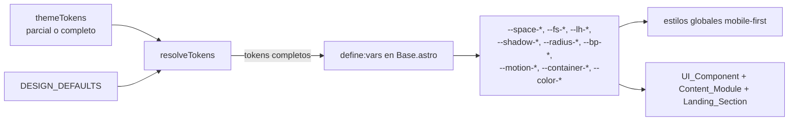

# Documento de Diseño

## Overview

Este diseño cubre dos objetivos acoplados que se entregan como una sola funcionalidad sobre la Template Astro de Puriq: (1) un **Design_System** guiado por datos —escala de espaciado, escala tipográfica, sombras, radios, breakpoints, motion, anchos de contenedor, una biblioteca de UI_Component reutilizables, responsive mobile-first, micro-motion y dos Layout_Variant (`clasico`/`moderno`) genuinamente distintas— y (2) un **Landing_Module** de portada componible (Hero enriquecido, Features, CTA, Galería, Stats) que el usuario activa, ordena y edita desde el Wizard y cuyo copy redacta el LLM.

Ambos objetivos comparten un principio rector: **todo se deriva de los tres documentos del Contrato validados contra `schemas/`**, sin marca ni contenido hardcodeado. La marca fluye desde `theme.tokens.json` a variables CSS (como ya hace `Base.astro` con `define:vars`); la estructura de portada vive en `site.config.json`; y el copy vive donde el LLM lo redacta sin pisar lo existente.

Invariantes de arquitectura que este diseño respeta de forma estricta:

1. **El agente compone y configura módulos/secciones pre-construidos; nunca genera su código.** El `Landing_Module` y sus secciones son componentes Astro versionados en la Template; el agente y el Wizard solo escriben datos (`site.config.json`) que activan/ordenan/rellenan esas secciones (Req 10, 14.6, cross-cutting).
2. **El LLM solo toca contenido/config.** `generate_content` redacta el copy de las secciones activas con campos vacíos dentro de `site.config.json`; jamás produce código de secciones ni de build (Req 15).
3. **El Contrato son 3 JSON validados contra `schemas/` antes de cada escritura o build.** Toda tool o endpoint que produzca o transforme un documento lo valida antes de persistirlo o usarlo (Req 1.5, 13.3, 15.5, cross-cutting).
4. **Edición en capas sin pisar datos del usuario.** Los tokens ausentes se completan con defaults del Design_System; el copy no vacío se conserva; las secciones se fusionan de forma aditiva (Req 1.4, 15.2, 16).
5. **Retrocompatibilidad total.** Con `landing` y los tokens ampliados ausentes, presentes de forma parcial o completos, el build siempre produce un sitio válido y nunca falla (Req 16).
6. **La Template es data-driven y ya expone tokens vía `define:vars`.** Este diseño amplía el conjunto de variables CSS y añade una capa de defaults, sin cambiar el mecanismo (Req 2).

Alcance mapeado a requisitos: Req 1–3 (tokens ampliados y su aplicación), Req 4 (UI_Component), Req 5 (responsive), Req 6 (motion), Req 7 (Layout_Variant), Req 8 (accesibilidad), Req 9 (uplift de Content_Module), Req 10–12 (composición y catálogo de Landing_Section), Req 13 (persistencia/validación en Site_Config), Req 14 (Wizard), Req 15 (copy con LLM), Req 16 (retrocompatibilidad y defaults).

**Fuera de alcance (declarado):** editor libre de layout/CSS, panel de administración, i18n avanzado, marketplace de plantillas y la lógica interna del chatbot RAG (solo su uplift visual). La composición de portada se limita a las cinco secciones enumeradas.

### Investigación y hallazgos que informan el diseño

- **`Base.astro` ya aplica tokens con `define:vars`** pero solo colores, tipografías y `radius`; los estilos globales (`header`, `main`, `h1..h3`) traen valores fijos (`1080px`, paddings en `rem`, color `#fff` del header). Para cumplir Req 2 sin romper la retrocompatibilidad, el diseño **amplía el conjunto de variables CSS** y **elimina los valores fijos de marca**, derivándolos de tokens con defaults. El mecanismo (`define:vars`) no cambia.
- **`theme-tokens.schema.json` fija `additionalProperties: false`** en la raíz. Añadir tokens ampliados **requiere** declararlos como propiedades opcionales del esquema; de lo contrario un documento con `spacing`/`typeScale`/etc. sería rechazado por la validación. Todas las propiedades nuevas se declaran **opcionales**, por lo que los documentos existentes siguen siendo válidos (Req 1, 16.2).
- **`site-config.schema.json` fija `additionalProperties: false`** en la raíz y ya define un `hero` heredado con forma `{type, asset, headline, subheadline}` (ver el `site.config.json` de ejemplo). La propiedad `landing` se añade como **array opcional**; el `hero` heredado se conserva para retrocompatibilidad y se mapea a un `Hero_Section` cuando no hay uno en `landing` (Req 13.5, 16.4).
- **`build_site._theme_to_css` y `_write_contract`** ya materializan tokens a CSS y validan los 3 documentos antes del build. El diseño **extiende `_theme_to_css`** para emitir las nuevas variables (con defaults) y se apoya en la validación existente (Req 5.6, 13.3).
- **`generate_content.enrich(data, voice)`** ya implementa el patrón de completar-solo-lo-faltante con `_safe_complete` (tolerancia por ítem, Req 15.4), `get_provider()` (proveedor pluggable, DD-4 de agent-tools) y `voice.tone` en el prompt. El copy de landing reutiliza exactamente este patrón, operando sobre `site.config.json` en vez de `tourism-data.json`.
- **El Wizard** ya usa el patrón `load → merge → validate → save` (`contracts.merge_document`/`save_contract`) y expone `PUT /api/site-config`. El paso de portada reutiliza esta infraestructura; `merge_document` es puro y no destructivo, lo que preserva secciones/copy no tocados (Req 14.3, 14.5).
- **Los Content_Module actuales traen estilos inline hardcodeados** (`#eee`, `#fff`, `12px`, grids con `minmax(240px,1fr)`). El uplift (Req 9) los reescribe para consumir UI_Component y variables CSS **sin cambiar sus datos de entrada ni su comportamiento** (`Map.astro` sigue usando Leaflet igual, `Blog.astro` sigue leyendo la Content Collection, `Chat.astro` conserva su recuperación client-side).

## Architecture

### Vista de capas del Design_System y el Landing_Module

El Design_System se materializa en la Template en tres capas: **defaults** (valores del sistema), **tokens** (marca del usuario) y **CSS variables + estilos globales/componentes** (render). El Landing_Module es una capa de composición que se sienta sobre los Content_Module en `index.astro`.

```mermaid
flowchart TD
    subgraph Contrato["Contrato (3 JSON validados contra schemas/)"]
        THM[(theme.tokens.json<br/>tokens ampliados opcionales)]
        CFG[(site.config.json<br/>landing[] + hero heredado)]
        TD[(tourism-data.json)]
    end

    subgraph Template["Template Astro (componentes pre-construidos)"]
        DEF[design-system/defaults.ts<br/>defaults del Design_System]
        MERGE[resolveTokens: merge defaults + tokens]
        BASE[Base.astro<br/>define:vars + estilos globales + Layout_Variant]
        UI[UI_Component: Container/Section/Button/Card/Grid]
        LM[Landing_Module: index compone secciones]
        REG[section registry: hero/features/cta/gallery/stats]
        CM[Content_Module: map/places/events/blog/chatweb]
    end

    THM --> MERGE
    DEF --> MERGE
    MERGE -->|CSS variables| BASE
    BASE --> UI
    CFG -->|resolveLanding| LM
    LM --> REG
    REG -->|reusa| UI
    LM --> CM
    CM -->|reusa| UI
    TD --> CM

    BUILD[build_site.assemble] -->|valida + escribe + theme.css| Template
    GEN[generate_content.enrich_landing] -->|copy en landing| CFG
    WIZ[Wizard: paso portada] -->|load-merge-save| CFG
```

### Flujo de tokens: de datos a CSS (Req 2, 3, 6)

El punto crítico de retrocompatibilidad es que **ningún token ampliado es obligatorio**. La Template define un módulo de **defaults** del Design_System y una función pura `resolveTokens(themeTokens)` que fusiona los defaults con lo que el usuario definió. `Base.astro` consume el resultado y lo expone como variables CSS con `define:vars`.



`resolveTokens` es **idempotente**: fusionar dos veces con los defaults produce el mismo resultado, porque los valores del usuario ya presentes nunca se sobreescriben y los ausentes se rellenan una sola vez con el default (Req 1.4, 16.2). Esta misma lógica se replica en Python (`build_site._theme_to_css`) para materializar `src/data/theme.css`, garantizando el mismo conjunto de variables tanto por `define:vars` como por el artefacto CSS.

### Flujo de composición de la portada (Req 10, 13.5, 16.4)

`index.astro` deja de renderizar un hero trivial inline y pasa a delegar en el Landing_Module, que resuelve las secciones a partir de `site.config.json` mediante una función pura `resolveLanding(siteConfig)`.

```mermaid
flowchart TD
    CFG[siteConfig] --> RL[resolveLanding]
    RL --> LEGACY{¿hay landing[]?}
    LEGACY -->|no, solo hero heredado| MAPHERO[mapear hero heredado<br/>a un Hero_Section]
    LEGACY -->|sí| FILTER[filtrar enabled + tipos soportados +<br/>contenido no vacío]
    MAPHERO --> ORDER
    FILTER --> PRECED{¿landing tiene hero<br/>Y existe hero heredado?}
    PRECED -->|sí| USELANDING[landing.hero gana; se ignora el heredado]
    PRECED -->|no| KEEP[conservar secciones tal cual]
    USELANDING --> ORDER[ordenar por order asc]
    KEEP --> ORDER
    ORDER --> RENDER[render de cada Landing_Section<br/>vía section registry]
    RENDER --> MODS[Content_Module activos debajo]
```

`resolveLanding` devuelve una lista ordenada y saneada de secciones a renderizar; el render itera esa lista contra un **section registry** (`type -> componente Astro`), omitiendo con gracia cualquier tipo no soportado o sección sin contenido, sin interrumpir el resto (Req 10.5, 12.5).

### Decisiones de diseño

#### DD-1: Los defaults del Design_System viven en un módulo de la Template y se fusionan con los tokens

**Contexto:** Los tokens ampliados (spacing, typeScale, shadows, radii, breakpoints, motion, container) son opcionales (Req 1). Un `theme.tokens.json` existente (o mínimo) puede omitir todos o algunos. El build no debe fallar y el sitio debe verse bien con valores por defecto sensatos (Req 1.4, 16.2, 16.5).

**Decisión:** Definir un módulo `template/src/design-system/defaults.ts` (`DESIGN_DEFAULTS`) con el conjunto completo de tokens del Design_System, y una función pura `resolveTokens(themeTokens) -> tokens completos` que fusiona `DESIGN_DEFAULTS` con el `themeTokens` del usuario **sin pisar** lo que el usuario definió. `Base.astro` llama `resolveTokens(themeTokens)` y expone el resultado como variables CSS con `define:vars`. La misma tabla de defaults se replica en Python dentro de `build_site` para el artefacto `theme.css`, con una sola fuente conceptual de verdad documentada.

**Justificación:** Centraliza los valores por defecto en un único lugar de la Template (donde vive el Design_System), mantiene el mecanismo `define:vars` existente y hace que "token ausente ⇒ default aplicado" sea una propiedad verificable (Property 1) e idempotente (Property 2). No añade dependencias.

**Alternativas descartadas:** (a) Hardcodear defaults dispersos en cada componente CSS — rechazada: viola "sin marca fijada en código" de forma difusa y duplica valores. (b) Exigir todos los tokens en el esquema — rechazada: rompe retrocompatibilidad (Req 16.2) y contradice que sean opcionales (Req 1).

#### DD-2: Los tokens ampliados se añaden como propiedades opcionales al esquema (aditivo, retrocompatible)

**Contexto:** `theme-tokens.schema.json` fija `additionalProperties: false`. Sin declarar los tokens nuevos, un documento que los incluya sería rechazado por `schemas.validate` (Req 1.6), bloqueando el build.

**Decisión:** Extender `theme-tokens.schema.json` con las propiedades **opcionales** `spacing`, `typeScale`, `shadows`, `radii`, `breakpoints`, `motion` y `container`, cada una con su forma y tipos (ver Data Models). Ninguna se añade a `required`. Un valor con tipo/formato inválido se rechaza nombrando el token (Req 1.6). Los documentos previos que omiten todo siguen validando (Req 16.2).

**Justificación:** Es el cambio mínimo que habilita los tokens sin romper el contrato ni los proyectos existentes. Mantener `additionalProperties: false` preserva la detección de typos y campos espurios.

**Alternativas descartadas:** relajar `additionalProperties` a `true` — rechazada: perdería la validación estricta que detecta errores de tipeo del usuario.

#### DD-3: `landing` es un array opcional de secciones en Site_Config; el hero heredado tiene precedencia mínima

**Contexto:** La portada debe ser componible y ordenable (Req 10), persistirse en `Site_Config` (Req 13) y ser retrocompatible con proyectos que solo tienen el `hero` heredado (Req 13.5, 16.4).

**Decisión:** Añadir a `site-config.schema.json` una propiedad **opcional** `landing`: un array de `Landing_Section`, cada una con `type` (enum `hero|features|cta|gallery|stats`), `enabled` (bool), `order` (entero ≥ 1) y `content` (objeto con los campos por tipo). El `hero` heredado se conserva en el esquema. La regla de precedencia, implementada en `resolveLanding` y respetada por `Build_Site`, es:

- Si `landing` **no** existe pero sí el `hero` heredado ⇒ se sintetiza un `Hero_Section` a partir del `hero` heredado (Req 16.4).
- Si `landing` contiene un `Hero_Section` **y** además existe el `hero` heredado ⇒ **gana `landing`** y se ignora el heredado (Req 13.5).
- Si `landing` existe sin sección `hero` ⇒ se usa tal cual (no se sintetiza hero heredado, para respetar la intención explícita del usuario).

**Justificación:** Un solo predicado de precedencia cubre Req 13.5 y 16.4 y es puro/verificable (Property 8). Declarar `landing` opcional mantiene la retrocompatibilidad (Req 16.1).

**Alternativas descartadas:** (a) Reemplazar el `hero` heredado por `landing` en el esquema (breaking) — rechazada: rompe proyectos existentes. (b) Fusionar el hero heredado con el de landing campo a campo — rechazada: ambigua y sorprendente; la regla "landing gana" es más predecible.

#### DD-4: Las Layout_Variant comparten tokens y se diferencian por un atributo de datos y reglas CSS

**Contexto:** `clasico` y `moderno` deben ser estéticas realmente distintas (Req 7.3) pero derivadas de **los mismos** Design_Tokens de marca (Req 7.4).

**Decisión:** `Base.astro` escribe el valor de `Site_Config.layout` (con default `clasico` si se omite, Req 7.5) como un atributo `data-variant` en el elemento raíz (`<html data-variant="moderno">`). Los estilos globales y los UI_Component definen reglas condicionadas por `[data-variant="clasico"]` / `[data-variant="moderno"]` que cambian **composición** (header centrado con borde inferior vs. header full-bleed; hero con marco vs. hero a sangre; tarjetas con borde fino vs. tarjetas con sombra elevada), pero **todas** las reglas leen las mismas variables `--color-*`, `--fs-*`, `--space-*`. Ninguna variante fija colores/tipografías en el código.

**Justificación:** Un único punto de conmutación (`data-variant`) mantiene los tokens como fuente de marca compartida y permite diferencias de composición reales sin duplicar la marca (Property 12). Es data-driven y testeable (el atributo refleja el `layout` resuelto).

**Alternativas descartadas:** dos hojas de estilo completamente separadas — rechazada: duplica reglas, invita a divergencias de marca y complica el mantenimiento.

#### DD-5: `generate_content` gana un paso `enrich_landing` que reutiliza el patrón existente

**Contexto:** El copy de las secciones activas con campos vacíos lo redacta el LLM respetando el tono, preservando lo no vacío y tolerando fallos por sección (Req 15).

**Decisión:** Añadir a `generate_content` una función `enrich_landing(site_config, tourism_data, voice) -> site_config` que recorre `site_config.landing`, y para cada sección **activa** con un campo de copy vacío genera el texto con `get_provider()` a partir de `Tourism_Data` y el `type` de sección, incluyendo `Theme_Tokens.voice.tone` en el prompt (Req 15.3). Reutiliza `_safe_complete` (un fallo por sección conserva el valor previo y continúa, Req 15.4) y la política de "no pisar lo no vacío" (Req 15.2). El resultado se valida contra `site-config.schema.json` (Req 15.5). El paso se ejecuta durante `build`/`collect` junto al `enrich` de contenido, detrás del mismo *translate gate* conceptual (solo se invoca al LLM cuando hay algo que redactar).

**Justificación:** Maximiza la reutilización del patrón probado (`_safe_complete`, `get_provider`, `voice`) y respeta las invariantes 2 y 4. Mantiene el LLM confinado a contenido/config.

**Alternativas descartadas:** un módulo LLM nuevo e independiente — rechazada: duplicaría la selección de proveedor y la tolerancia a fallos ya resueltas en `generate_content`.

#### DD-6: El Wizard añade un paso de portada sobre la infraestructura load-merge-save existente

**Contexto:** El usuario no programador activa/reordena/edita el copy de las secciones desde formularios (Req 14), y el estado prellena desde `Site_Config.landing` existente (Req 14.5).

**Decisión:** Añadir un paso "Portada" en el `Wizard_UI` y extender `PUT /api/site-config` (o un endpoint hermano `PUT /api/site-config/landing`) que recibe la lista **ordenada** de secciones con su `enabled` y su `content`, construye el sub-documento `landing` con un constructor puro (`build_landing(selection)` que asigna `order` según la posición y restringe `type` al catálogo), y persiste vía `contracts.merge_document` + `save_contract` (validate-before-write). `GET /api/state` ya devuelve `site-config`, de donde el `Wizard_UI` prellena los campos (Req 14.5). El Wizard compone secciones pre-construidas y no genera código (Req 14.6).

**Justificación:** Reutiliza el patrón DD-1 del spec web-wizard sin superficie nueva de riesgo; `merge_document` no destructivo preserva secciones/copy no tocados por el usuario.

**Alternativas descartadas:** un almacén de estado paralelo para landing — rechazada: rompería la coherencia con el resto del contrato y la recuperación de sesión.

#### DD-7: El uplift de los Content_Module cambia solo la presentación, no los datos ni el comportamiento

**Contexto:** Los módulos existentes deben verse tan cuidados como la portada usando UI_Component y tokens (Req 9), pero conservando sus datos de entrada y su comportamiento funcional (Req 9.4, 16.3).

**Decisión:** Reescribir el marcado/estilos inline de `Places`, `Events`, `Map`, `Blog` y `Chat` para envolver su contenido en `Container`/`Section`/`Card`/`Grid` y referenciar variables CSS, **sin** tocar sus fuentes de datos (`places`, `events`, `getCollection("blog")`, `faq`) ni su lógica (Leaflet en `Map`, recuperación client-side en `Chat`, orden por fecha en `Blog`). El grid de tarjetas usa breakpoints de tokens (Req 5.3, 9.3).

**Justificación:** Aísla el cambio a la capa de presentación, garantizando Req 9.4/16.3 por construcción y permitiendo verificar que los datos de entrada no cambian.

**Alternativas descartadas:** reimplementar módulos desde cero — rechazada: riesgo de regresión funcional y violación de la invariante de no reescribir módulos core como `Map`.

## Components and Interfaces

Las firmas del lado Template se expresan en TypeScript/Astro; las del agente y el Wizard, en Python, manteniendo compatibilidad con el código existente.

### Capa de tokens y defaults (Req 1, 2, 6)

```typescript
// template/src/design-system/defaults.ts
export const DESIGN_DEFAULTS: ResolvedTokens;      // tabla completa de tokens del sistema
export function resolveTokens(theme: Partial<ThemeTokens>): ResolvedTokens;
// Fusiona DESIGN_DEFAULTS con `theme` sin pisar lo definido por el usuario.
// Pura e idempotente: resolveTokens(resolveTokens(t)) == resolveTokens(t).

export function tokensToCssVars(tokens: ResolvedTokens): Record<string, string>;
// Aplana los tokens resueltos a un mapa de variables CSS para define:vars.
```

Responsabilidad: proveer el conjunto completo de tokens partiendo de un `theme.tokens.json` parcial o completo, y aplanarlo a variables CSS. `Base.astro` consume `tokensToCssVars(resolveTokens(themeTokens))`.

- Token ausente ⇒ se aplica el default correspondiente (Req 1.4).
- Colores/tipografía/spacing/typeScale/shadows/radii/motion expuestos como variables CSS (Req 2.1, 2.4).
- Motion ausente ⇒ duraciones/curvas por defecto (Req 6.4).

### Base_Layout (Req 2, 3, 5, 7, 8)

```astro
---
// template/src/layouts/Base.astro
import { resolveTokens, tokensToCssVars } from "../design-system/defaults";
import { site, themeTokens, siteConfig, activeModules } from "../lib/data";
const vars = tokensToCssVars(resolveTokens(themeTokens));
const variant = siteConfig.layout ?? "clasico";  // Req 7.5
---
<html lang={...} data-variant={variant}>
  <head><style define:vars={vars}> /* estilos globales mobile-first */ </style></head>
  <body> <header>...</header> <main><slot /></main> <footer>...</footer> </body>
</html>
```

Responsabilidad: exponer todos los Design_Tokens como variables CSS (Req 2.1), aplicar estilos globales derivados **solo** de variables (Req 2.2), limitar el ancho al `container` de tokens y centrarlo (Req 3.4), aplicar la Type_Scale a `h1..h3` y cuerpo (Req 3.1), conmutar la Layout_Variant por `data-variant` (Req 7.1, 7.2, 7.5) y estructurar con HTML semántico (`header`/`nav`/`main`/`footer`, Req 8.1) con foco visible (Req 8.2) y navegación accesible en pantalla estrecha (Req 5.2).

### Biblioteca de UI_Component (Req 4, 8)

```astro
// template/src/design-system/ui/
Container.astro   // props: as?; aplica --container-* y padding --space-* (Req 4.1)
Section.astro     // props: id?, title?, variant?; ritmo vertical --space-* (Req 3.2, 3.3)
Button.astro      // props: href?, variant('primary'|'ghost'); color/radio/foco/hover (Req 4.2, 6.1, 8.2)
Card.astro        // props: href?; radio + sombra + padding de tokens (Req 4.3)
Grid.astro        // props: min?, gap?; columnas responsive por breakpoints (Req 5.3)
```

Responsabilidad: componentes reutilizables cuya apariencia deriva **exclusivamente** de variables CSS (Req 4.5), que renderizan contenido por slots/props conservando los estilos del sistema (Req 4.4), con transición de hover/foco usando `--motion-*` (Req 6.1) anulada bajo Reduced_Motion (Req 6.2).

### Section registry y resolución de la portada (Req 10, 11, 12, 13.5, 16.4)

```typescript
// template/src/design-system/landing/resolve.ts
export function resolveLanding(config: SiteConfig): ResolvedSection[];
// Aplica precedencia de hero (DD-3), filtra enabled + tipos soportados +
// contenido no vacío, y ordena por `order` ascendente. Pura.

// template/src/design-system/landing/registry.ts
export const SECTION_REGISTRY: Record<LandingType, AstroComponent>;
// { hero: Hero.astro, features: Features.astro, cta: Cta.astro,
//   gallery: Gallery.astro, stats: Stats.astro }
```

```astro
---
// template/src/pages/index.astro
import { resolveLanding, SECTION_REGISTRY } from "../design-system/landing";
const sections = resolveLanding(siteConfig);
const mods = activeModules();
---
<Base>
  {sections.map((s) => { const C = SECTION_REGISTRY[s.type]; return C ? <C content={s.content} /> : null; })}
  {mods.map((m) => { const C = moduleRegistry[m.key]; return C ? <Section id={m.key}><C /></Section> : null; })}
</Base>
```

Responsabilidad: componer las secciones activas en orden por encima de los Content_Module (Req 10.1), omitir inactivas (Req 10.2), ordenar por `order` asc (Req 10.3), restringir al catálogo (Req 10.4), omitir tipos no soportados o secciones sin contenido sin romper el render (Req 10.5, 12.5).

### Componentes de Landing_Section (Req 11, 12)

```astro
Hero.astro      // fondo imagen/video + overlay + headline/subhead + Button CTA (Req 11)
Features.astro  // Grid de Card con título+descripción (Req 12.1)
Cta.astro       // mensaje + Button al destino (Req 12.2)
Gallery.astro   // galería responsive con alt por imagen (Req 12.3, 8.4)
Stats.astro     // métricas con valor + etiqueta (Req 12.4)
```

Responsabilidad de `Hero.astro`: mostrar el recurso de fondo cuando está definido (Req 11.1), titular/subtítulo sobre el fondo (Req 11.2), un `Button` CTA cuando hay etiqueta+destino (Req 11.3), un overlay que preserve contraste ≥ 4.5:1 (Req 11.4, 8.5), y un fondo derivado de los colores de tokens cuando no hay imagen/video (Req 11.5). Todas las secciones reutilizan UI_Component y tokens.

### Extensión de `build_site` (Req 5.6, 13.3, 16)

```python
# agent/puriq/tools/build_site.py
def _theme_to_css(theme: dict) -> str:
    """Materializa TODOS los tokens (con defaults del Design_System) a CSS vars.
    Emite --space-*, --fs-*/--lh-*, --shadow-*, --radius-*, --bp-*, --motion-*,
    --container-* además de los --color-*/--font-* actuales (Req 5.6)."""
```

Responsabilidad: replicar `resolveTokens` en Python para escribir `src/data/theme.css` con el conjunto completo de variables, aplicando defaults cuando faltan (Req 16.2). `_write_contract` sigue validando los 3 documentos antes de escribir/construir (Req 13.3, 16.5); un `site.config.json` con `landing` inválido impide el build (Req 13.4).

### Extensión de `generate_content` (Req 15)

```python
# agent/puriq/tools/generate_content.py
def enrich_landing(site_config: dict, data: dict, voice: dict | None = None) -> dict:
    """Redacta el copy de las Landing_Section activas con campos vacíos (Req 15.1).
    - Preserva el copy no vacío (Req 15.2).
    - Incluye voice.tone en el prompt (Req 15.3), vía _voice_directives.
    - Un fallo del LLM por sección conserva el valor y continúa (Req 15.4), vía _safe_complete.
    - Devuelve un site_config conforme al esquema (Req 15.5)."""
```

Responsabilidad: rellenar solo lo faltante en `site_config.landing`, reutilizando `get_provider()`, `_safe_complete` y `_voice_directives` ya existentes. Los prompts por tipo de sección se arman con datos de `Tourism_Data` (nombre/región/lugares destacados) y el `type`.

### Extensión del Wizard (Req 14)

```python
# agent/puriq/wizard/landing.py (constructor puro, análogo a modules.py)
def build_landing(selection: list[dict]) -> list[dict]:
    """Construye Site_Config.landing desde la selección ordenada del Wizard.
    Asigna `order` = posición+1, restringe `type` al catálogo, conserva `content`.
    Rechaza tipos fuera del catálogo (LandingCatalogError)."""

# agent/puriq/wizard/server.py
@app.put("/api/site-config")   # extendido: acepta `landing` en el cuerpo
```

Responsabilidad: el `Wizard_UI` presenta el paso de portada con controles de activar/desactivar y reordenar (Req 14.1, 14.2) y campos de copy editable (Req 14.3); el `Wizard_Server` construye `landing` con `build_landing` y persiste vía load-merge-save con validación previa (Req 14.4); `GET /api/state` prellena los campos desde `Site_Config.landing` existente (Req 14.5); el Wizard compone secciones pre-construidas sin generar código (Req 14.6).

## Data Models

El Contrato son tres documentos JSON validados contra `schemas/`. Este spec **extiende** dos de ellos de forma aditiva y opcional; ninguna extensión rompe documentos existentes.

### Theme_Tokens extendido (`theme.tokens.json`)

Requeridos sin cambios: `colors` (`primary`, `background`, `text`; opcionales `secondary`, `accent`; formato hex) y `typography` (`headingFont`, `bodyFont`; opcional `baseSize`). Opcionales existentes: `voice`, `logo`, `radius`. **Nuevas propiedades opcionales** (Req 1.1–1.3):

```jsonc
{
  "spacing":     { "xs": "0.25rem", "sm": "0.5rem", "md": "1rem", "lg": "2rem", "xl": "4rem", "2xl": "8rem" },
  "typeScale":   {
    "h1":   { "size": "2.5rem",  "lineHeight": "1.15" },
    "h2":   { "size": "2rem",    "lineHeight": "1.25" },
    "h3":   { "size": "1.5rem",  "lineHeight": "1.3"  },
    "body": { "size": "1rem",    "lineHeight": "1.6"  },
    "small":{ "size": "0.875rem","lineHeight": "1.5"  }
  },
  "shadows":     { "sm": "0 1px 2px rgba(0,0,0,.08)", "md": "0 4px 12px rgba(0,0,0,.12)", "lg": "0 12px 32px rgba(0,0,0,.18)" },
  "radii":       { "sm": "4px", "md": "8px", "lg": "16px", "pill": "999px" },
  "breakpoints": { "sm": "640px", "md": "768px", "lg": "1024px" },
  "motion":      { "durationFast": "120ms", "durationBase": "240ms", "easing": "cubic-bezier(.4,0,.2,1)" },
  "container":   { "sm": "640px", "md": "768px", "lg": "1080px", "xl": "1280px" }
}
```

Adiciones al `theme-tokens.schema.json` (todas bajo `properties`, ninguna en `required`, DD-2):

```jsonc
"spacing":     { "type": "object", "additionalProperties": { "type": "string" } },
"typeScale":   { "type": "object", "additionalProperties": {
                   "type": "object", "additionalProperties": false,
                   "required": ["size"],
                   "properties": { "size": { "type": "string" }, "lineHeight": { "type": "string" } } } },
"shadows":     { "type": "object", "additionalProperties": { "type": "string" } },
"radii":       { "type": "object", "additionalProperties": { "type": "string" } },
"breakpoints": { "type": "object", "additionalProperties": { "type": "string" } },
"motion":      { "type": "object", "additionalProperties": false,
                 "properties": { "durationFast": { "type": "string" }, "durationBase": { "type": "string" }, "easing": { "type": "string" } } },
"container":   { "type": "object", "additionalProperties": { "type": "string" } }
```

Los defaults del Design_System (los mismos valores de arriba) viven en `template/src/design-system/defaults.ts` (`DESIGN_DEFAULTS`) y se replican en `build_site._theme_to_css`. Un valor con tipo/formato inválido (p. ej. `spacing.md` numérico) es rechazado por `schemas.validate`, nombrando el token (Req 1.6).

### Site_Config extendido (`site.config.json`)

Requeridos sin cambios: `layout` (`clasico`|`moderno`), `modules`. Opcionales existentes: `hero` (heredado, `{type, asset, headline?, subheadline?}`), `contact`, `deploy`. **Nueva propiedad opcional** `landing` (Req 13.1):

```jsonc
{
  "landing": [
    { "type": "hero", "enabled": true, "order": 1, "content": {
        "headline": "Potosí, plata y sal",
        "subheadline": "Del espejo del Salar al corazón del Cerro Rico.",
        "background": { "type": "image", "asset": "assets/hero-uyuni.jpg" },
        "overlay": 0.45,
        "cta": { "label": "Explorar el mapa", "href": "#map" } } },
    { "type": "features", "enabled": true, "order": 2, "content": {
        "title": "Qué te espera",
        "items": [ { "title": "Salar de Uyuni", "description": "" }, { "title": "Cerro Rico", "description": "" } ] } },
    { "type": "stats", "enabled": true, "order": 3, "content": {
        "metrics": [ { "value": "4000m", "label": "de altitud" }, { "value": "1545", "label": "fundación" } ] } },
    { "type": "cta", "enabled": false, "order": 4, "content": { "message": "", "cta": { "label": "", "href": "" } } },
    { "type": "gallery", "enabled": true, "order": 5, "content": {
        "images": [ { "src": "assets/g1.jpg", "alt": "Salar al amanecer" } ] } }
  ]
}
```

Adición al `site-config.schema.json` (opcional, DD-3):

```jsonc
"landing": {
  "type": "array",
  "items": {
    "type": "object",
    "required": ["type", "enabled", "order"],
    "additionalProperties": false,
    "properties": {
      "type":    { "enum": ["hero", "features", "cta", "gallery", "stats"] },
      "enabled": { "type": "boolean" },
      "order":   { "type": "integer", "minimum": 1 },
      "content": { "type": "object" }
    }
  }
}
```

`content` se declara como objeto abierto en el esquema para no acoplar el contrato a la forma interna de cada tipo de sección (que evoluciona en la Template); los componentes de sección leen defensivamente sus campos y omiten la sección si su contenido esencial está vacío (Req 12.5). **Campos de copy por tipo** (los que redacta el LLM y edita el Wizard): `hero.content.{headline, subheadline}`, `features.content.items[].{title, description}`, `cta.content.message`, `stats.content.metrics[].label`, `gallery.content.images[].alt`.

**Precedencia hero heredado ↔ landing (DD-3, Req 13.5, 16.4):** resuelta por `resolveLanding` y respetada por `Build_Site`. El `hero` heredado se conserva en el esquema; cuando coexiste con un `Hero_Section` en `landing`, gana `landing`; cuando `landing` está ausente, el `hero` heredado se sintetiza como `Hero_Section`.

### Modelo de tokens resueltos (`ResolvedTokens`, en la Template)

Estructura en memoria que produce `resolveTokens`: la unión de `colors`, `typography`, `spacing`, `typeScale`, `shadows`, `radii`, `breakpoints`, `motion`, `container` y `radius`, con **todos** los campos presentes (los ausentes provistos por `DESIGN_DEFAULTS`). No se persiste; es el insumo de `tokensToCssVars` y del `theme.css` materializado. Garantiza que el conjunto de variables CSS emitidas sea estable independientemente de cuántos tokens definió el usuario (Req 16.5).

### Tourism_Data (`tourism-data.json`)

Sin cambios de esquema. `generate_content.enrich_landing` lo **lee** (nombre del sitio, región, lugares destacados) para redactar el copy de las secciones, pero no lo modifica. El uplift de los Content_Module conserva intactas sus estructuras de entrada (`places`, `events`, `categories`, Articles del blog, `faq`), garantizando Req 9.4 y 16.3.

## Correctness Properties

*Una propiedad es una característica o comportamiento que debe cumplirse en todas las ejecuciones válidas de un sistema — esencialmente, una afirmación formal sobre lo que el sistema debe hacer. Las propiedades son el puente entre las especificaciones legibles por humanos y las garantías de corrección verificables por máquina.*

Estas propiedades se derivan del análisis de prework y de su reflexión de consolidación. Se concentran en la **lógica pura** del sistema —`resolveTokens` (merge de defaults), `tokensToCssVars` (aplanado), `resolveLanding` (resolución/ordenamiento/precedencia/omisión), `build_landing` (asignación de orden), la validación-antes-de-escribir, `enrich_landing` (copy con LLM) y el cálculo de contraste— que es donde la variación de entrada revela errores. La apariencia visual (variables aplicadas, motion, responsive, foco, snapshots de componentes y variantes) se cubre con pruebas de ejemplo/snapshot y revisión (ver Testing Strategy), no con PBT.

### Propiedad 1: Los tokens ausentes se completan con el default del Design_System

*Para todo* documento Theme_Tokens parcial (cualquier subconjunto de tokens ampliados presente u omitido), `resolveTokens` devuelve una estructura con **todos** los tokens presentes: cada token que el usuario definió se conserva sin cambios y cada token ausente toma su valor de `DESIGN_DEFAULTS` (incluidos spacing, typeScale, shadows, radii, breakpoints, motion y container).

**Validates: Requirements 1.4, 6.4, 16.2**

### Propiedad 2: El merge de defaults es idempotente

*Para todo* documento Theme_Tokens, aplicar `resolveTokens` dos veces produce el mismo resultado que aplicarlo una vez: `resolveTokens(resolveTokens(t)) == resolveTokens(t)`.

**Validates: Requirements 1.4, 16.5**

### Propiedad 3: Cada token resuelto se materializa como una variable CSS

*Para todo* conjunto de tokens resueltos, `tokensToCssVars` produce una variable CSS por cada color, fuente y token de escala definido (incluidos `colors.secondary` y `colors.accent` cuando existen), de modo que ningún token resuelto queda sin su variable correspondiente.

**Validates: Requirements 2.1, 2.4**

### Propiedad 4: Validación estricta antes de toda escritura del Contrato

*Para todo* documento del Contrato (Theme_Tokens o Site_Config) producido o transformado por Puriq o el Wizard, el documento se persiste o se usa en el build **si y solo si** cumple su esquema de `schemas/`; si es inválido, no se escribe nada y se produce un error que identifica el campo infractor.

**Validates: Requirements 1.5, 1.6, 13.3, 13.4, 14.4, 15.5**

### Propiedad 5: La resolución de la portada devuelve solo secciones activas del catálogo, en orden

*Para toda* configuración `landing`, `resolveLanding` devuelve exactamente las secciones con `enabled=true`, cuyo `type` pertenece al catálogo (`hero|features|cta|gallery|stats`) y cuyo contenido esencial no está vacío, ordenadas de forma ascendente por `order`; las secciones inactivas, de tipo no soportado o sin contenido se omiten.

**Validates: Requirements 10.1, 10.2, 10.3, 10.4, 12.5**

### Propiedad 6: Los tipos no soportados se omiten sin afectar al resto

*Para toda* configuración `landing` que incluya secciones de tipo no soportado mezcladas con secciones válidas, `resolveLanding` produce el mismo resultado que si esas secciones no soportadas no existieran; el resto de las secciones se resuelve y ordena igual.

**Validates: Requirements 10.5, 12.5**

### Propiedad 7: El Landing_Module se compone por encima de los Content_Module

*Para toda* portada resuelta, la secuencia de render sitúa todas las Landing_Section activas antes de cualquier Content_Module activo.

**Validates: Requirements 10.1**

### Propiedad 8: Precedencia del Hero_Section entre `landing` y el `hero` heredado

*Para toda* Site_Config: si `landing` contiene un `Hero_Section` y además existe el `hero` heredado, `resolveLanding` usa el hero de `landing` como fuente; si `landing` está ausente y solo existe el `hero` heredado, `resolveLanding` sintetiza un `Hero_Section` a partir del `hero` heredado.

**Validates: Requirements 13.5, 16.4**

### Propiedad 9: La portada se resuelve sin error ante configuración ausente, parcial o completa

*Para toda* combinación de presencia de `landing` y de tokens ampliados (ausentes, parciales o completos), `resolveLanding` y `resolveTokens` producen estructuras completas y renderizables sin lanzar una excepción; en particular, una Site_Config sin `landing` produce una portada por defecto (hero heredado o portada vacía) sin error.

**Validates: Requirements 16.1, 16.5**

### Propiedad 10: La Layout_Variant resuelta respeta el valor configurado o el default

*Para toda* Site_Config, la Layout_Variant resuelta que `Base_Layout` escribe en `data-variant` es igual a `layout` cuando está definido y es la variante por defecto (`clasico`) cuando `layout` se omite.

**Validates: Requirements 7.5**

### Propiedad 11: `build_landing` asigna un orden coherente con la posición

*Para toda* selección ordenada de secciones recibida del Wizard, `build_landing` produce una lista donde cada sección recibe un `order` entero ≥ 1 estrictamente creciente y coherente con su posición en la selección, y donde todo `type` pertenece al catálogo soportado (cualquier tipo fuera del catálogo se rechaza).

**Validates: Requirements 14.2, 10.4**

### Propiedad 12: El copy vacío de secciones activas se completa; el copy no vacío se conserva

*Para toda* Site_Config con secciones activas, tras `enrich_landing` con un LLM_Provider exitoso: todo campo de copy que estaba vacío deja de estarlo, y todo campo de copy que ya tenía texto no vacío se conserva sin modificarse.

**Validates: Requirements 15.1, 15.2**

### Propiedad 13: El prompt del copy refleja la voz de marca

*Para todo* valor de `Theme_Tokens.voice.tone`, el prompt construido por `enrich_landing` para cada sección contiene ese tono.

**Validates: Requirements 15.3**

### Propiedad 14: Robustez ante fallo del LLM por sección

*Para todo* conjunto de secciones, si la invocación al LLM_Provider falla para algunas, `enrich_landing` conserva el valor previo del copy de esas secciones y procesa correctamente las restantes, produciendo una Site_Config conforme al esquema.

**Validates: Requirements 15.4, 15.5**

### Propiedad 15: El uplift preserva los datos y el comportamiento de los Content_Module

*Para todo* conjunto de datos de entrada (places, events, Articles del blog, faq), un Content_Module tras el uplift del Design_System renderiza exactamente el mismo conjunto de elementos (identificados por su `id`/clave) y en el mismo orden funcional que antes del uplift; sus datos de entrada no se alteran.

**Validates: Requirements 9.4, 16.3**

### Propiedad 16: Cada imagen informativa se renderiza con su texto alternativo

*Para toda* lista de imágenes de una Landing_Section (galería) o Content_Module, el render incluye el texto alternativo asociado a cada imagen.

**Validates: Requirements 8.4, 12.3**

### Propiedad 17: Cada métrica de Stats se renderiza con su valor y su etiqueta

*Para toda* lista de métricas de una Landing_Section de tipo `stats`, el render incluye el valor y la etiqueta de cada métrica.

**Validates: Requirements 12.4**

### Propiedad 18: El contraste texto/fondo derivado de los tokens cumple el umbral WCAG

*Para todo* par de colores de Theme_Tokens usado para texto de cuerpo y su fondo, la relación de contraste calculada según WCAG 2.1 es ≥ 4.5:1 (y, para el Hero_Section con imagen de fondo, el overlay aplicado eleva el contraste efectivo del texto hasta cumplir ese umbral).

**Validates: Requirements 8.3, 8.5, 11.4**

## Error Handling

- **Tokens ampliados inválidos (Theme_Tokens):** un token con tipo/formato incorrecto (p. ej. `spacing.md` numérico, `typeScale.h1` sin `size`) es rechazado por `schemas.validate` con un mensaje que nombra el campo infractor, **antes** de escribir o construir (Req 1.6). El build no se ejecuta con un Theme_Tokens inválido.
- **Tokens ausentes:** nunca son un error. `resolveTokens` (Template) y `_theme_to_css` (Python) aplican los defaults del Design_System, garantizando un conjunto completo de variables CSS (Req 1.4, 16.2).
- **`landing` inválida (Site_Config):** una sección con `type` fuera del catálogo, `order < 1` o `enabled` no booleano es rechazada por `schemas.validate` nombrando el campo (Req 13.4); en el Wizard esto se traduce a un `422` con el campo infractor (patrón existente `wizard_error_response`), sin persistir nada (Req 14.4).
- **Tipo de sección no soportado en render:** `resolveLanding` y el `SECTION_REGISTRY` omiten con gracia cualquier `type` desconocido sin interrumpir el render de las demás (Req 10.5).
- **Sección con contenido esencial vacío:** `resolveLanding` la omite del render sin producir error (Req 12.5); si además el copy debía redactarlo el LLM y este falla, la sección conserva su valor vacío y se omite (degradación con gracia).
- **Fallo del LLM al redactar copy:** `enrich_landing` captura el fallo por sección con `_safe_complete`, conserva el valor previo, registra la causa y continúa con las demás secciones (Req 15.4); el resultado sigue siendo un Site_Config conforme al esquema (Req 15.5).
- **Ausencia de `landing` (proyecto anterior):** no es un error. `resolveLanding` sintetiza el Hero_Section desde el `hero` heredado si existe, o produce una portada por defecto; el build nunca falla por su ausencia (Req 16.1, 16.4).
- **Contraste insuficiente:** cuando los colores de marca no alcanzan 4.5:1, el Design_System aplica el overlay del Hero_Section para preservar el contraste del texto sobre imagen (Req 8.5, 11.4); para el texto de cuerpo, el cálculo de contraste se verifica en pruebas y se documenta como criterio de calidad (Req 8.3).
- **Astro build:** un `site.config.json`/`theme.tokens.json` inválido detiene el build en `_write_contract` antes de invocar Astro (Req 13.3, reutiliza el manejo existente de `build_site`).

## Testing Strategy

El diseño se hace testeable separando la **lógica pura** (merge de tokens, aplanado a CSS vars, resolución/ordenamiento/precedencia de la portada, `build_landing`, validación previa a escribir, `enrich_landing`, cálculo de contraste) de la **presentación** (variables efectivamente aplicadas, motion, responsive, foco, composición de las Layout_Variant y render de componentes). La lógica pura se ejercita con property-based testing; la presentación con snapshots/ejemplos y revisión de código. **Este documento no agrega tests; describe la estrategia para cuando se implementen.**

### Aplicabilidad de PBT

PBT **es apropiado** para la capa de lógica pura del Design_System y del Landing_Module: `resolveTokens`/`tokensToCssVars`, `resolveLanding`, `build_landing`, la validación-antes-de-escribir, `enrich_landing` y el cálculo de contraste WCAG. Todas son funciones con entrada/salida clara y un espacio de entradas amplio (tokens parciales arbitrarios, listas de secciones con tipos/orden/estado variados, copy vacío/no vacío, colores arbitrarios) donde la variación revela casos límite.

PBT **no es apropiado** para: el render de las Layout_Variant, los estilos globales, el motion, el comportamiento responsive, el foco visible y el marcado semántico (se cubren con **snapshot tests** de componentes/páginas Astro y ejemplos); las invariantes de "sin marca fijada en código" y "el agente/Wizard no genera código de secciones" (revisión de código / lint que verifica ausencia de literales hex/px inline en la capa de presentación); y la carga/persistencia del Wizard y la invocación del LLM real (integración con mocks). Para estas se usan pruebas de ejemplo, snapshot e integración.

### Enfoque dual

- **Pruebas de propiedad:** validan las 18 propiedades sobre entradas generadas. Se usan las librerías de PBT del ecosistema de cada capa: **fast-check** para la lógica de la Template en TypeScript (`resolveTokens`, `tokensToCssVars`, `resolveLanding`, contraste) e **Hypothesis** para la lógica del agente/Wizard en Python (`build_landing`, `enrich_landing`, validación previa a escribir). No se implementa PBT desde cero.
- **Pruebas de ejemplo / snapshot:** esquema con/sin tokens ampliados y con/sin `landing` (Req 1.1–1.3, 13.1); estilos globales, Type_Scale ordenada y ancho de contenedor (Req 3.1–3.4); render de `Container`/`Section`/`Button`/`Card`/`Grid` (Req 4.1–4.4); mobile-first, grid responsive, imágenes escaladas y navegación estrecha (Req 5.1–5.5); hover/foco y Reduced_Motion (Req 6.1–6.3); Layout_Variant clásica/moderna y sus diferencias (Req 7.1–7.3); HTML semántico y foco visible (Req 8.1, 8.2); uplift de módulos con tokens (Req 9.2, 9.3); render de Hero/Features/CTA/Gallery/Stats en sus casos con y sin contenido (Req 11.1–11.3, 11.5, 12.1, 12.2); paso de portada del Wizard y prellenado (Req 14.1, 14.3, 14.5); persistencia de `landing` (Req 13.2).
- **Pruebas de integración (con mocks):** `enrich_landing` con un LLM_Provider mockeado que falla en algunas secciones (Req 15.4); `GET /api/state` devolviendo `landing` existente para prellenar (Req 14.5); `build_site` que valida y materializa `theme.css` con defaults ante un theme parcial (Req 16.2).
- **Revisión de código / lint:** ausencia de literales de marca (hex/px) inline en estilos globales, UI_Component, Content_Module y reglas de variante (Req 2.2, 2.3, 4.5, 7.4, 9.1); el Wizard y el agente solo escriben datos, no generan código de secciones (Req 14.6).

### Configuración de pruebas de propiedad

- Mínimo **100 iteraciones** por prueba de propiedad.
- Cada prueba de propiedad referencia su propiedad del diseño con la etiqueta:
  `// Feature: landing-and-design-system, Property {número}: {texto de la propiedad}` (o `#` en Python).
- Cada propiedad se implementa con **una sola** prueba de propiedad.
- El LLM_Provider se sustituye por mocks deterministas para probar la lógica de `enrich_landing` (completar vacíos, preservar, tono, tolerancia a fallos) sin costo de servicios externos ni builds reales de Astro.

### Trazabilidad

Cada propiedad declara los requisitos que valida mediante `**Validates: Requirements X.Y**`. En conjunto, las propiedades, los ejemplos/snapshots, la integración y la revisión de código cubren los 16 requisitos del documento aprobado.

## Mapeo de componentes a requisitos

| Componente / Decisión | Requisitos que satisface |
| --- | --- |
| `design-system/defaults.ts` (`DESIGN_DEFAULTS`, `resolveTokens`, `tokensToCssVars`) — DD-1 | 1.4, 2.1, 2.4, 6.4, 16.2, 16.5 |
| Adiciones opcionales a `theme-tokens.schema.json` — DD-2 | 1.1, 1.2, 1.3, 1.5, 1.6, 16.2 |
| `Base.astro` (define:vars, estilos globales, `data-variant`, semántica, foco) | 2.1, 2.2, 3.1, 3.4, 5.1, 5.2, 7.1, 7.2, 7.5, 8.1, 8.2 |
| Biblioteca UI_Component (`Container`/`Section`/`Button`/`Card`/`Grid`) | 3.2, 3.3, 4.1, 4.2, 4.3, 4.4, 4.5, 5.3, 6.1, 6.2, 6.3 |
| Layout_Variant por `data-variant` — DD-4 | 7.1, 7.2, 7.3, 7.4, 7.5 |
| `resolveLanding` + `SECTION_REGISTRY` + `index.astro` — DD-3 | 10.1, 10.2, 10.3, 10.4, 10.5, 12.5, 13.5, 16.1, 16.4 |
| Componentes de Landing_Section (`Hero`/`Features`/`Cta`/`Gallery`/`Stats`) | 8.4, 8.5, 11.1, 11.2, 11.3, 11.4, 11.5, 12.1, 12.2, 12.3, 12.4 |
| Adición opcional `landing` a `site-config.schema.json` — DD-3 | 13.1, 13.2, 13.3, 13.4 |
| Uplift de Content_Module (`map`/`places`/`events`/`blog`/`chatweb`) — DD-7 | 9.1, 9.2, 9.3, 9.4, 16.3 |
| `build_site._theme_to_css` extendido + `_write_contract` | 5.6, 13.3, 16.2, 16.5 |
| `generate_content.enrich_landing` — DD-5 | 15.1, 15.2, 15.3, 15.4, 15.5 |
| `wizard/landing.build_landing` + `PUT /api/site-config` + `GET /api/state` — DD-6 | 14.1, 14.2, 14.3, 14.4, 14.5, 14.6 |
| Accesibilidad transversal (contraste, alt, overlay, semántica) | 8.1, 8.2, 8.3, 8.4, 8.5 |
