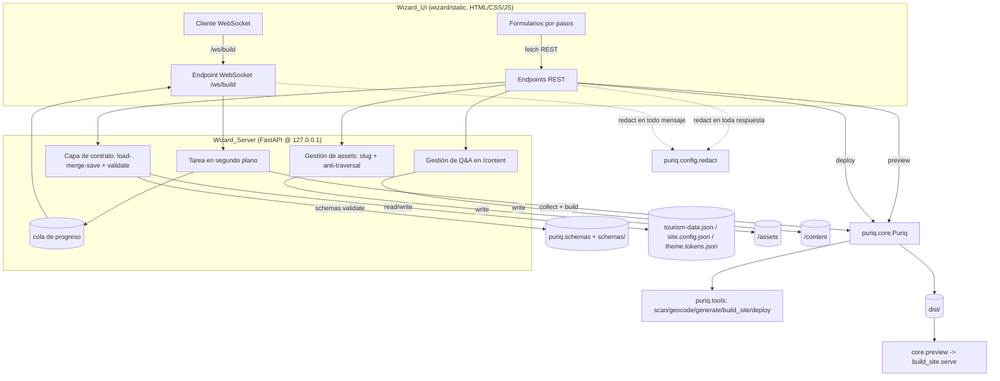
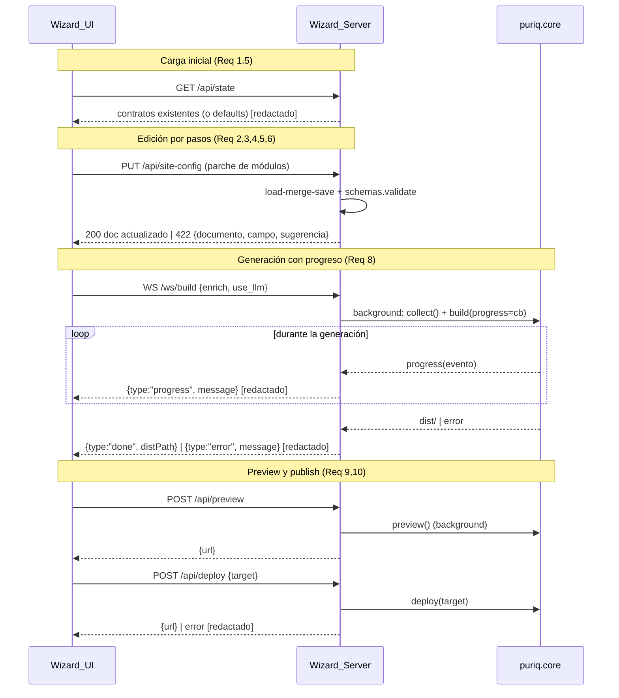

# Documento de Diseño

## Overview

Este diseño describe la implementación real del **wizard web local** de Puriq: un servidor FastAPI y una UI de formularios por pasos que llevan al encargado de turismo no programador de recursos dispersos a un sitio publicado, sin editar JSON ni escribir código. Hoy `agent/puriq/wizard/server.py` y `wizard/static/index.html` son *stubs* (una tarjeta estática con un botón deshabilitado y un `TODO` de endpoints); este diseño define los endpoints, la UI y el mecanismo de progreso en vivo que cumplen los requisitos aprobados.

El principio rector es que **el wizard es una capa web fina** sobre `puriq.core.Puriq` (`collect`/`build`/`preview`/`deploy`) y `puriq.tools`, exactamente análoga a como `cli.py` es una capa fina sobre el mismo core. El wizard **no** reimplementa las tools, **no** agrega superficies de LLM nuevas y **no** genera código de módulos: se limita a leer/escribir los tres documentos del contrato, mover archivos a `/assets` y `/content`, y disparar las fases del core.

Invariantes de arquitectura que este diseño respeta de forma estricta:

1. **Capa fina, cero lógica de negocio duplicada.** Toda generación se delega en `puriq.core`/`puriq.tools`. El wizard nunca reimplementa `scan_resources`, `geocode`, `generate_content`, `build_site` ni `deploy` (Req 8.5).
2. **El contrato son 3 JSON validados contra `schemas/` en cada escritura.** Toda ruta que produzca o transforme un documento del contrato lo valida con `puriq.schemas` **antes** de escribirlo (Req 7.1). Nunca se persiste un documento inválido.
3. **Edición en capas sin pisar datos del usuario.** Las escrituras siguen un patrón *load → merge → save*: se parte del documento existente en disco, se fusiona lo que el usuario cambió y se conserva el resto (Req 11).
4. **El agente compone módulos pre-construidos; no genera su código.** El wizard configura `modules` (on/off/orden), contenido y marca; el build efectivo lo hace `build_site` sobre la Template (Req 8.5, 12.5).
5. **Postura de seguridad local.** Escucha solo en `127.0.0.1` (Req 12.1); los secretos nunca aparecen en respuestas HTTP/WebSocket (se aplica `config.redact`, Req 12.2, 7.5); las cargas se acotan a `/assets` con nombres normalizados a Slug y se rechaza el path traversal (Req 12.4, 4.6).
6. **Se mantiene la forma pública del core.** El único ajuste propuesto es *aditivo y mínimo*: un callback de progreso opcional en `build()`/`collect()` (ver [DD-2](#dd-2-progreso-en-vivo-mediante-callback-opcional-y-tarea-en-segundo-plano)), sin romper las firmas actuales ni el uso desde el CLI.

Alcance mapeado a requisitos: Req 1 (flujo por pasos + carga de contratos previos), Req 2 (módulos), Req 3 (intake de contenido), Req 4 (assets), Req 5 (Q&A), Req 6 (marca), Req 7 (validación/errores), Req 8 (generación con progreso), Req 9 (preview), Req 10 (deploy), Req 11 (edición segura por capas), Req 12 (ejecución local y seguridad).

**Fuera de alcance (declarado explícitamente):** el chatbot RAG del visitante (`chatweb`) — el wizard solo *captura y almacena* los `QA_Entry` como conocimiento para un chatweb futuro, sin consumirlos ni indexarlos (Req 5.3); el panel de administración con login y roles; y el i18n avanzado. El wizard se limita al ciclo intake → build → preview → publish para un único usuario local.

### Investigación y hallazgos que informan el diseño

- **`puriq.core` corre el pipeline de forma síncrona y bloqueante.** `collect()` y `build()` ejecutan las fases una tras otra y retornan al terminar; el CLI imprime a `stdout`. `preview()`/`serve()` son bloqueantes (sirven hasta Ctrl-C). Para transmitir `Build_Progress` en vivo (Req 8.2) sin duplicar la lógica de las tools, hace falta (a) un punto de enganche para emitir progreso y (b) correr la generación fuera del hilo del event loop. Se resuelve en [DD-2](#dd-2-progreso-en-vivo-mediante-callback-opcional-y-tarea-en-segundo-plano).
- **Dependencias ya declaradas** en `agent/pyproject.toml`: `fastapi` + `uvicorn` (servidor y WebSocket), `jsonschema` (validación vía `puriq.schemas`), `boto3`/`httpx` (usadas por las tools, no por el wizard directamente). No se introducen librerías nuevas ni un toolchain de front-end: la UI es HTML/CSS/JS estático servido desde `wizard/static/` (se mantiene el enfoque del stub actual).
- **`puriq.schemas`** ya centraliza `validate`/`load`/`load_raw`/`dumps` y las comprobaciones accionables (`check_places_have_coords`, `MissingCoordsError`). El wizard reutiliza este módulo como única fuente de validación (Req 7.1), en lugar de validar por su cuenta.
- **`puriq.config.redact`** ya enmascara valores de secretos conocidos (credenciales AWS y variables leídas con `secret=True`) y `MissingEnvVarError` ya nombra la variable faltante sin exponer su valor. El wizard reutiliza ambos para su postura de seguridad (Req 12.2, 12.3, 7.5), igual que hace el CLI con `manejar_errores`.
- **`slugify`** vive en `puriq/tools/_slug.py` (NFKD → ASCII → kebab-case, patrón `^[a-z0-9-]+$`). El wizard la reutiliza para derivar `id` de Places/Events (Req 3.2, 3.3) y para normalizar nombres de archivo de Assets (Req 4.6). No se duplica.
- **`build_site.serve`** ya sirve `project/dist` con `http.server` en un puerto y es bloqueante (Req 9 del spec agent-tools). El wizard lo dispara vía `core.preview()` y ofrece al usuario el enlace, sin reimplementar el servidor estático.
- **La Template es data-driven.** `build_site` resuelve módulos/tema desde los JSON del contrato; el wizard solo necesita escribir un `site.config.json`/`theme.tokens.json` correctos para que la activación/orden y el theming se materialicen (Req 2, 6, 8).

## Architecture

### Vista de capas

El wizard añade exactamente dos piezas nuevas —`Wizard_Server` (FastAPI) y `Wizard_UI` (estático)— sobre el core existente. El servidor traduce peticiones HTTP/WebSocket a llamadas del core y a lecturas/escrituras validadas del contrato; nunca contiene lógica de las tools.



### Componentes y responsabilidades

- **Wizard_UI (`wizard/static/`)**: HTML/CSS/JS plano, sin build de front-end. Renderiza el flujo por pasos (módulos → intake de sitio/lugares/eventos → assets → Q&A → marca → generar → preview → publicar). Guarda el estado del paso en memoria del navegador y sincroniza cada paso con el backend vía `fetch` (REST) y un `WebSocket` para el progreso. Muestra causa + corrección sugerida ante errores (Req 7.3).
- **Wizard_Server (`wizard/server.py`)**: backend FastAPI. Sirve la UI, expone los endpoints REST del contrato/assets/Q&A/preview/deploy, y un WebSocket de progreso. Es la capa fina: cada endpoint hace *validar → delegar en core/tools → responder (redactado)*.
- **Capa de contrato (helpers internos del servidor)**: implementa el patrón *load-merge-save* sobre los tres JSON reutilizando `puriq.schemas`. No es un módulo nuevo de dominio; es el pegamento de E/S del wizard análogo a lo que hace `core` al persistir.
- **Core (`puriq.core.Puriq`)**: sin cambios de forma pública salvo el callback de progreso opcional de DD-2. El wizard lo instancia con la raíz del proyecto y llama `collect`/`build`/`preview`/`deploy`.
- **Config (`puriq.config`)**: `redact` y `MissingEnvVarError`/`get_env` para la postura de secretos (Req 12.2, 12.3).

### Modelo de interacción UI ↔ Servidor

La UI es una SPA mínima de una sola página con navegación por pasos del lado del cliente. Cada paso mapea a uno o más endpoints REST idempotentes que leen/escriben una porción del contrato. El progreso de generación es el único canal en tiempo real y usa WebSocket.



### Superficie de endpoints

Todos los endpoints viven bajo el mismo proceso FastAPI, montan `wizard/static` y aplican `redact` a toda respuesta de error. Las escrituras del contrato validan antes de persistir.

| Método | Ruta | Responsabilidad | Requisitos |
| --- | --- | --- | --- |
| `GET` | `/` | Servir el `Wizard_UI` con el flujo de pasos | 1.1 |
| `GET` | `/api/state` | Cargar los 3 contratos existentes (o defaults) para prellenar la UI | 1.5, 11.1 |
| `PUT` | `/api/tourism-data/site` | Guardar datos de sitio (nombre, región, locale, centro) | 3.1, 7.1 |
| `POST` | `/api/tourism-data/places` | Anexar un Place con `id` slug; validar coords/dirección | 3.2, 3.4–3.6, 11.2 |
| `POST` | `/api/tourism-data/events` | Anexar un Event con `id` slug | 3.3, 11.2 |
| `PUT` | `/api/site-config` | Guardar selección/orden de módulos y `deploy.target` | 2.1–2.5, 10.5 |
| `PUT` | `/api/theme-tokens` | Guardar colores, tipografía, voz, logo | 6.1–6.5 |
| `POST` | `/api/assets` | Subir Asset (imagen/logo/video) a `/assets` | 4.1–4.6 |
| `POST` | `/api/qa` | Guardar un `QA_Entry` en `/content` | 5.1, 5.2, 5.4 |
| `WS` | `/ws/build` | Disparar `collect`+`build` y transmitir `Build_Progress` | 8.1–8.5 |
| `POST` | `/api/preview` | Disparar `core.preview()` y devolver el enlace | 9.1–9.3 |
| `POST` | `/api/deploy` | Disparar `core.deploy(target)` y devolver la URL | 10.1–10.5 |

### Decisiones de diseño

#### DD-1: El wizard es una capa fina; toda escritura pasa por load-merge-save + validación

**Contexto:** El wizard produce y edita los tres documentos del contrato desde formularios, y el usuario vuelve en sesiones posteriores a agregar un evento o cambiar el banner sin perder lo cargado (Req 11). A la vez, ningún documento puede escribirse sin validarse (Req 7.1) y la lógica de las tools no debe duplicarse (Req 8.5).

**Decisión:** Toda ruta de escritura del contrato sigue el mismo patrón puro **load → merge → validate → save**:

1. **Load:** leer el documento existente del disco si existe. Para `site.config.json` y `theme.tokens.json` se usa `schemas.load` (validación estricta al cargar). Para `tourism-data.json` se usa `schemas.load_raw` (carga tolerante), porque puede contener Places editados a mano con solo `address` y sin `coords` todavía; si no existe, se parte de un documento base con los campos requeridos mínimos.
2. **Merge:** aplicar el parche del paso actual sobre el documento cargado. El merge es *aditivo y no destructivo*: los Places/Events se **anexan** (dedup por `id` slug) y las claves no tocadas por el usuario se conservan (Req 11.1, 11.2). Las descripciones no vacías nunca se sobreescriben aquí (y `generate_content` tampoco las pisa, Req 11.3).
3. **Validate:** validar el documento fusionado con `schemas.validate` contra su esquema. Para `tourism-data` no se exige `coords` en esta etapa (el usuario puede haber dado solo `address`): la garantía de coords la aporta `geocode` durante la generación (ver DD del spec agent-tools). La validación de rango de `lat`/`lng` sí se aplica cuando el usuario ingresa coordenadas explícitas (Req 3.5, 3.6).
4. **Save:** escribir con `schemas.dumps` solo si la validación pasó. Si falla, se rechaza el guardado y se devuelve un error `422` que nombra el documento y el campo inválido (Req 2.5, 7.2).

**Justificación:** Un solo patrón cubre la validación-antes-de-escribir (Req 7.1), la edición por capas (Req 11) y la no duplicación de lógica (el wizard solo mueve datos; el pipeline hace el trabajo). La función de merge es pura y por tanto testeable con PBT.

**Alternativas descartadas:** (a) *Overwrite* completo del documento en cada guardado — rechazada porque pisa el contenido existente (viola Req 11). (b) Mantener el estado del contrato en memoria del servidor y persistir solo al final — rechazada porque un único usuario local puede cerrar el navegador entre pasos y espera que cada paso persista (Req 1.3); además complica la recuperación de sesión (Req 1.5).

#### DD-2: Progreso en vivo mediante callback opcional y tarea en segundo plano

**Contexto:** `core.collect()`/`build()` hoy corren síncronos y el CLI imprime a `stdout`; no hay forma de observar el avance. El wizard debe transmitir `Build_Progress` en vivo por WebSocket (Req 8.2) sin reimplementar las tools (Req 8.5) y sin bloquear el event loop de FastAPI.

**Decisión:** Introducir un cambio **aditivo y mínimo** en el core: un parámetro opcional `progress: Callable[[str], None] | None = None` en `collect()` y `build()` (y su propagación opcional hacia las tools que ya emiten hitos). Cuando es `None` (el caso del CLI actual), el comportamiento no cambia. El wizard:

1. Abre `/ws/build`, crea una cola (`queue.Queue`) y define un callback `progress(msg)` que encola `redact(msg)`.
2. Lanza `collect()` + `build(progress=cb)` en una **tarea en segundo plano** (hilo vía `run_in_threadpool`/`asyncio.to_thread`), de modo que el pipeline bloqueante no congele el event loop.
3. Un consumidor asíncrono drena la cola y envía cada mensaje al WebSocket como `{"type":"progress","message":...}`.
4. Al finalizar, envía `{"type":"done","distPath":...}` (Req 8.3) o, si una fase lanzó, `{"type":"error","message": redact(descripción)}` con causa + acción sugerida (Req 8.4), reutilizando la misma traducción de errores del CLI (`_describir_error`).

**Justificación:** Es la intervención más pequeña que habilita progreso real respetando la invariante de capa fina: el core sigue orquestando y las tools no se tocan salvo por emitir hitos opcionales. El callback no acopla el core a FastAPI ni a WebSocket (es un `Callable[[str], None]` genérico), por lo que el CLI podría usarlo para imprimir con `rich` sin cambios de contrato.

**Alternativas descartadas:** (a) Capturar `stdout` del core y reenviarlo — frágil (mezcla logs, difícil de redactar por campo, acopla a formato de impresión). (b) Reescribir el pipeline como generador `async` — cambia la forma pública del core y rompe el uso del CLI (viola la invariante 6). (c) Sondear el estado por polling REST — no da progreso en vivo y añade estado de servidor innecesario.

#### DD-3: Assets acotados a `/assets` con nombre Slug y defensa contra path traversal

**Contexto:** El wizard recibe cargas de archivos de un usuario local (Req 4) y debe almacenarlas dentro de `/assets`, rechazando rutas que escapen del directorio (Req 12.4) y evitando colisiones de nombres (Req 4.6).

**Decisión:** Toda carga pasa por una función pura de **normalización de nombre**: se toma el nombre base del archivo (descartando cualquier componente de directorio), se separa la extensión, se aplica `slugify` al *stem*, se revalida la extensión contra la lista de formatos de imagen soportados (Req 4.4) y se recompone `slug + ext`. La ruta destino se resuelve con `(<project>/assets / nombre).resolve()` y se **verifica que sea descendiente de `<project>/assets`** (comparación de rutas resueltas); cualquier resultado fuera de ese árbol se rechaza (Req 12.4). El tamaño se compara contra un límite configurado antes de escribir (Req 4.5). En colisión de nombre, se desambigua con sufijo numérico conservando los Assets previos (Req 4.6, 11.4).

**Justificación:** `slugify` ya garantiza `^[a-z0-9-]+$`, lo que por construcción elimina `/`, `..`, espacios y caracteres de control del *stem*; la verificación de contención por ruta resuelta es la defensa en profundidad contra traversal vía extensión o symlink. Ambas piezas son puras y testeables con PBT.

**Alternativas descartadas:** confiar solo en `slugify` sin verificar contención — insuficiente frente a symlinks o casos límite de resolución; confiar solo en la verificación de ruta — deja nombres conflictivos y no-portables.

#### DD-4: Reutilización de la traducción de errores y de `redact` del CLI

**Contexto:** El CLI ya traduce excepciones de tools/core a (causa, acción sugerida) accionables y enmascara secretos con `redact` (Req 9 del spec agent-tools). El wizard necesita el mismo comportamiento en HTTP/WebSocket (Req 7.2–7.5, 8.4, 10.4, 12.2, 12.3).

**Decisión:** Extraer/compartir la lógica de descripción de errores (hoy `_describir_error` en `cli.py`) como utilidad reutilizable y aplicarla en el manejador de errores del wizard, seguida siempre de `config.redact` antes de serializar cualquier respuesta o mensaje WebSocket. Los `MissingEnvVarError` se mapean a un mensaje que nombra la variable sin su valor (Req 12.3). La validación de esquema (`jsonschema.ValidationError`) se traduce a `{documento, campo, sugerencia}` (Req 7.2). `MissingCoordsError` se traduce a un mensaje que nombra cada Place afectado (Req 7.4).

**Justificación:** Una sola fuente de verdad para los mensajes accionables evita divergencia entre CLI y wizard y garantiza que el enmascarado de secretos sea uniforme y no se olvide en ninguna ruta.

## Components and Interfaces

Las firmas se expresan en Python (FastAPI) y describen la capa fina. Ninguna reimplementa tools; todas delegan en `puriq.core`/`puriq.tools`/`puriq.schemas`/`puriq.config`.

### Servido de la UI y estado inicial (Req 1)

```python
@app.get("/", response_class=HTMLResponse)
def index() -> str:
    """Sirve wizard/static/index.html con el flujo de pasos (Req 1.1)."""

@app.get("/api/state")
def get_state() -> dict:
    """Devuelve los 3 contratos existentes (o defaults) para prellenar la UI (Req 1.5, 11.1).
    Aplica redact a la respuesta (Req 12.2)."""
```

- Sirve el `Wizard_UI` con los pasos: módulos, intake, assets, Q&A, marca, generar, preview, publicar (Req 1.1).
- `GET /api/state` carga con `schemas.load_raw`/`schemas.load` los documentos presentes; si faltan, devuelve defaults mínimos para que la UI arranque (Req 1.5).
- La navegación adelante/atrás y la persistencia de datos por sesión son responsabilidad del `Wizard_UI` (estado del cliente) + persistencia por paso vía los endpoints REST (Req 1.2, 1.3, 1.4).

### Capa de contrato: load-merge-save (Req 3, 6, 7, 11)

```python
def _load_contract(project: Path, doc: str) -> dict:
    """Carga un documento del contrato: load_raw para 'tourism-data',
    load (estricto) para 'site-config'/'theme-tokens'; default si no existe."""

def merge_document(base: dict, patch: dict) -> dict:
    """Fusiona patch sobre base de forma aditiva/no destructiva (Req 11.1).
    Anexa Places/Events por id slug sin borrar existentes (Req 11.2);
    conserva descriptions no vacías (Req 11.3). Función pura."""

def save_contract(project: Path, doc: str, merged: dict) -> None:
    """Valida merged con schemas.validate y solo entonces escribe con dumps (Req 7.1).
    Si falla, lanza un error que nombra documento y campo (Req 7.2)."""
```

Responsabilidad: única puerta de escritura del contrato. Aplica DD-1. Endpoints de sitio (Req 3.1), Places (Req 3.2, 3.4–3.6), Events (Req 3.3), módulos (Req 2), marca (Req 6) y `deploy.target` (Req 10.5) llaman estos helpers.

- Places/Events: derivan `id = slugify(name)` (Req 3.2, 3.3) y se anexan; colisión de `id` → desambiguación por sufijo.
- Coordenadas: si el usuario da `lat`/`lng`, se valida `lat ∈ [-90,90]`, `lng ∈ [-180,180]` (Req 3.5) y se rechaza fuera de rango con mensaje de rango permitido (Req 3.6). Si da solo `address`, se conserva para que `geocode` complete durante la generación (Req 3.4).
- Marca: colores hex validados por el esquema; un color inválido se rechaza con mensaje de formato esperado (Req 6.4).

### Gestión de Assets (Req 4, 12.4)

```python
def normalize_asset_name(filename: str, allowed_exts: set[str]) -> str:
    """Toma el basename, slugifica el stem y revalida la extensión contra
    allowed_exts; recompone 'slug.ext'. Rechaza extensiones no soportadas (Req 4.4, 4.6). Pura."""

def resolve_within_assets(project: Path, name: str) -> Path:
    """Resuelve <project>/assets/<name> y verifica que sea descendiente de
    <project>/assets; si escapa, lanza error (Req 12.4). Pura respecto a rutas."""

@app.post("/api/assets")
async def upload_asset(...) -> dict:
    """Valida tipo (Req 4.4) y tamaño (Req 4.5), normaliza el nombre (Req 4.6),
    verifica contención (Req 12.4), escribe en /assets y devuelve la ruta relativa (Req 4.1).
    Opcionalmente enlaza la ruta a Place/Event.images (Req 4.2) o a Theme_Tokens.logo (Req 4.3)."""
```

Responsabilidad: recibir cargas, normalizar y almacenar en `/assets` sin escapar del directorio (DD-3).

- Imagen asociada a Place/Event → agrega ruta relativa a `images` de esa entrada vía load-merge-save (Req 4.2).
- Logo → escribe la ruta relativa en `Theme_Tokens.logo` (Req 4.3).
- Tipo no soportado → rechazo con formatos aceptados (Req 4.4); tamaño excedido → rechazo con máximo permitido (Req 4.5).
- Assets previos referenciados por el contrato se conservan salvo reemplazo explícito (Req 11.4).

### Captura de Q&A (Req 5)

```python
@app.post("/api/qa")
def add_qa(entry: dict) -> dict:
    """Valida que pregunta y respuesta no estén vacías (Req 5.4); almacena el
    QA_Entry en <project>/content (Req 5.1) SIN indexarlo (Req 5.3); registra la
    ruta de la base de conocimiento en Site_Config.modules.chatweb.knowledgeSource (Req 5.2)."""
```

Responsabilidad: persistir conocimiento para un chatweb futuro. Fuera de alcance consumirlo/indexarlo (Req 5.3). El registro de `knowledgeSource` pasa por load-merge-save del `site.config.json` (Req 5.2).

### Generación con progreso en vivo (Req 8)

```python
@app.websocket("/ws/build")
async def ws_build(ws: WebSocket) -> None:
    """Dispara collect()+build() en segundo plano y transmite Build_Progress (Req 8.1, 8.2).
    Envía {type:'done', distPath} al terminar (Req 8.3) o {type:'error', message}
    con causa+acción tras redact si una fase falla (Req 8.4). Delega en el Core (Req 8.5)."""

# Cambio aditivo mínimo en core (DD-2):
class Puriq:
    def collect(self, resources_dir, enrich=False, progress=None): ...
    def build(self, use_llm=True, progress=None) -> Path: ...
```

Responsabilidad: orquestar la generación observando el avance (DD-2).

- Invoca `collect` y `build` del core sobre el proyecto (Req 8.1); nunca reimplementa tools (Req 8.5).
- Transmite cada hito por WebSocket mientras la fase corre (Req 8.2), redactando cada mensaje (Req 12.2).
- Éxito → notifica finalización y `dist/` (Req 8.3); error → mensaje descriptivo redactado (Req 8.4).

### Previsualización (Req 9)

```python
@app.post("/api/preview")
def start_preview(port: int = 4322) -> dict:
    """Si existe dist/, dispara core.preview() (build_site.serve) en segundo plano y
    devuelve el enlace (Req 9.1, 9.3). Si no hay build, devuelve un mensaje que pide
    generar el sitio primero (Req 9.2)."""
```

Responsabilidad: exponer el sitio ya construido. Delega en `core.preview()`; no reimplementa el servidor estático. `dist/` ausente → mensaje accionable (Req 9.2).

### Publicación (Req 10)

```python
@app.post("/api/deploy")
def start_deploy(target: str) -> dict:
    """Con dist/ disponible y target soportado, invoca core.deploy(target) y
    devuelve la URL pública (Req 10.1); escribe target en Site_Config.deploy.target (Req 10.5).
    Sin build -> mensaje de generar primero (Req 10.3). Fallo/credenciales faltantes ->
    mensaje con la causa tras redact (Req 10.4)."""
```

Responsabilidad: publicar `dist/` en el destino elegido. `Wizard_UI` restringe la selección a los `Deploy_Target` soportados (Req 10.2); el servidor valida el target contra el catálogo y persiste `deploy.target` (Req 10.5).

### Postura de seguridad (Req 12)

```python
def serve(port: int = 4321) -> None:
    """Arranca uvicorn ligado a host='127.0.0.1' (Req 12.1)."""

def wizard_error_response(exc: BaseException) -> dict:
    """Traduce la excepción a (causa, acción) reutilizando la lógica del CLI (DD-4)
    y aplica config.redact al texto antes de devolverlo (Req 12.2, 7.5).
    MissingEnvVarError -> nombra la variable sin su valor (Req 12.3)."""
```

Responsabilidad transversal: enlace a Loopback (Req 12.1), redacción de secretos en toda respuesta HTTP/WebSocket (Req 12.2), errores de env-var por nombre sin valor (Req 12.3), contención de cargas en `/assets` (Req 12.4) y composición de módulos pre-construidos sin generar código (Req 12.5, delegando el build en `build_site`).

## Data Models

El wizard trabaja con los **tres documentos del contrato**, cada uno validado contra su esquema en `schemas/` mediante `puriq.schemas`. El wizard no define modelos nuevos: edita porciones de estos documentos y dos directorios auxiliares (`/assets`, `/content`).

### Tourism_Data (`tourism-data.json`)

Validado contra `schemas/tourism-data.schema.json`. Requeridos de nivel superior: `site`, `places`.

- **Site** (`tourism-data.site`): requeridos `name`, `region`, `defaultLocale` (`^[a-z]{2}$`), `center` (`coords`); opcionales `description`, `locales`. El wizard escribe estos campos desde el formulario de sitio (Req 3.1).
- **Place** (`tourism-data.places[]`): requeridos `id` (`^[a-z0-9-]+$`), `name` (no vacío), `category`, `coords` (`{lat ∈ [-90,90], lng ∈ [-180,180], zoom?}`); opcionales `address`, `shortDescription`, `description` (vacío = lo genera el LLM), `images`, `hours`, `tags`, `source` (`user`|`osm`|`wikidata`, default `user`). El wizard crea Places con `id = slugify(name)` y, si el usuario da solo `address`, los deja **sin `coords`** para que `geocode` los complete durante la generación (Req 3.2, 3.4). Los Assets asociados se agregan a `images` (Req 4.2).
- **Event** (`tourism-data.events[]`): requeridos `id` (`^[a-z0-9-]+$`), `name`, `startDate` (fecha ISO); opcionales `endDate`, `placeId`, `description`, `images`, `recurring`. El wizard crea Events con `id = slugify(name)` (Req 3.3).

Nota de flujo: en la escritura del wizard, `tourism-data.json` puede tener Places con solo `address` (sin `coords`). Por eso el wizard lo **carga de forma tolerante** (`schemas.load_raw`) y la garantía de `coords` la aporta `geocode` durante `collect`/`build` (consistente con el pipeline del spec agent-tools). Si al generar un Place sigue sin `coords` ni `address`, el pipeline nombra cada Place afectado (Req 7.4).

### Site_Config (`site.config.json`)

Validado contra `schemas/site-config.schema.json`. Requeridos: `layout` (`clasico`|`moderno`), `modules`. Cada módulo del catálogo (`map`, `places`, `events`, `blog`, `chatweb`) tiene `enabled` (bool) y `order` (entero ≥ 1); `chatweb` añade `persona` y `knowledgeSource`. Opcionales: `hero`, `contact`, `deploy` (`target` ∈ `{aws-amplify, s3-cloudfront, static-export, vercel, netlify}`, `domain`).

El wizard escribe `enabled` al activar/desactivar (Req 2.1), asigna `order` ≥ 1 según el orden elegido (Req 2.2), restringe los módulos al catálogo soportado (Req 2.3), registra `chatweb.knowledgeSource` cuando hay Q&A (Req 5.2) y persiste `deploy.target` al elegir destino (Req 10.5). Toda escritura valida contra el esquema (Req 2.4, 2.5).

### Theme_Tokens (`theme.tokens.json`)

Validado contra `schemas/theme-tokens.schema.json`. Requeridos: `colors` (`primary`, `background`, `text`; opcionales `secondary`, `accent`; formato hex `^#([0-9a-fA-F]{3}|[0-9a-fA-F]{6})$`) y `typography` (`headingFont`, `bodyFont`; opcional `baseSize`). Opcionales: `voice` (`tone`, `formality`), `logo`, `radius`.

El wizard escribe `colors` (Req 6.1), `typography` (Req 6.2), `voice.tone` (Req 6.3) y `logo` (ruta del Asset, Req 4.3); un color no-hex se rechaza con mensaje de formato (Req 6.4); toda escritura valida contra el esquema (Req 6.5).

### Directorios auxiliares

- **`/assets`**: archivos binarios subidos (fotos, video, logo) con nombre en formato Slug (Req 4.1, 4.6). Las rutas relativas se referencian desde `images`/`logo` del contrato. Toda escritura queda contenida en este árbol (Req 12.4).
- **`/content`**: `QA_Entry` almacenados como conocimiento para el chatweb futuro (Req 5.1); no se indexan ni consumen en el wizard (Req 5.3). `Site_Config.modules.chatweb.knowledgeSource` apunta aquí (Req 5.2).

## Correctness Properties

*Una propiedad es una característica o comportamiento que debe cumplirse en todas las ejecuciones válidas de un sistema — esencialmente, una afirmación formal sobre lo que el sistema debe hacer. Las propiedades son el puente entre las especificaciones legibles por humanos y las garantías de corrección verificables por máquina.*

Estas propiedades se derivan del análisis de prework y de su reflexión de consolidación. Se agrupan alrededor de la lógica **pura** del wizard —`merge_document`, la validación-antes-de-escribir, la derivación de slugs, la normalización/contención de Assets y la redacción de secretos— que es donde la variación de entrada revela errores. Las fronteras de E/S (escritura en disco, WebSocket, invocación del core y de los adaptadores de deploy) se cubren con pruebas de ejemplo/integración (ver Testing Strategy), no con PBT.

### Propiedad 1: Validación estricta antes de toda escritura del contrato

*Para todo* documento base y todo parche del usuario, `save_contract` escribe el documento fusionado en disco **si y solo si** el resultado cumple su esquema de `schemas/`; si es inválido, no se escribe nada y se produce un error que identifica el documento y el campo infractor.

**Validates: Requirements 2.4, 2.5, 3.7, 6.5, 7.1**

### Propiedad 2: `load-merge-save` es no destructivo y preserva lo existente

*Para todo* documento del contrato existente y todo parche que no toca un conjunto de claves, `merge_document` conserva sin cambios esos valores existentes (incluyendo Assets referenciados y personalizaciones de contenido, marca y estructura). En consecuencia, un guardado que no modifica un campo deja ese campo idéntico al leído.

**Validates: Requirements 1.5, 2.1, 3.1, 6.1, 6.2, 6.3, 10.5, 11.1, 11.4, 11.5**

### Propiedad 3: Anexar entradas conserva las previas

*Para toda* lista de Places o Events existente y toda entrada nueva, el resultado de anexar contiene todas las entradas previas más la nueva (por `id`), sin eliminar ninguna existente.

**Validates: Requirements 11.2**

### Propiedad 4: El merge no pisa descripciones no vacías

*Para todo* Place o Event con una `description` no vacía, `merge_document` conserva ese texto sin modificarlo al fusionar un parche que no reemplaza explícitamente la descripción.

**Validates: Requirements 11.3**

### Propiedad 5: Los ids de Places y Events son slugs derivados del nombre

*Para todo* nombre de Place o Event, el `id` generado por el wizard es igual a `slugify(name)` y cumple el patrón `^[a-z0-9-]+$`.

**Validates: Requirements 3.2, 3.3**

### Propiedad 6: Coordenadas explícitas se aceptan en rango y se rechazan fuera de rango

*Para todo* par `(lat, lng)`: si `lat ∈ [-90, 90]` y `lng ∈ [-180, 180]`, el wizard asigna `coords` con esos valores; si alguno está fuera de rango, rechaza el valor con un mensaje que indica el rango permitido.

**Validates: Requirements 3.5, 3.6**

### Propiedad 7: Una dirección sin coordenadas se preserva para geocode

*Para todo* Place ingresado con `address` y sin `coords`, el documento guardado conserva la `address` y no inventa `coords` (las completará `geocode` durante la generación).

**Validates: Requirements 3.4**

### Propiedad 8: Solo se aceptan módulos del catálogo soportado, con order entero ≥ 1

*Para toda* selección de módulos, el `Site_Config` resultante contiene únicamente claves del catálogo (`map`, `places`, `events`, `blog`, `chatweb`) y asigna a cada módulo un `order` entero ≥ 1 consistente con el orden elegido; cualquier clave fuera del catálogo se rechaza.

**Validates: Requirements 2.2, 2.3**

### Propiedad 9: El nombre de un Asset se normaliza a Slug con extensión soportada

*Para todo* nombre de archivo de entrada, `normalize_asset_name` produce un nombre cuyo *stem* cumple `^[a-z0-9-]+$` y cuya extensión pertenece al conjunto de formatos soportados; un archivo con extensión no soportada se rechaza con un mensaje que lista los formatos aceptados.

**Validates: Requirements 4.4, 4.6**

### Propiedad 10: Toda carga queda contenida en `/assets` (sin path traversal)

*Para todo* nombre de archivo de entrada (incluidos `../`, separadores de ruta y rutas absolutas), la ruta destino resuelta por `resolve_within_assets` es descendiente de `<project>/assets`, o bien la carga se rechaza; nunca se escribe fuera de ese árbol.

**Validates: Requirements 12.4**

### Propiedad 11: Un QA_Entry con pregunta o respuesta vacía se rechaza

*Para todo* `QA_Entry`, si su pregunta o su respuesta está vacía o es solo espacios en blanco, el wizard rechaza la entrada con un mensaje que indica el campo faltante y no la almacena.

**Validates: Requirements 5.4**

### Propiedad 12: Solo se aceptan Deploy_Target del catálogo soportado

*Para todo* string de destino, el wizard acepta la publicación solo si pertenece a `{aws-amplify, s3-cloudfront, static-export, vercel, netlify}`; cualquier otro destino se rechaza con un mensaje que lista los válidos.

**Validates: Requirements 10.2**

### Propiedad 13: Ningún valor de secreto aparece en las respuestas del wizard

*Para todo* texto de salida producido por el wizard (respuesta HTTP o mensaje WebSocket, de éxito o de error), ningún valor de secreto configurado (credenciales AWS y variables leídas como secreto) aparece sin enmascarar tras aplicar `config.redact`.

**Validates: Requirements 7.5, 12.2**

## Error Handling

Toda respuesta de error del wizard se compone reutilizando la traducción de errores del CLI (causa + acción sugerida, DD-4) y se pasa **siempre** por `config.redact` antes de serializarse a HTTP o WebSocket (Req 7.5, 12.2).

- **Validación de esquema (transversal):** un `jsonschema.ValidationError` al guardar un documento del contrato se traduce a una respuesta `422` que nombra el documento y el campo infractor, y **no** se escribe nada (Req 2.5, 7.2). La `Wizard_UI` muestra causa y corrección en el paso correspondiente (Req 7.3).
- **Coordenadas fuera de rango (intake):** `lat`/`lng` fuera de `[-90,90]`/`[-180,180]` → `422` con el rango permitido (Req 3.6), sin persistir.
- **Coords faltantes al generar:** si un Place no tiene `coords` ni `address` al momento de generar, el pipeline lanza `schemas.MissingCoordsError`, que ya nombra cada Place afectado; el wizard lo propaga como mensaje accionable por WebSocket (Req 7.4).
- **Carga de Assets:** tipo no soportado → rechazo con formatos aceptados (Req 4.4); tamaño excedido → rechazo con el máximo permitido (Req 4.5); nombre que intenta escapar de `/assets` → rechazo (Req 12.4).
- **Q&A:** pregunta o respuesta vacía → `422` que nombra el campo faltante (Req 5.4).
- **Marca:** color que no cumple el patrón hex → `422` con el formato esperado (Req 6.4).
- **Generación (WebSocket):** una fase que lanza (`collect`/`build`) se traduce a `{"type":"error","message": redact(causa + acción)}` (Req 8.4). Falta de variable de entorno → `MissingEnvVarError` que nombra la variable sin su valor (Req 12.3).
- **Preview/Deploy:** `dist/` ausente → mensaje que pide generar el sitio primero (Req 9.2, 10.3); destino no soportado → mensaje que lista los válidos (Req 10.2); rechazo del proveedor o credenciales faltantes → mensaje con la causa tras `redact` (Req 10.4).

## Testing Strategy

El diseño se hace testeable aislando la **lógica pura** (merge, validación, slug, normalización/contención de Assets, redacción) de las **fronteras de E/S** (disco, WebSocket, invocación del core y adaptadores de deploy). La lógica pura se ejercita con datos generados y property-based testing; las fronteras se cubren con ejemplos e integración usando el core mockeado. **Este documento no agrega tests; describe la estrategia para cuando se implementen.**

### Aplicabilidad de PBT

PBT **es apropiado** aquí para la capa de lógica pura del wizard: `merge_document` (invariantes de preservación y anexado), la validación-antes-de-escribir, la derivación de `id` slug, `normalize_asset_name`/`resolve_within_assets` (normalización y seguridad) y la redacción de secretos. Todas son funciones con entrada/salida clara y un espacio de entradas amplio donde la variación revela casos límite (nombres Unicode, rutas maliciosas, parches parciales, coords en los bordes del rango).

PBT **no es apropiado** para: servir la UI estática (ejemplo), la transmisión por WebSocket y la invocación de `collect`/`build`/`preview`/`deploy` del core (integración con mocks, el comportamiento no varía útilmente con la entrada), el enlace a `127.0.0.1` (smoke) y las invariantes de arquitectura (revisión de código). Para estas se usan pruebas de ejemplo e integración.

### Enfoque dual

- **Pruebas de propiedad (Hypothesis):** validan las 13 propiedades de la sección anterior sobre entradas generadas. La librería del ecosistema Python es **Hypothesis** (ya presente en el proyecto); no se implementa PBT desde cero.
- **Pruebas de ejemplo / edge case:** servir la UI (Req 1.1); navegación y persistencia por paso (Req 1.2–1.4); escritura de logo/imágenes en disco y su enlace (Req 4.1–4.3); umbral de tamaño de Asset (Req 4.5); almacenamiento de Q&A y registro de `knowledgeSource` (Req 5.1–5.3); mensajes de validación (Req 7.2, 7.3); `MissingEnvVarError` (Req 12.3); preview/publish sin build (Req 9.2, 10.3); invariantes de arquitectura (Req 8.5, 12.5).
- **Pruebas de integración (core mockeado):** WebSocket de progreso con un `progress` callback que emite N hitos → N mensajes (Req 8.1–8.4); `core.preview()` con `dist/` presente (Req 9.1, 9.3); `core.deploy(target)` que devuelve URL o lanza (Req 10.1, 10.4); Place sin coords/address al generar → mensaje que lo nombra (Req 7.4).
- **Smoke:** el servidor se liga a `host='127.0.0.1'` (Req 12.1).

### Configuración de pruebas de propiedad

- Mínimo **100 iteraciones** por prueba de propiedad.
- Cada prueba de propiedad referencia su propiedad del diseño con la etiqueta:
  `# Feature: web-wizard, Property {número}: {texto de la propiedad}`.
- Cada propiedad se implementa con **una sola** prueba de propiedad.
- El core y los adaptadores de deploy se sustituyen por mocks deterministas para probar la lógica del wizard sin costo de servicios externos ni builds reales de Astro.

### Trazabilidad

Cada propiedad declara los requisitos que valida mediante `**Validates: Requirements X.Y**`. En conjunto, las propiedades, los ejemplos, la integración y el smoke cubren los 12 requisitos del documento aprobado.

## Mapeo de componentes a requisitos

| Componente / Decisión | Requisitos que satisface |
| --- | --- |
| Servido de la UI (`GET /`) y `GET /api/state` | 1.1, 1.5, 11.1 |
| `Wizard_UI` (flujo por pasos, navegación, formularios) | 1.2, 1.3, 1.4, 7.3, 9.3, 10.2 |
| Capa de contrato `load-merge-save` (`_load_contract`/`merge_document`/`save_contract`) — DD-1 | 1.3, 1.5, 2.1, 3.1, 6.1, 6.2, 6.3, 7.1, 7.2, 11.1, 11.2, 11.3, 11.4, 11.5 |
| Endpoints de módulos (`PUT /api/site-config`) | 2.1, 2.2, 2.3, 2.4, 2.5, 10.5 |
| Endpoints de intake (`PUT /api/tourism-data/site`, `POST .../places`, `POST .../events`) | 3.1, 3.2, 3.3, 3.4, 3.5, 3.6, 3.7 |
| Gestión de Assets (`POST /api/assets`, `normalize_asset_name`, `resolve_within_assets`) — DD-3 | 4.1, 4.2, 4.3, 4.4, 4.5, 4.6, 12.4 |
| Captura de Q&A (`POST /api/qa`) | 5.1, 5.2, 5.3, 5.4 |
| Endpoints de marca (`PUT /api/theme-tokens`) | 6.1, 6.2, 6.3, 6.4, 6.5 |
| Traducción de errores + `redact` (DD-4, `wizard_error_response`) | 7.2, 7.4, 7.5, 8.4, 10.4, 12.2, 12.3 |
| WebSocket de generación (`/ws/build`) + callback de progreso en el core — DD-2 | 8.1, 8.2, 8.3, 8.4, 8.5 |
| Preview (`POST /api/preview` → `core.preview`) | 9.1, 9.2, 9.3 |
| Deploy (`POST /api/deploy` → `core.deploy`) | 10.1, 10.2, 10.3, 10.4, 10.5 |
| Arranque `serve` ligado a Loopback | 12.1 |
| Delegación estricta en `puriq.core`/`puriq.tools` (capa fina) | 8.5, 12.5 |
