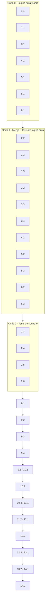

# Plan de Implementación: web-wizard

## Overview

Este plan convierte el diseño aprobado en pasos de codificación incrementales sobre `agent/puriq/wizard/` (backend FastAPI en `server.py` y UI estática en `static/`), más un ajuste **aditivo y mínimo** en `puriq/core.py` (callback de progreso). El objetivo es reemplazar los *stubs* actuales por la experiencia real de intake → build → preview → publish, respetando las invariantes de arquitectura: el wizard es una **capa web fina** que delega en `puriq.core`/`puriq.tools` (nunca reimplementa tools, Req 8.5/12.5), **toda escritura del contrato pasa por `puriq.schemas.validate`** antes de persistir (Req 7.1), y se **reutiliza** `puriq.config.redact` y la traducción de errores del CLI (Req 12.2, 7.5, DD-4).

El orden sigue la estrategia de testabilidad del diseño: primero la **lógica pura** (merge no destructivo, derivación de slug, validación de coords, catálogo de módulos, normalización/contención de assets, validación de Q&A/deploy, redacción) con sus pruebas de propiedad, luego el **callback de progreso en el core** (DD-2), y recién después los **endpoints REST/WebSocket** que cablean esa lógica, cerrando con la **UI estática por pasos** y una pasada de integración. Así no queda código huérfano: cada endpoint consume helpers ya probados.

Lenguaje de implementación: **Python** (definido en el diseño; FastAPI + uvicorn, UI HTML/CSS/JS plano sin toolchain de front-end). Pruebas de propiedad con **Hypothesis** (mínimo 100 iteraciones por propiedad, etiqueta `# Feature: web-wizard, Property {n}: {texto}`); pruebas de ejemplo/integración con el core y los adaptadores mockeados.

Convención: las subtareas marcadas con `*` (tests) son opcionales y pueden omitirse para un MVP más rápido; las tareas de implementación no marcadas son obligatorias.

## Tasks

- [x] 1. Reutilización de la traducción de errores y `redact` (DD-4)
  - [x] 1.1 Extraer la descripción de errores del CLI a una utilidad compartida y componer `wizard_error_response`
    - Refactorizar `_describir_error` de `cli.py` a una utilidad reutilizable (p. ej. `puriq/errors.py`) sin cambiar el comportamiento del CLI, que lo importe
    - Implementar `wizard_error_response(exc)` que traduzca la excepción a `(causa, acción)` y aplique **siempre** `config.redact` antes de serializar; mapear `MissingEnvVarError` a un mensaje que nombra la variable sin su valor, `jsonschema.ValidationError` a `{documento, campo, sugerencia}` y `MissingCoordsError` a un mensaje que nombra cada Place afectado
    - _Requirements: 7.2, 7.4, 7.5, 8.4, 10.4, 12.2, 12.3_
  - [ ]* 1.2 Prueba de propiedad: ningún secreto aparece en las respuestas del wizard
    - **Property 13: Ningún valor de secreto aparece en las respuestas del wizard**
    - **Validates: Requirements 7.5, 12.2**
  - [ ]* 1.3 Pruebas unitarias de traducción de errores del wizard
    - `MissingEnvVarError` nombra la variable sin valor; `ValidationError` → documento+campo; `MissingCoordsError` nombra cada Place
    - _Requirements: 7.2, 7.4, 12.3_

- [x] 2. Capa de contrato pura: load-merge-save (DD-1)
  - [x] 2.1 Implementar `_load_contract` y `save_contract` en un helper del wizard (p. ej. `wizard/contracts.py`)
    - `_load_contract(project, doc)`: `schemas.load_raw` para `tourism-data`, `schemas.load` (estricto) para `site-config`/`theme-tokens`; si no existe, devolver un documento base con los campos requeridos mínimos
    - `save_contract(project, doc, merged)`: llamar `schemas.validate(merged, doc)` y **solo entonces** escribir con `schemas.dumps`; si falla, no escribir nada y propagar un error que nombra documento y campo
    - _Requirements: 1.5, 7.1, 7.2, 11.5_
  - [x] 2.2 Implementar `merge_document(base, patch)` puro y no destructivo (misma capa `wizard/contracts.py`)
    - Fusión aditiva: conservar sin cambios las claves no tocadas por el parche (Req 11.1); anexar Places/Events por `id` slug sin borrar existentes, desambiguando colisión de `id` (Req 11.2); no sobreescribir `description` no vacía (Req 11.3); conservar Assets ya referenciados salvo reemplazo explícito (Req 11.4)
    - Función pura (sin E/S), apta para PBT
    - _Requirements: 11.1, 11.2, 11.3, 11.4, 11.5_
  - [ ]* 2.3 Prueba de propiedad: validación estricta antes de toda escritura del contrato
    - **Property 1: Validación estricta antes de toda escritura del contrato**
    - **Validates: Requirements 2.4, 2.5, 3.7, 6.5, 7.1**
  - [ ]* 2.4 Prueba de propiedad: load-merge-save es no destructivo y preserva lo existente
    - **Property 2: `load-merge-save` es no destructivo y preserva lo existente**
    - **Validates: Requirements 1.5, 2.1, 3.1, 6.1, 6.2, 6.3, 10.5, 11.1, 11.4, 11.5**
  - [ ]* 2.5 Prueba de propiedad: anexar entradas conserva las previas
    - **Property 3: Anexar entradas conserva las previas**
    - **Validates: Requirements 11.2**
  - [ ]* 2.6 Prueba de propiedad: el merge no pisa descripciones no vacías
    - **Property 4: El merge no pisa descripciones no vacías**
    - **Validates: Requirements 11.3**

- [x] 3. Lógica pura de intake: slug de ids, coords y dirección
  - [x] 3.1 Implementar constructores puros de Place/Event y validación de coordenadas (p. ej. `wizard/intake.py`)
    - Derivar `id = slugify(name)` para Places y Events reutilizando `puriq.tools._slug.slugify` (sin duplicar) (Req 3.2, 3.3)
    - Si el usuario da `lat`/`lng`: validar `lat ∈ [-90,90]`, `lng ∈ [-180,180]` y asignar `coords`; fuera de rango → error que indica el rango permitido (Req 3.5, 3.6)
    - Si el usuario da solo `address` sin `coords`: conservar `address` y no inventar `coords` (Req 3.4)
    - _Requirements: 3.2, 3.3, 3.4, 3.5, 3.6_
  - [ ]* 3.2 Prueba de propiedad: los ids de Places y Events son slugs derivados del nombre
    - **Property 5: Los ids de Places y Events son slugs derivados del nombre**
    - **Validates: Requirements 3.2, 3.3**
  - [ ]* 3.3 Prueba de propiedad: coordenadas explícitas se aceptan en rango y se rechazan fuera de rango
    - **Property 6: Coordenadas explícitas se aceptan en rango y se rechazan fuera de rango**
    - **Validates: Requirements 3.5, 3.6**
  - [ ]* 3.4 Prueba de propiedad: una dirección sin coordenadas se preserva para geocode
    - **Property 7: Una dirección sin coordenadas se preserva para geocode**
    - **Validates: Requirements 3.4**

- [x] 4. Lógica pura de catálogo y orden de módulos
  - [x] 4.1 Implementar el constructor puro de `Site_Config.modules` (p. ej. `wizard/modules.py`)
    - Restringir las claves al catálogo soportado (`map`, `places`, `events`, `blog`, `chatweb`); rechazar cualquier clave fuera del catálogo (Req 2.3)
    - Escribir `enabled` por módulo (Req 2.1) y asignar `order` entero ≥ 1 consistente con el orden elegido (Req 2.2)
    - _Requirements: 2.1, 2.2, 2.3_
  - [ ]* 4.2 Prueba de propiedad: solo módulos del catálogo, con order entero ≥ 1
    - **Property 8: Solo se aceptan módulos del catálogo soportado, con order entero ≥ 1**
    - **Validates: Requirements 2.2, 2.3**

- [x] 5. Lógica pura de assets: normalización de nombre y contención (DD-3)
  - [x] 5.1 Implementar `normalize_asset_name` y `resolve_within_assets` (p. ej. `wizard/assets.py`)
    - `normalize_asset_name(filename, allowed_exts)`: tomar el basename (descartar componentes de directorio), separar extensión, aplicar `slugify` al *stem*, revalidar la extensión contra `allowed_exts` y recomponer `slug.ext`; extensión no soportada → error que lista formatos aceptados (Req 4.4, 4.6)
    - `resolve_within_assets(project, name)`: resolver `(<project>/assets/<name>).resolve()` y verificar que sea descendiente de `<project>/assets`; si escapa (incluye `../`, rutas absolutas, symlinks), lanzar error (Req 12.4)
    - Ambas funciones puras respecto a rutas, aptas para PBT
    - _Requirements: 4.4, 4.6, 12.4_
  - [ ]* 5.2 Prueba de propiedad: el nombre de un Asset se normaliza a Slug con extensión soportada
    - **Property 9: El nombre de un Asset se normaliza a Slug con extensión soportada**
    - **Validates: Requirements 4.4, 4.6**
  - [ ]* 5.3 Prueba de propiedad: toda carga queda contenida en /assets (sin path traversal)
    - **Property 10: Toda carga queda contenida en `/assets` (sin path traversal)**
    - **Validates: Requirements 12.4**

- [x] 6. Lógica pura de validación de Q&A y catálogo de deploy
  - [x] 6.1 Implementar validación de `QA_Entry` y del catálogo de `Deploy_Target` (p. ej. `wizard/validation.py`)
    - Rechazar un `QA_Entry` con pregunta o respuesta vacía o solo espacios, con un mensaje que nombra el campo faltante (Req 5.4)
    - Aceptar un destino solo si pertenece a `{aws-amplify, s3-cloudfront, static-export, vercel, netlify}`; cualquier otro → error que lista los válidos (Req 10.2)
    - _Requirements: 5.4, 10.2_
  - [ ]* 6.2 Prueba de propiedad: un QA_Entry con pregunta o respuesta vacía se rechaza
    - **Property 11: Un QA_Entry con pregunta o respuesta vacía se rechaza**
    - **Validates: Requirements 5.4**
  - [ ]* 6.3 Prueba de propiedad: solo se aceptan Deploy_Target del catálogo soportado
    - **Property 12: Solo se aceptan Deploy_Target del catálogo soportado**
    - **Validates: Requirements 10.2**

- [x] 7. Checkpoint - Asegurar que las pruebas pasan
  - Ejecutar la suite de lógica pura (contrato, intake, módulos, assets, validación, errores) y confirmar que las 13 propiedades y las unitarias pasan; consultar al usuario si surgen dudas.

- [x] 8. Callback de progreso aditivo en el core (DD-2)
  - [x] 8.1 Agregar `progress: Callable[[str], None] | None = None` a `Puriq.collect()` y `Puriq.build()`
    - Emitir hitos vía `progress(msg)` cuando esté definido; con `progress=None` el comportamiento y las firmas actuales no cambian (el CLI sigue funcionando igual)
    - Propagar el callback de forma opcional hacia las tools que ya emiten hitos, sin reimplementar su lógica
    - _Requirements: 8.1, 8.2, 8.5_

- [x] 9. Endpoints REST de estado e intake de contenido en `wizard/server.py`
  - [x] 9.1 Implementar `GET /api/state`
    - Cargar los 3 contratos existentes con `_load_contract` (o defaults mínimos si faltan) para prellenar la UI; aplicar `redact` a la respuesta
    - _Requirements: 1.5, 11.1, 12.2_
  - [x] 9.2 Implementar el intake de sitio, Places y Events
    - `PUT /api/tourism-data/site`: escribir nombre, región, `defaultLocale`, centro vía load-merge-save (Req 3.1)
    - `POST /api/tourism-data/places`: anexar un Place con `id` slug, validar coords/dirección (Req 3.2, 3.4–3.6, 11.2)
    - `POST /api/tourism-data/events`: anexar un Event con `id` slug (Req 3.3, 11.2)
    - Cada ruta usa `merge_document` + `save_contract` (validar antes de escribir) y responde `422` redactado ante error
    - _Requirements: 3.1, 3.2, 3.3, 3.4, 3.5, 3.6, 3.7_
  - [x] 9.3 Implementar `PUT /api/site-config`
    - Guardar selección/orden de módulos con el constructor de la tarea 4.1 y persistir `deploy.target` validado; load-merge-save con `schemas.validate` contra `site-config.schema.json`; inválido → `422` que nombra el campo (Req 2.4, 2.5)
    - _Requirements: 2.1, 2.2, 2.3, 2.4, 2.5, 10.5_
  - [x] 9.4 Implementar `PUT /api/theme-tokens`
    - Escribir `colors`, `typography`, `voice.tone` y `logo` vía load-merge-save; color no-hex → `422` con el formato esperado (delegado a la validación de esquema) (Req 6.4); validar contra `theme-tokens.schema.json` antes de escribir (Req 6.5)
    - _Requirements: 6.1, 6.2, 6.3, 6.4, 6.5_
  - [ ]* 9.5 Pruebas de integración de los endpoints de contrato
    - Persistencia por paso, recuperación con `GET /api/state`, y mensajes `422` de validación con documento+campo (Req 1.3, 7.2, 7.3)
    - _Requirements: 1.2, 1.3, 1.4, 7.2, 7.3_

- [x] 10. Endpoints de Assets y Q&A en `wizard/server.py`
  - [x] 10.1 Implementar `POST /api/assets`
    - Validar tipo (Req 4.4) y tamaño contra el límite configurado (Req 4.5); normalizar nombre con `normalize_asset_name` y verificar contención con `resolve_within_assets` (Req 4.6, 12.4); escribir en `/assets` y devolver la ruta relativa (Req 4.1); en colisión, desambiguar con sufijo conservando Assets previos (Req 4.6, 11.4)
    - Enlazar la ruta a `images` del Place/Event vía load-merge-save (Req 4.2) o a `Theme_Tokens.logo` (Req 4.3)
    - _Requirements: 4.1, 4.2, 4.3, 4.4, 4.5, 4.6, 11.4, 12.4_
  - [x] 10.2 Implementar `POST /api/qa`
    - Validar pregunta/respuesta no vacías con el helper de la tarea 6.1 (Req 5.4); almacenar el `QA_Entry` en `<project>/content` sin indexarlo ni consumirlo (Req 5.1, 5.3); registrar la ruta en `Site_Config.modules.chatweb.knowledgeSource` vía load-merge-save (Req 5.2)
    - _Requirements: 5.1, 5.2, 5.3, 5.4_
  - [ ]* 10.3 Pruebas de ejemplo de Assets y Q&A
    - Escritura de logo/imágenes en disco y su enlace (Req 4.1–4.3); umbral de tamaño (Req 4.5); almacenamiento de Q&A y registro de `knowledgeSource` (Req 5.1–5.3)
    - _Requirements: 4.1, 4.2, 4.3, 4.5, 5.1, 5.2, 5.3_

- [x] 11. WebSocket de generación con progreso en vivo en `wizard/server.py`
  - [x] 11.1 Implementar `WS /ws/build`
    - Crear una `queue.Queue` y un callback `progress(msg)` que encole `redact(msg)`; lanzar `collect()` + `build(progress=cb)` en segundo plano (`asyncio.to_thread`/`run_in_threadpool`) para no bloquear el event loop (Req 8.1, 8.2)
    - Drenar la cola y emitir `{"type":"progress","message":...}`; al terminar `{"type":"done","distPath":...}` (Req 8.3) o `{"type":"error","message": redact(causa+acción)}` reutilizando `wizard_error_response` si una fase falla (Req 8.4); delegar en el core sin reimplementar tools (Req 8.5)
    - _Requirements: 8.1, 8.2, 8.3, 8.4, 8.5_
  - [ ]* 11.2 Prueba de integración del WebSocket con core mockeado
    - Un `progress` callback que emite N hitos → N mensajes `progress`; éxito → `done` con distPath; excepción de fase → `error` redactado
    - _Requirements: 8.1, 8.2, 8.3, 8.4_

- [x] 12. Endpoints de preview y deploy en `wizard/server.py`
  - [x] 12.1 Implementar `POST /api/preview`
    - Con `dist/` disponible, disparar `core.preview()` (`build_site.serve`) en segundo plano y devolver el enlace (Req 9.1, 9.3); sin build → mensaje que pide generar el sitio primero (Req 9.2)
    - _Requirements: 9.1, 9.2, 9.3_
  - [x] 12.2 Implementar `POST /api/deploy`
    - Validar `target` contra el catálogo (helper 6.1); con `dist/` disponible, invocar `core.deploy(target)` y devolver la URL, y persistir `deploy.target` en `Site_Config` (Req 10.1, 10.5); sin build → mensaje de generar primero (Req 10.3); fallo/credenciales faltantes → mensaje con la causa tras `redact` (Req 10.4)
    - _Requirements: 10.1, 10.2, 10.3, 10.4, 10.5_
  - [ ]* 12.3 Pruebas de integración de preview y deploy con core mockeado
    - `preview`/`deploy` sin `dist/` → mensaje accionable (Req 9.2, 10.3); `core.deploy(target)` que devuelve URL o lanza (Req 10.1, 10.4)
    - _Requirements: 9.1, 9.2, 10.1, 10.3, 10.4_

- [x] 13. Postura de seguridad local y montaje de la UI en `wizard/server.py`
  - [x] 13.1 Confirmar el enlace a Loopback y cablear el servido de la UI
    - Asegurar que `serve()` liga uvicorn a `host='127.0.0.1'` (Req 12.1); montar `wizard/static`; `GET /` sirve el `Wizard_UI` con el flujo de pasos (Req 1.1); registrar el manejador de errores transversal que aplica `wizard_error_response`+`redact` a toda respuesta HTTP/WebSocket
    - _Requirements: 1.1, 12.1, 12.2_
  - [ ]* 13.2 Smoke test del binding y del servido de la UI
    - El servidor se liga a `127.0.0.1`; `GET /` responde el HTML del wizard (Req 1.1, 12.1)
    - _Requirements: 1.1, 12.1_

- [ ] 14. UI estática por pasos en `wizard/static/`
  - [-] 14.1 Implementar el flujo por pasos y la sincronización con el backend (`index.html` + JS)
    - Renderizar los pasos (módulos → intake de sitio/lugares/eventos → assets → Q&A → marca → generar → preview → publicar) con formularios, sin interacción conversacional (Req 1.1, 1.4)
    - Navegación adelante/atrás sin perder datos de la sesión (Req 1.2); persistir cada paso vía `fetch` a los endpoints REST (Req 1.3); prellenar campos desde `GET /api/state` al iniciar (Req 1.5); cliente WebSocket a `/ws/build` que muestra el progreso y el resultado (Req 8.2, 8.3); restringir la selección de destino a los `Deploy_Target` soportados (Req 10.2); ofrecer el enlace de preview cuando esté disponible (Req 9.3)
    - _Requirements: 1.1, 1.2, 1.3, 1.4, 1.5, 8.2, 8.3, 9.3, 10.2_
  - [-] 14.2 Mostrar errores accionables en el paso correspondiente (estilos + manejo de errores en la UI)
    - Al recibir un mensaje de error del servidor, mostrar causa y corrección sugerida en el paso donde ocurrió (Req 7.3); aplicar estilos mínimos al flujo por pasos
    - _Requirements: 7.3_

- [x] 15. Checkpoint final - Asegurar que todas las pruebas pasan
  - Ejecutar la suite completa (propiedad + ejemplo + integración con mocks) y confirmar la cobertura de los 12 requisitos del documento aprobado; consultar al usuario si surgen dudas.

## Notas

- Las subtareas marcadas con `*` (tests) son opcionales y pueden omitirse para un MVP más rápido; las tareas de implementación no marcadas son obligatorias.
- Cada tarea referencia los requisitos que cubre para trazabilidad; en conjunto cubren los 12 requisitos del documento aprobado.
- Las pruebas de propiedad validan las 13 propiedades del diseño (Hypothesis, mínimo 100 iteraciones, etiqueta `# Feature: web-wizard, Property {n}: {texto}`); las de ejemplo/integración cubren fronteras de E/S (disco, WebSocket, invocación del core y adaptadores de deploy) con mocks deterministas.
- La lógica pura y sus pruebas (Tareas 1–6) se implementan **antes** que los endpoints (Tareas 9–13) para que cada endpoint solo cablee helpers ya probados y no quede código huérfano.
- El callback de progreso del core (Tarea 8) se agrega **antes** del WebSocket (Tarea 11) que lo consume, y es un cambio aditivo que no altera las firmas usadas por el CLI (DD-2).
- Invariantes respetadas en todas las tareas: capa fina que delega en `puriq.core`/`puriq.tools` (Req 8.5, 12.5); toda escritura del contrato valida con `puriq.schemas` antes de persistir (Req 7.1); reutilización de `puriq.config.redact` y de la traducción de errores del CLI (DD-4).

## Task Dependency Graph

Vista de dependencias (las tareas de una misma onda pueden ejecutarse en paralelo; una onda N solo arranca cuando terminan las ondas 0..N-1). Las tareas de implementación sobre `wizard/server.py` se distribuyen en ondas distintas para evitar conflictos de escritura sobre el mismo archivo.



```json
{
  "waves": [
    { "id": 0, "tasks": ["1.1", "2.1", "3.1", "4.1", "5.1", "6.1", "8.1"] },
    { "id": 1, "tasks": ["2.2", "1.2", "1.3", "3.2", "3.3", "3.4", "4.2", "5.2", "5.3", "6.2", "6.3"] },
    { "id": 2, "tasks": ["2.3", "2.4", "2.5", "2.6"] },
    { "id": 3, "tasks": ["9.1"] },
    { "id": 4, "tasks": ["9.2"] },
    { "id": 5, "tasks": ["9.3"] },
    { "id": 6, "tasks": ["9.4"] },
    { "id": 7, "tasks": ["9.5", "10.1"] },
    { "id": 8, "tasks": ["10.2"] },
    { "id": 9, "tasks": ["10.3", "11.1"] },
    { "id": 10, "tasks": ["11.2", "12.1"] },
    { "id": 11, "tasks": ["12.2"] },
    { "id": 12, "tasks": ["12.3", "13.1"] },
    { "id": 13, "tasks": ["13.2", "14.1"] },
    { "id": 14, "tasks": ["14.2"] }
  ]
}
```
